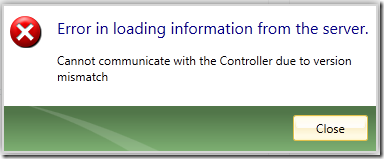
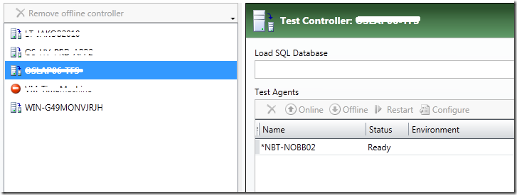

**UPDATE 10.01.2012: \**

The issue has been resolved by Microsoft and will be addressed in patch soon. Here is the full description from the Connect site: \

*“We've identified the rootcause. This bug was introduced in the compatibility GDR patch released for VS 2010 to work against 2011 TFS Server. We shall be releasing a patch soon. Till then, please follow the workaround mentioned to unblock yourselves. “*

When setting up a physical environment for a new test controller on our TFS 2010 server, I ran into a problem that seems to be related to having installed the [Visual Studio 2010 SP1 TFS Compatibility GDR](http://connect.microsoft.com/VisualStudio/Downloads/DownloadDetails.aspx?DownloadID=39070) and/or [Visual Studio 2011 Developer Preview](http://www.microsoft.com/download/en/details.aspx?displaylang=en&id=27543)

on the same machine as Visual Studio 2010 (SP1)

The problem occurs when trying to add a test agent to the physical environment, MTM gives the following error: \
 ***\
Failed to obtain available machines from the selected test controller. \
 \*** \
Clicking on the View details link shows the following error dialog: \

Error dialog: Cannot communicate with the Controller due to version mismatch

I have investigated the problem together with Microsoft, and they are working on finding out why this is happening. I have posted the issue on the Connect site here: \
[https://connect.microsoft.com/VisualStudio/feedback/details/712290/microsoft-test-manager-2010-can-not-communicate-with-test-controllers-when-visual-studio-11-is-installed-on-the-same-machine](https://connect.microsoft.com/VisualStudio/feedback/details/712290/microsoft-test-manager-2010-can-not-communicate-with-test-controllers-when-visual-studio-11-is-installed-on-the-same-machine "https://connect.microsoft.com/VisualStudio/feedback/details/712290/microsoft-test-manager-2010-can-not-communicate-with-test-controllers-when-visual-studio-11-is-installed-on-the-same-machine")

**Workaround**

Fortunately, we found a workaround that is not too bad. When facing this problem, go the the Controllers tab that list all the controllers. If you select the controller from the list, it will actually show the test agent.

Then go back to the Environments tab and voila, the test agent appears now on the list. It seems like the

I’ll post an update when the issue has been resolved by MS

---

## Comments

*Imported from the original WordPress site. Closed for new replies.*

> **Qinyuan Zhang** — 01 Apr 2013
>
> Originally posted on: <http://geekswithblogs.net/jakob/archive/2011/12/09/compatibility-problem-with-microsoft-test-manager-2010-and-visual-studio.aspx#626588>
>
> Is there any updated about this issue?It had been fixed or not , currently I use API to invode method in Microsoft.VisualStudio.QualityTools.ControllerObject.dll, if client had installed the vs2010 sp1 my application will throw out an exception of '{Microsoft.VisualStudio.TestTools.Controller.ControllerConnectionException: Cannot communicate with the Controller due to version mismatch\
>  at Microsoft.VisualStudio.TestTools.Controller.ControllerConnectionManager.InternalConnect(ControllerConnectionInfo controllerConnectionInfo)\
>  at Microsoft.VisualStudio.TestTools.Controller.ControllerConnectionManager.Connect(ControllerConnectionInfo connectionInfo)\
>  at Microsoft.VisualStudio.TestTools.Controller.ControllerConnectionManager.Connect(String fullControllerName)}'
