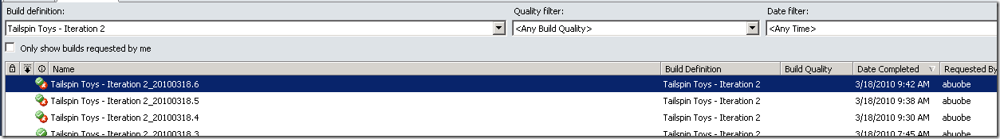
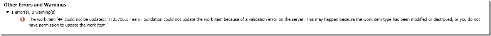
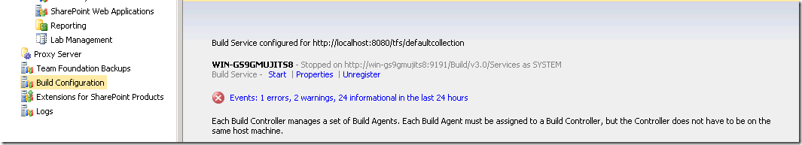
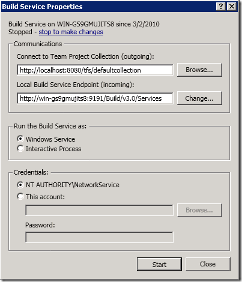
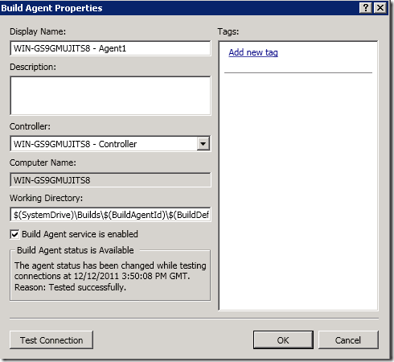

I often use the VS 2010/TFS 2010 evaluation virtual machines that Microsoft publishes every 6 months with the latest bits. It’s a great timesaver to use an image where everything is already setup and also contains a bit of sample data that is useful when you want to demo something for customers.

There is one thing that has always been a, albeit small, but still very annoying problem and that is that the builds always partially fail when you start using the image. When you want to demo the powerful feature of associated work items in a build, you’ll find yourself with your pants down since the build fails when trying to update the associated work item! Even when looking at the historical builds for the Tailspin Toys project, you will notice that they also partially failed:

If you look at the error message in the build details, you’ll see the following error:

*The work item 'XX' could not be updated: 'TF237165: Team Foundation could not update the work item because of a validation error on the server. This may happen because the work item type has been modified or destroyed, or you do not have permission to update the work item.'*

The problem here is that the build agent by default is running as the NT AUTHORITYSYSTEM account, which is an account that do not have permission to modify work items. Your best option here is to switch account and use the Network Service account instead. Open TFS Administration Console, and select the Build Configuration node. Press the Stop link in the Build Service section:

Select Properties and select NT AUTHORITYNetworkService as Credentials

Press Start to start the build service with the new credentials.

If you would queue a new build now, the build would fail because of conflicting workspace mappings. The reason for this is that we haven’t changed the working folder path for the build agents, so when the build agent try to create a new workspace, the local path will conflict with the workspace previously created by NT AUTHORITYSYSTEM.

So to resolve this we can do two things:

1. (Preferred). Delete the team build workspaces previously created by the SYSTEM account. To do this, start a Visual Studio command prompt and type: \
   **tf.exe workspace /delete <workspacename>;NT AUTHORITYSYSTEM \
    \** \
   If you need to list the workspaces to get the names, you can type: \
   **tf workspaces /owner:NT AUTHORITYSYSTEM /computer: <buildserver> \
    \**
2. (Less preferred, but good if you want to switch back later to the old build service account)  \
   You can also modify the working folder path for the build agents, so that they don’t conflict with the existing workspaces. Click Properties on the build agent(s) and modify the Working Directory proprerty: \
   b \
   In this case, you can for example change it to ***$(SystemDrive)BuildsNS$(BuildAgentId)$(BuildDefinitionPath)***  where NS = Network Service. \
