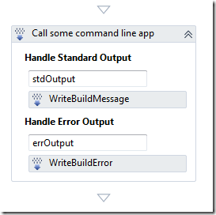
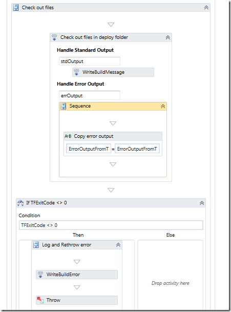
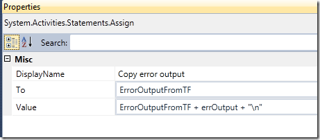
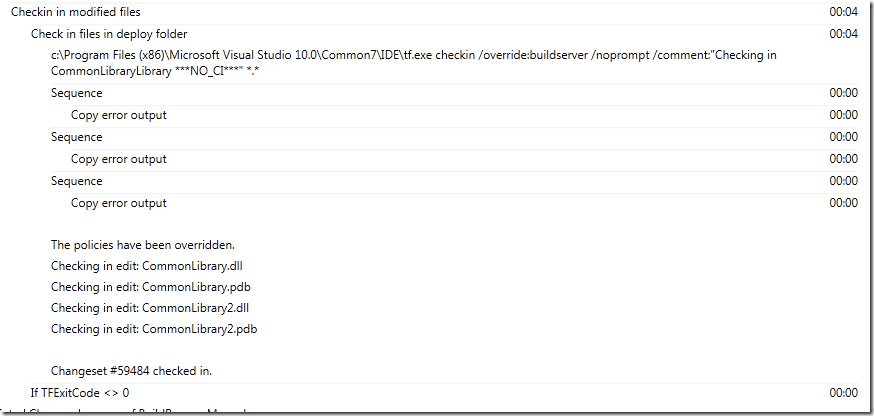

\
The [InvokeProcess activity](http://msdn.microsoft.com/en-us/library/microsoft.teamfoundation.build.workflow.activities.invokeprocess.aspx) is very useful when it comes to running shell commands and external command line tools during a build process. When it comes to integrating with TFS source control during a build, the TF.exe command line tool can be your friend, as it lets you do most of the usual stuff such as check-in, checkout, add, modify workspaces etc.

However, it can be a bit tricky to handle the output from tf.exe, since it often produces warnings that is not necessarily a problem for your build. This is not a problem related only to tf.exe, but to all applications that produces errors and warnings on the canonical error format.

The normal way to use the InvokeProcess activity is to setup the necessary parameters to call the tool with the correct path, working directory and command line switches. Then you add a [WriteBuildMessage](http://msdn.microsoft.com/en-us/library/microsoft.teamfoundation.build.workflow.activities.writebuildmessage.aspx) activity to the Handle Standard Output action handler and a [WriteBuildError](http://msdn.microsoft.com/en-us/library/microsoft.teamfoundation.build.workflow.activities.writebuilderror.aspx) to the Handle Error Output action handler. In addition, you store the Result output property from the InvokeProcess activity in a workflow variable that you can evaluate after the InvokeProcess activity has finished.

This will output all standard output from the application to the build log, and all errors will be written as errors to the build log and will partially fail the build. \
If you try this with TF.exe you will probably notice a problem with warnings from the tool being reported as errors in the build, causing it to partially fail the build, even though the ReturnCode was zero. \
To solve this problem you need to collect the information that is passed to the Error Output action handler. Note that this handler is called several times so you need to handle formatting of the output in some way. Then, you check the ReturnCode from the InvokeProcess activity and in case this is <> 0, you write the collection information as an error to the build log (using WriteBuildError) and then throw an exception. Otherwise, just write the information to the build log using WriteBuildMessage, so you get all information out there.

The finished sample looks like this: \

In the "Check out files” sequence I have defined a workflow variable called ErrorOutputFromTF of type string. In the “Handle Error Output” handler, I append the error to this variable, using the Assign activity: \

I just append a newline character at the end to have all the errors on separate rows in the build log later. After the InvokeProcess activity I check the TFExitCode variable,  that was assigned the ResultCode value from the InvokeProcess activity previously, if it is <> 0 I write the ErrorOutputFromTF to the build error log and then I throw an exception.

Here is a sample build log output:

Note that tf.exe in this case outputs information about check-in policies that have been overridden. This is an example of information that would cause the build to partially fail, but is now logged as information.

---

## Comments

*Imported from the original WordPress site. Closed for new replies.*

> **dunya tv** — 08 Sep 2012
>
> Originally posted on: <http://geekswithblogs.net/jakob/archive/2012/02/01/handling-warnings-and-errors-with-invokeprocess-in-tfs-2010-build.aspx#618806>
>
> I just came across your blog and reading your beautiful words. I thought I would leave my first comment but I don't know what to say except that I have enjoyed reading. Nice blog. I will keep visiting this blog very often.

> **sudhakar** — 03 Jan 2013
>
> Originally posted on: <http://geekswithblogs.net/jakob/archive/2012/02/01/handling-warnings-and-errors-with-invokeprocess-in-tfs-2010-build.aspx#623352>
>
> Hi,\
> \
> Can you let me know how the TFExitCode variable is assigned from th 'Result' property of the InvokeProcess?\
> \
> I am looking for this and am urgent. Please clarify.\
> \
> Thanks,

> **Diego Spinella** — 19 Aug 2015
>
> Originally posted on: <http://geekswithblogs.net/jakob/archive/2012/02/01/handling-warnings-and-errors-with-invokeprocess-in-tfs-2010-build.aspx#645881>
>
> Hi! Congratulations for the post. \
> \
> Let me ask you, would you know how to put the log in the summary?\
> \
> I need a piece of writing for summary.\
> \
> Thx!\
> \
> Sry for my english.

> **Victoria** — 10 Sep 2015
>
> Originally posted on: <http://geekswithblogs.net/jakob/archive/2012/02/01/handling-warnings-and-errors-with-invokeprocess-in-tfs-2010-build.aspx#646139>
>
> Thank you, this was very useful! \
> \
> @sudhakar: To assign to TFExitCode variable, select your InvokeProcess activity in Visual Studio, then hit F4 to see its properties. Set the value of 'Result' property to "TFExitCode" (without quotes).\
> For other kinds of assignments, use Assign activity, as mentioned in the article.

> **Aajaamu** — 13 Jul 2016
>
> Hi Jakob,
>
> i am not sure why but "WriteBuildError" activity only when included in TFExitCode0, through below error \
> "erroutput is not declared. It may be inaccessible due to its protection level"
>
> If i invoke the same activity somewhere else i don't see any issues.
>
> Please let me know if you need more details
