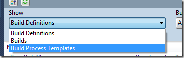
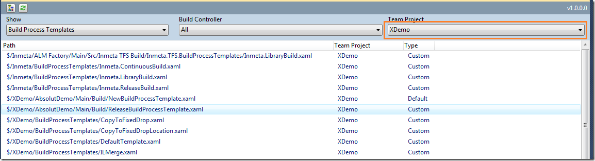
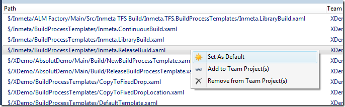
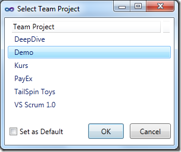
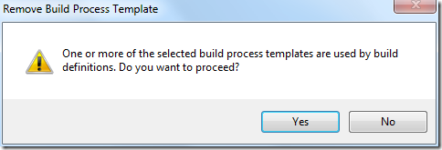

A year ago I blogged about how to [manage your build process templates using the TFS API](http://geekswithblogs.net/jakob/archive/2010/11/03/managing-build-process-templates-in-tfs-2010-build.aspx). The main reason for doing this is that you can (and should!) store your “golden” build process templates in a common location in your TFS project collection, and then add them to each team project that requires those templates. This way, you can fix a bug or add a new feature in one place and have the change affect all build definitions.

However, by having the build process templates in a single location, the users must know where the build process templates are located and browse to that path and add it to the team project, before it will show up in the list of build process templates: \

Unfortunately, you can’t manage the build process templates this way using Team Explorer, you have to resort to the TFS API to do these things.

Until now! 🙂 In the latest release of the [Community TFS Build Manager](http://visualstudiogallery.msdn.microsoft.com/16bafc63-0f20-4cc3-8b67-4e25d150102c) I have added support for managing build process templates.

The templates are accessible by selecting “Build Process Templates” in the “Show” dropdown: \

This will show all registered build process templates, either in the selected team project or in all team projects, depending on your current filter: \

All build process templates in the XDemo team project. The grid is of course sortable as the rest of the application. This lets you easily see where the template is registered.

Note that several of the build process templates in the list above is stored in the Inmeta team project, which is our team project for storing all artifacts related to our software factory, including the build process templates and custom activities.

Now, we can right click on a build process template and perform any of the following actions: \

- **Set As Default**  \
  This will set the selected build process template as the default build process template in the corresponding team project. There can only be one default build process template per team project, so the tool will automatically scan for any other default build process templates and set them back to “Custom”.  \
- **Add to Team Project(s)** \
  This will let you select one or more team projects where you want to add this build process template to: \
   \
  In the list you can select one or more team projects. You can also specify that the template(s) should be set as default by using the checkbox “Set as Default”. \
- **Remove from Team Project(s) \**This does the opposite from the previous operation, it removes the selected build process template(s) from one or more team project. After this operation, the template will not be visible in the “Build Process file” dropdown when editing a build process template. \
  **Note:** When removing a build process template, there might be build definitions using this template. If this is the case, the build manager will prompt you with a dialog before you proceed with the remove: \
  

Hope that you find the new functionality useful. Please report bugs and feature requests to the [Community TFS Build Extensions CodePlex site](http://tfsbuildextensions.codeplex.com/)

---

## Comments

*Imported from the original WordPress site. Closed for new replies.*

> **dunya tv** — 08 Sep 2012
>
> Originally posted on: <http://geekswithblogs.net/jakob/archive/2012/02/21/managing-build-templates-with-community-tfs-build-manager.aspx#618807>
>
> I thought I would leave my first comment but I don't know what to say except that I have enjoyed reading. Nice blog. I will keep visiting this blog very often.THANKS.\
