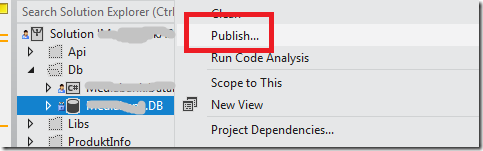
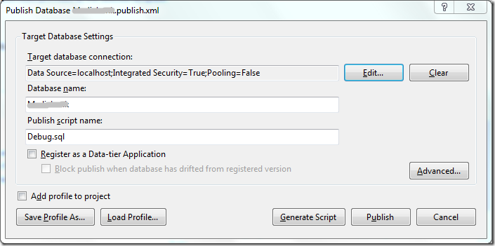
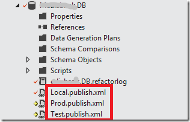
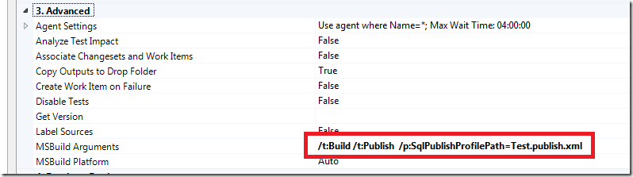
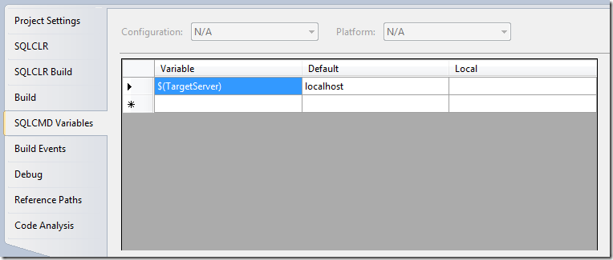
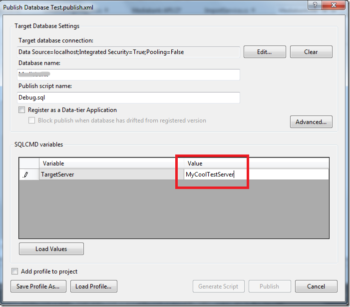

As many of you probably have noticed by now, [Visual Studio Database Projects](http://msdn.microsoft.com/en-us/library/xee70aty.aspx) are not supported in the next version of Visual Studio (currently named \
Visual Studio 11 Beta). When you open a solution containing a VSDB project, VS11 wants to convert it to a [SQL Server Developer Tools](http://msdn.microsoft.com/en-us/magazine/hh394146.aspx) project instead.

This project type ships with SQL Server and has a feature set that covers most of the functionality of the VSDB project, plus some new features, such \
a support for SQL 2012 and SQL Azure. A feature comparison list between the two project types can be found here: \
[http://blogs.msdn.com/b/ssdt/archive/2011/11/21/sql-server-data-tools-ctp4-vs-vs2010-database-projects.aspx](http://blogs.msdn.com/b/ssdt/archive/2011/11/21/sql-server-data-tools-ctp4-vs-vs2010-database-projects.aspx "http://blogs.msdn.com/b/ssdt/archive/2011/11/21/sql-server-data-tools-ctp4-vs-vs2010-database-projects.aspx")

Once you have converted your project to a SSDT project, you will find that most of the functionality is very similar to VSDB, how you work with \
schema objects, schema comparisons etc. Deploying a SSDT project is called Publish and is available in the Visual Studio context menu: \

[](http://gwb.blob.core.windows.net/jakob/Windows-Live-Writer/Deploying-SSDT-Project_10C55/image_2.png)

When you invoke the Publish command, Visual Studio will launch the Publish Profile dialog, where you can configure how and where you want to \
deploy the database: \

[](http://gwb.blob.core.windows.net/jakob/Windows-Live-Writer/Deploying-SSDT-Project_10C55/image_6.png)

There are lots of options that you can configure, and these options are often different depending on the target environment. For example, locally you \
typically want to recreate the database every time you deploy, but when deploying to a test server, you probably only want to update it incrementally \
without removing any existing data. The settings that you enter can be stored in a separate profile file, which you will use when you are deploying the database.

So, create a publish profile for each environment that you want to deploy to. In the following example, I have one profile for deploying to my local \
machine, and in addition publish profiles for the test and production environments:

[](http://gwb.blob.core.windows.net/jakob/Windows-Live-Writer/Deploying-SSDT-Project_10C55/image_8.png)

(Note that you can right-click a publish profile and mark it as default. This is the profile that will be chosen when you select Publish in Visual Studio, so \
in this case I would select Local.publish.xml) \
The Publish command calls the *Publish* MSBuild target which will eventually call the [SqlPublishTask](http://msdn.microsoft.com/en-us/library/microsoft.data.tools.schema.tasks.sql.sqlpublishtask(v=vs.103).aspx) MSBuild task which will do the work of deploying your \
database. This means that the deployment of the database project is easy to integrate into TFS Build, since you can just specify that you want to invoke \
the Publish target as part of your build: \

[](http://gwb.blob.core.windows.net/jakob/Windows-Live-Writer/Deploying-SSDT-Project_10C55/image_10.png)

Here, I have chosen to deploy the database using the Test profile, which would typically by a remote server used for testing of the build.

**Using SQLCMD variables \**Sometimes you need to use parameters in your scripts, e.g. values that you can pass in dynamically when the script is executed. These are called \
SQLCMD variables, and you can define these on the properties page of the database project:

[](http://gwb.blob.core.windows.net/jakob/Windows-Live-Writer/Deploying-SSDT-Project_10C55/image_12.png)

Here I have defined a variable called $(TargetServer), and given it a default value of localhost. Then I have references this variable inside a post \
deployment script in side the project, like this:

```bash
EXEC master..xp_cmdshell 'bcp Daatabase.[dbo].[Table] in "TableContent.dat" -T -c -S$(TargetServer)'
```

This is a scenario we had at a client recently, where they used the [BCP](http://msdn.microsoft.com/en-us/library/aa174646(v=sql.80).aspx) utility to bulk insert lots of data into a few tables as part of the deployment.
To be able to run BCP against different target servers (dev, test etc) in my build, I used the SQLCMD variable.

When you publish your database from Visual Studio, it will prompt you to give the variables a value. But when deploying from a build, the value need
to be set per configuration. This is done by opening the publish profile file for the target environment and store that value there:

[](http://gwb.blob.core.windows.net/jakob/Windows-Live-Writer/Deploying-SSDT-Project_10C55/image_14.png)

Select “Save Profile As” and save it as your target publish profile. Since we are specifying our publish profile in our build definition, it will populate
the variables with the correct values.

---

## Comments

*Imported from the original WordPress site. Closed for new replies.*

> **Gary Stafford** — 13 Aug 2012
>
> Originally posted on: <http://geekswithblogs.net/jakob/archive/2012/04/25/deploying-ssdt-projects-with-tfs-build.aspx#617802>
>
> Great article. Hard to find good coverage of SSDT and build strategies.

> **Hamid** — 19 Sep 2012
>
> Originally posted on: <http://geekswithblogs.net/jakob/archive/2012/04/25/deploying-ssdt-projects-with-tfs-build.aspx#619200>
>
> Great article. How would you suggest to maintain publish files when you have a number of similar environments, for instance 4 test rigs or a pre-prod environment similar to that of production?

> **HydTechie** — 21 May 2013
>
> Originally posted on: <http://geekswithblogs.net/jakob/archive/2012/04/25/deploying-ssdt-projects-with-tfs-build.aspx#628823>
>
> Kindly update this article for incremental updations to Test server, you mentioned it in text but i could not found any steps associated to it,\
> thanks\
> HydTechie

> **soso** — 02 Jul 2013
>
> Originally posted on: <http://geekswithblogs.net/jakob/archive/2012/04/25/deploying-ssdt-projects-with-tfs-build.aspx#630530>
>
> Hi, how do you handle the incremental updates of test database? i didnt find out.

> **Bal&#225;zs M&#225;t&#233;** — 30 Oct 2013
>
> Originally posted on: <http://geekswithblogs.net/jakob/archive/2012/04/25/deploying-ssdt-projects-with-tfs-build.aspx#633166>
>
> Hi, thanks a lot for this article.

> **Jordan** — 26 Nov 2013
>
> Originally posted on: <http://geekswithblogs.net/jakob/archive/2012/04/25/deploying-ssdt-projects-with-tfs-build.aspx#633920>
>
> I've been using publish profiles, and SQL publish profiles for a while. But recently have been struggling automating the DB publish. Of course, right clicking on my publish profiles works correctly, and runs as expected, but automating through TFS Build 2012 seems not to update anything, even when I match your parameters - any pointers?\
> \
> I have a very simple CI system, which works flawlessly for our 20 or so web services. DB portion is troublesome...

> **Jakob Ehn** — 26 Nov 2013
>
> Originally posted on: <http://geekswithblogs.net/jakob/archive/2012/04/25/deploying-ssdt-projects-with-tfs-build.aspx#633925>
>
> @Jordan: Hard to tell, are you sure that the SqlPublishProfilePath parameter matches an existing file?

> **Justin** — 17 Jan 2014
>
> Originally posted on: <http://geekswithblogs.net/jakob/archive/2012/04/25/deploying-ssdt-projects-with-tfs-build.aspx#635062>
>
> Is this possible when your build targets a solution with multiple projects? I would like to build my application as well as deploy my database changes

> **Mr Singh** — 13 May 2014
>
> Originally posted on: <http://geekswithblogs.net/jakob/archive/2012/04/25/deploying-ssdt-projects-with-tfs-build.aspx#637652>
>
> Great Article, thanks heaps
