TFS 2012 introduces a new type of Lab environment called Standard Environment. This allows you to setup a full Build Deploy Test (BDT) workflow that will build your application, deploy it to your target machine(s) and then run a set of tests on that server to verify the deployment. In TFS 2010, you had to use System Center Virtual Machine Manager and involve half of your IT department to get going. Now all you need is a server (virtual or physical) where you want to deploy and test your application. You don’t even have to install a test agent on the machine, TFS 2012 will do this for you!

Although each step is rather simple, the entire process of setting it up consists of a bunch of steps. So I thought that it could be useful to run through a typical setup.I will also link to some good guidance from MSDN on each topic.

**High Level Steps**

1. Install and configure Visual Studio 2012 Test Controller on Target Server
2. Create Standard Environment
3. Create Test Plan with Test Case
4. Run Test Case
5. Create Coded UI Test from Test Case
6. Associate Coded UI Test with Test Case
7. Create Build Definition using LabDefaultTemplate

**\
1. Install and Configure Visual Studio 2012 Test Controller on Target Server**

First of all, note that you do not have to have the Test Controller running on the target server. It can be running on another server, as long as the Test Agent can communicate with the test controller and the test controller can communicate with the TFS server. If you have several machines in your environment (web server, database server etc..), the test controller can be installed either on one of those machines or on a dedicated machine.

To install the test controller, simply mount the Visual Studio Agents media on the server and browse to the *vstf_controller.exe* file located in the *TestController* folder. \
Run through the installation, you might need to reboot the server since it installs .NET 4.5.

When the test controller is installed, the Test Controller configuration tool will launch automatically (if it doesn’t, you can start it from the Start menu). Here you will supply the credentials of the account running the test controller service. Note that this account will be given the necessary permissions in TFS during the configuration. Make sure that you have entered a valid account by pressing the Test link. \
Also, you have to register the test controller with the TFS collection where your test plan is located (and usually the code base of course)

[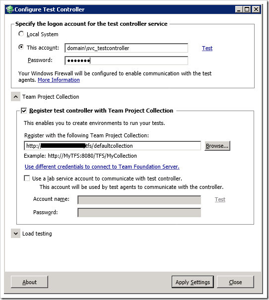](http://gwb.blob.core.windows.net/jakob/Windows-Live-Writer/9c2a6c9ead7c_127E5/image_8.png)

When you press Apply Settings, all the configuration will be done. You might get some warnings at the end, that might or might not cause a problem later. Be sure to read them carefully.

[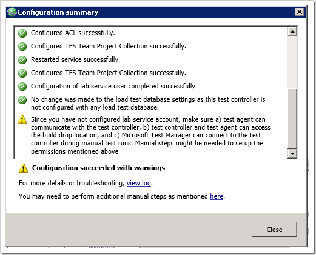](http://gwb.blob.core.windows.net/jakob/Windows-Live-Writer/9c2a6c9ead7c_127E5/image_10.png)

For more information about configuring your test controllers, see [Setting Up Test Controllers and Test Agents to Manage Tests with Visual Studio](http://msdn.microsoft.com/en-us/library/hh546459)

**2. Create Standard Environment**

Now you need to create a Lab environment in Microsoft Test Manager. Since we are using an existing physical or virtual machine we will create a Standard Environment.

1. Open MTM and go to Lab Center. \
2. Click New to create a new environment \
3. Enter a name for the environment. Since this environment will only contain one machine, we will use the machine name for the environment (*TargetServer* in this case) \
   [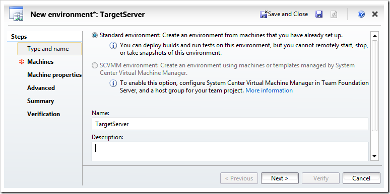](http://gwb.blob.core.windows.net/jakob/Windows-Live-Writer/9c2a6c9ead7c_127E5/image_2.png) \
4. On the next page, click Add to add a machine to the environment. Enter the name of the machine (*TargetServer.Domain.Com*), and give it the Web Server role. The name must be reachable both from your machine during configuration and from the TFS app tier server. \
   You also need to supply an account that is a local administration on the target server. This is needed in order to automatically install a test agent later on the machine. \
   [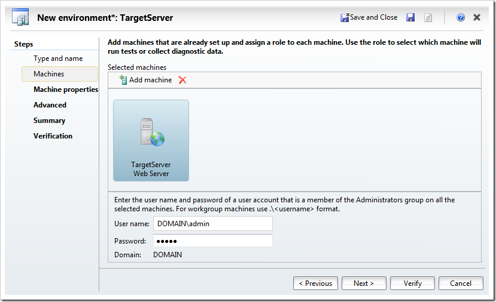](http://gwb.blob.core.windows.net/jakob/Windows-Live-Writer/9c2a6c9ead7c_127E5/image_4.png) \
5. On the next page, you can add tags to the machine. This is not needed in this scenario so go to the next page. \
6. Here you will specify which test controller to use and that you want to run UI tests on this environment. This will in result in a Test Agent being automatically installed and configured on the target server. \
   [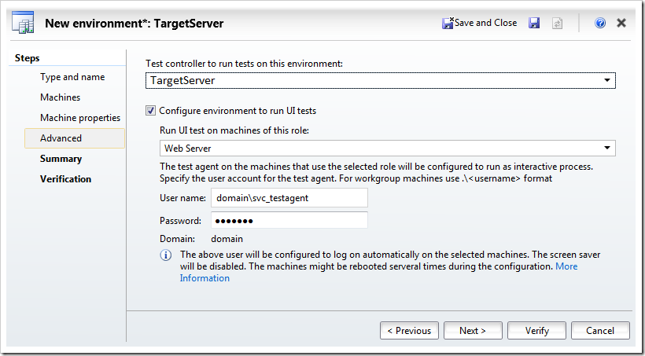](http://gwb.blob.core.windows.net/jakob/Windows-Live-Writer/9c2a6c9ead7c_127E5/image_14.png) \
   The name of the machine where you installed the test controller should be available on the drop down list (TargetServer in this sample). If you can’t see it, you might have selected a different TFS project collection. \
7. Press Next twice and then Verify to verify all the settings: \
   [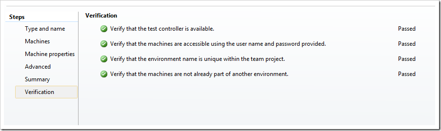](http://gwb.blob.core.windows.net/jakob/Windows-Live-Writer/9c2a6c9ead7c_127E5/image_16.png) \
8. Press finish. This will now create and prepare the environment, which means that it will remote install a test agent on the machine. As part of this installation, the remote server will be restarted. \

**3-5. Create Test Plan, Run Test Case, Create Coded UI Test**

I will not cover step 3-5 here, there are plenty of information on how you create test plans and test cases and automate them using Coded UI Tests.

In this example I have a test plan called My Application and it contains among other things a test suite called *Automated Tests* where I plan to put test cases that should be automated and executed as part of the BDT workflow.

[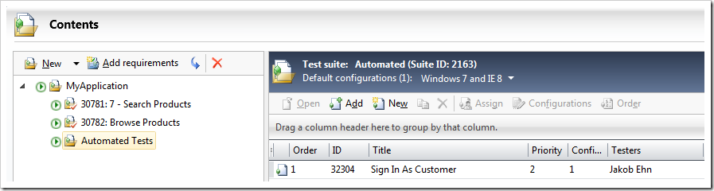](http://gwb.blob.core.windows.net/jakob/Windows-Live-Writer/9c2a6c9ead7c_127E5/image_39.png)

For more information about Coded UI Tests, see [Verifying Code by Using Coded User Interface Tests](http://msdn.microsoft.com/en-us/library/dd286726)

**6. Associate Coded UI Test with Test Case**

OK, so now we want to automate our Coded UI Test and have it run as part of the BDT workflow. You might think that you coded UI test already is automated, but the meaning of the term here is that you link your coded UI Test to an existing Test Case, thereby making the *Test Case* automated. And the test case should be part of the test suite that we will run during the BDT.

1. Open the solution that contains the coded UI test method. \
2. Open the Test Case work item that you want to automate. \
3. Go to the Associated Automation tab and click on the “…” button. \
4. Select the coded UI test that you corresponds to the test case: \
   [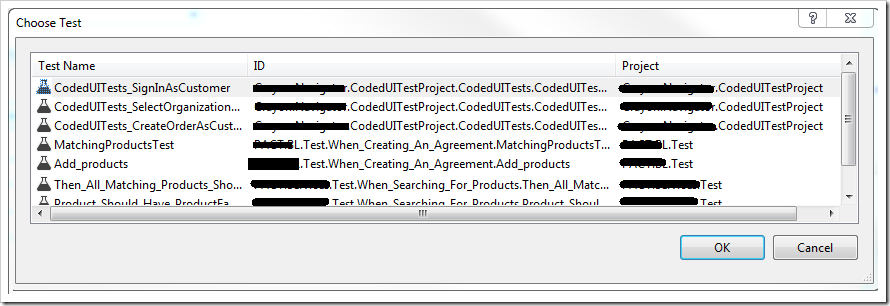](http://gwb.blob.core.windows.net/jakob/Windows-Live-Writer/9c2a6c9ead7c_127E5/image_18.png) \
5. Press OK and the save the test case

For more information about associating an automated test case with a test case, see [How to: Associate an Automated Test with a Test Case](http://msdn.microsoft.com/en-us/library/dd380741.aspx)

**7. Create Build Definition using LabDefaultTemplate**

Now we are ready to create a build definition that will implement the full BDT workflow. For this purpose we will use the LabDefaultTemplate.11.xaml that comes out of the box in TFS 2012. This build process template lets you take the output of another build and deploy it to each target machine. Since the deployment process will be running on the target server, you will have less problem with permissions and firewalls than if you were to remote deploy your solution.

So, before creating a BDT workflow build definition, make sure that you have an existing build definition that produces a release build of your application.

1. Go to the Builds hub in Team Explorer and select *New Build Definition* \
2. Give the build definition a meaningful name, here I called it *MyApplication.Deploy* \
   [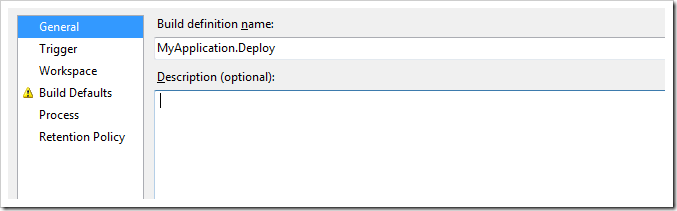](http://gwb.blob.core.windows.net/jakob/Windows-Live-Writer/9c2a6c9ead7c_127E5/image_20.png) \
3. Set the trigger to Manual \
   [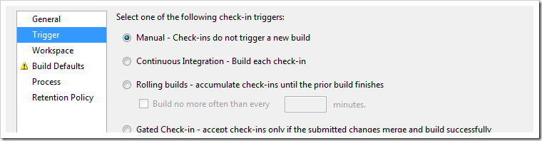](http://gwb.blob.core.windows.net/jakob/Windows-Live-Writer/9c2a6c9ead7c_127E5/image_22.png) \
4. Define a workspace for the build definition. Note that a BDT build doesn’t really need a workspace, since all it does is to launch another build definition and deploy the output of that build. \
   But TFS doesn’t allow you to save a build definition without adding at least one mapping. \
5. On Build Defaults, select the build controller. Since this build actually won’t produce any output, you can select the “*This build does not copy output files to a drop folder*” option. \
   [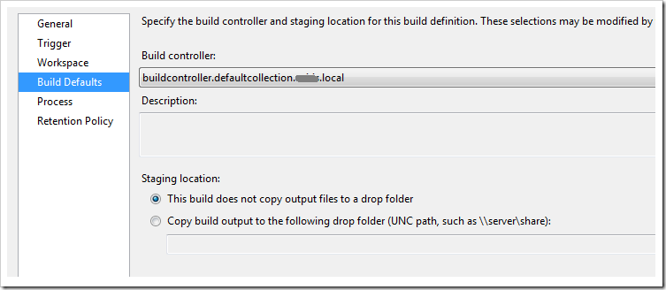](http://gwb.blob.core.windows.net/jakob/Windows-Live-Writer/9c2a6c9ead7c_127E5/image_11.png) \
6. On the process tab, select the LabDefaultTemplate.11.xaml. This is usually located at *$/TeamProject/BuildProcessTemplates/LabDefaultTemplate.11.xaml*. To configure it, press the … button on the Lab Process Settings property \
7. First, select the environment that you created before: \
   [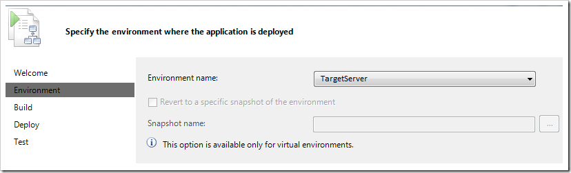](http://gwb.blob.core.windows.net/jakob/Windows-Live-Writer/9c2a6c9ead7c_127E5/image_41.png) \
8. Select which build that you want to deploy and test. The “Select an existing build” option is very useful when developing the BDT workflow, because you do not have to run through the target build every time, instead it will basically just run through the deployment and test steps which speeds up the process. \
   Here I have selected to queue a new build of the *MyApplication.Test* build definition \
   [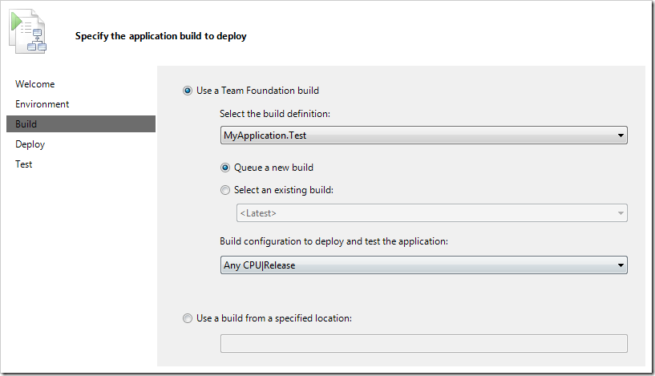](http://gwb.blob.core.windows.net/jakob/Windows-Live-Writer/9c2a6c9ead7c_127E5/image_27.png) \
9. On the deploy tab, you need to specify how the application should be installed on the target server. You can supply a list of deployment scripts with arguments that will be executed **on the target server.** In this example I execute the generated [web deploy command file](http://msdn.microsoft.com/en-us/library/ff356104.aspx) to deploy the solution. If you for example have databases you can use sqlpackage.exe to deploy the database. If you are producing MSI installers in your build, you can run them using msiexec.exe and so on. \
   A good practice is to create a batch file that contain the entire deployment that you can run both locally and on the target server. Then you would just execute the deployment batch file here in one single step. \
   [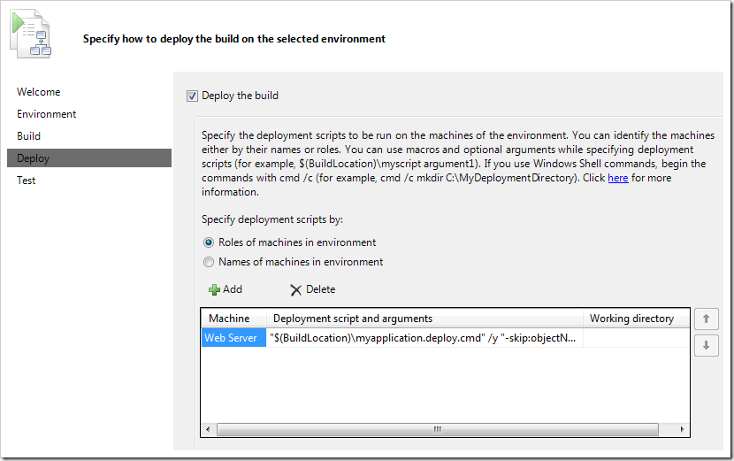](http://gwb.blob.core.windows.net/jakob/Windows-Live-Writer/9c2a6c9ead7c_127E5/image_29.png) \
   The workflow defines some variables that are useful when running the deployments. These variables are: \
   **$(BuildLocation) \**The full path to where your build files are located \
   **$(InternalComputerName_<VM Name>) \**The computer name for a virtual machine in a SCVMM environment \
   **$(ComputerName_<VM Name>) \**The fully qualified domain name of the virtual machine \
   As you can see, I specify the path to the myapplication.deploy.cmd file using the $(BuildLocation) variable, which is the drop folder of the MyApplication.Test build. \
   **Note:** The test agent account must have read permission in this drop location. \
   You can find more information here on [Building your Deployment Scripts](http://msdn.microsoft.com/en-us/library/hh968963.aspx) \
10. On the last tab, we specify which tests to run after deployment. Here I select the test plan and the *Automated Tests* test suite that we saw before: \
    [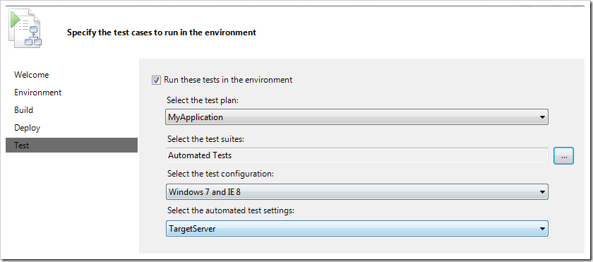](http://gwb.blob.core.windows.net/jakob/Windows-Live-Writer/9c2a6c9ead7c_127E5/image_35.png) \
    Note that I also selected the automated test settings (called TargetServer in this case) that I have defined for my test plan. In here I define what data that should be collected as part of the test run. \
    For more information about test settings, see [Specifying Test Settings for Microsoft Test Manager Tests](http://msdn.microsoft.com/en-us/library/ee231892.aspx)

We are done! Queue your BDT build and wait for it to finish. If the build succeeds, your build summary should look something like this: \

[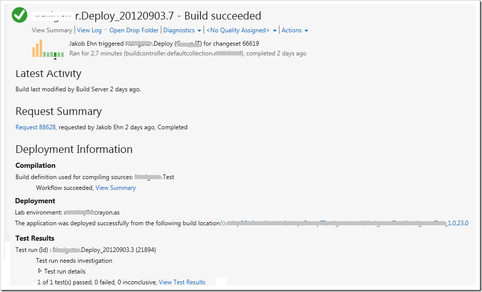](http://gwb.blob.core.windows.net/jakob/Windows-Live-Writer/9c2a6c9ead7c_127E5/image_37.png)

---

## Comments

*Imported from the original WordPress site. Closed for new replies.*

> **Hassan Fadili** — 06 Sep 2012
>
> Originally posted on: <http://geekswithblogs.net/jakob/archive/2012/09/05/get-started-using-build-deploy-test-workflow-with-tfs-2012.aspx#618710>
>
> Thanks Ed, Great Post!

> **Nikhil Rajan** — 07 Dec 2012
>
> Originally posted on: <http://geekswithblogs.net/jakob/archive/2012/09/05/get-started-using-build-deploy-test-workflow-with-tfs-2012.aspx#622411>
>
> Do i need to build my automation code along with my application code , inorder to do this . I need to implement the build- deploy-test workflow. I will be deploying into a virtual machine. I have prepared my coded ui scripts in visual studio and checked in the solution to source control. I have also associatd these test methods to the test cases in mtm. Now do i need to build my automation solution along with the application solution.

> **Jakob Ehn** — 07 Dec 2012
>
> Originally posted on: <http://geekswithblogs.net/jakob/archive/2012/09/05/get-started-using-build-deploy-test-workflow-with-tfs-2012.aspx#622414>
>
> @Nikhil: Yes, you should build the automation code together with the application code. If not, you need to make sure that the build outputs the automation assemblies to the drop folder, otherwise MTM will not be able to find them when running the tests

> **Wade Bynum** — 12 Dec 2012
>
> Originally posted on: <http://geekswithblogs.net/jakob/archive/2012/09/05/get-started-using-build-deploy-test-workflow-with-tfs-2012.aspx#622607>
>
> I've got two VM's in play. First one does the build, runs the test controller and also has a test agent for build deployment. The second just has the test agent for build deployment. Builds deploy fine to the first box. My problems is deploying to the second box. I always get an "Access Denied" message in the build log for this second box. Doesn't matter what I do. Currently I am just trying to do a directory listing on the build location. Here is my command in the deployment build:\
> \
> cmd /c dir "$(BuildLocation)"\
> \
> I get the following in the build log:\
> \
> Deployment Task Logs for Machine: XXXXXXXXX\
>  Access is denied.\
>  Exception Message: Team Foundation Server could not complete the deployment task for machine 'XXXXXXXXX', script 'cmd' and arguments '/c dir "\XXXXXXXXXtfs_buildsAWS_Utilities MainAWS_Utilities Main_20121211.4"'. (type LabDeploymentProcessException)\
> \
> Note that if I run that dir command with the UNC path from a dos prompt on the second box it executes successfully without prompting for a login. I have turned off the Windows firewall on both VM's. Both VM's are running on the same physical machine. I have told both boxes to use the Administrator login in all places I can find. Still get the access denied. Any ideas?

> **Paul Brinkley-Rogers** — 11 Feb 2013
>
> Originally posted on: <http://geekswithblogs.net/jakob/archive/2012/09/05/get-started-using-build-deploy-test-workflow-with-tfs-2012.aspx#624931>
>
> Wade,\
> \
> I believe that you also need a build agent installed on your second box. The deployment commands run in the context of the build agent on the target server, not the test agent. All the test agent does is a) execute tests, or b) enable the collection of test data (code coverage, ASP.Net instrumentation, etc.) on a remote machine.

> **Elena** — 12 Apr 2013
>
> Originally posted on: <http://geekswithblogs.net/jakob/archive/2012/09/05/get-started-using-build-deploy-test-workflow-with-tfs-2012.aspx#626881>
>
> Wade,\
> \
> I'm facing the same problem ("Access is denied").\
> Were you able to solve it?\
> \
> -- Elena

> **Saravanan** — 16 Apr 2013
>
> Originally posted on: <http://geekswithblogs.net/jakob/archive/2012/09/05/get-started-using-build-deploy-test-workflow-with-tfs-2012.aspx#627911>
>
> Hi Jakob,\
> \
> Thanks for the post. It was surprising to know that, BDT workflows cannot be triggered as a Gated-Checkin. In my project, we would like to trigger a BDT workflow as part of a gated checkin process. Is there a workaround? I could certainly think about developing a custom workflow for achieving this. I wanted to know your thoughts about solving this issue using a custom workflow?

> **Gary** — 21 Feb 2015
>
> Originally posted on: <http://geekswithblogs.net/jakob/archive/2012/09/05/get-started-using-build-deploy-test-workflow-with-tfs-2012.aspx#643084>
>
> Is there a way to display/view such the dashboard for this type of workflow? Like in jenkins.

> **gaurav** — 10 Jun 2015
>
> Originally posted on: <http://geekswithblogs.net/jakob/archive/2012/09/05/get-started-using-build-deploy-test-workflow-with-tfs-2012.aspx#644686>
>
> Is there any way where we set instructions in our build workflow to close browser once all tests are executed.\
> \
> My tests are running on build server but brower remains open. I want something like, after my last execution, browser should get closed

> > **Raul** — 18 Jan 2016
> >
> > I think the easiest way is defining drop down attribute to test class. i mean, if you define a method to execute one all test have been executed, there you can force to close the main driver o whatever you need. Even if referenced browser is just attached to a single test, you can always driver.quit() before test execution finishes
