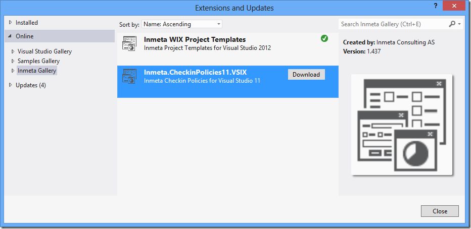
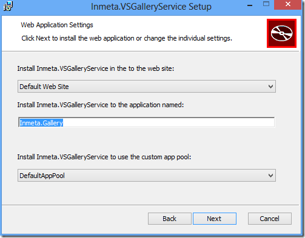
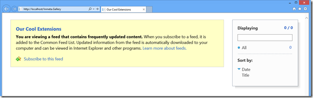
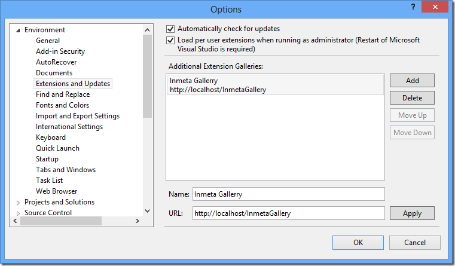
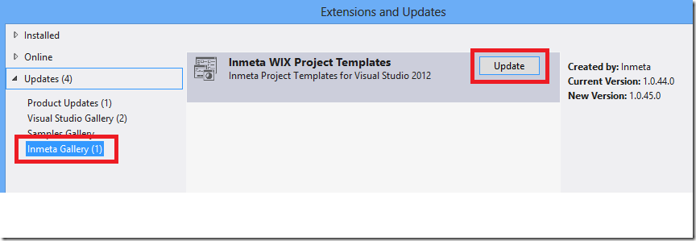

**Updated January 13th 2013**:  Added note about ASP.NET MVC 4.0 prerequirement

**Note:** The installer and the complete source code is available over at CodePlex at the following location: <http://inmetavsgallery.codeplex.com>

Extensions and addins are everywhere in the Visual Studio ALM ecosystem! Microsoft releases new cool features in the form of extensions and the list of 3rd party extensions that plug into Visual Studio just keeps growing. One of the nice things about the VSIX extensions is how they are deployed. Microsoft hosts a public Visual Studio Gallery where you can upload extensions and make them available to the rest of the community. Visual Studio checks for updates to the installed extensions when you start Visual Studio, and installing/updating the extensions is fast since it is only a matter of extracting the files within the VSIX package to the local extension folder.

But for custom, enterprise-specific extensions, you don’t want to publish them online to the whole world, but you still want an easy way to distribute them to your developers and partners. This is where Private Extension Galleries come into play. In Visual Studio 2012, it is now possible to add custom extensions galleries that can point to any URL, as long as that URL returns the expected content of course (see below).Registering a new gallery in Visual Studio is easy, but there is very little documentation on how to actually host the gallery.

Visual Studio galleries uses Atom Feed XML as the protocol for delivering new and updated versions of the extensions. [This MSDN page](http://blogs.msdn.com/b/visualstudio/archive/2011/10/03/private-extension-galleries-for-the-enterprise.aspx) describes how to create a static XML file that returns the information about your extensions. This approach works, but require manual updates of that file every time you want to deploy an update of the extension.

Wouldn’t it be nice with a web service that takes care of this for you, that just lets you drop a new version of your VSIX file and have it automatically detect the new version and produce the correct Atom Feed XML?

Well search no more, this is exactly what the Inmeta Visual Studio Gallery Service does for you :-)

Here you can see that in addition to the standard Online galleries there is an *Inmeta Gallery* that contains two extensions (our WIX templates and our custom TFS Checkin Policies). These can be installed/updated i the same way as extensions from the public Visual Studio Gallery.

**Installing the Service**

1. The service uses ASP.NET MVC 4.0, so make sure that you have this installed on your web server. \
2. Download the installer (*Inmeta.VSGalleryService.Install.msi*) for the service and run it. \
   The installation is straight forward, just select web site, application pool and (optional) a virtual directory where you want to install the service. \
     \
   **Note**: If you want to run it in the web site root, just leave the application name blank \
3. Press Next and finish the installer. \
4. Open web.config in a text editor and locate the the <applicationSettings> element \
5. Edit the following setting values: \
   - **FeedTitle \**This is the name that is shown if you browse to the service using a browser. Not used by Visual Studio \
   - **BaseURI** \
     When Visual Studio downloads the extension, it will be given this URI + the name of the extension that you selected. This value should be on the following format: \
     [*http://SERVER/[VDIR]/gallery/extension/*](http://SERVER/[VDIR]/gallery/extension/) \
      *\*
   - **VSIXAbsolutePath \**This is the path where you will deploy your extensions. This can be a local folder or a remote share. You just need to make sure that the application pool identity account has read permissions in this folder \
6. Save web.config to finish the installation \
7. Open a browser and enter the URL to the service. It should show an empty Feed page: \
    

**Adding the Private Gallery in Visual Studio 2012 \**Now you need to add the gallery in Visual Studio. This is very easy and is done as follows:

1. Go to **Tools –> Options** and select *Environment –> Extensions and Updates \
    \*
2. Press *Add* to add a new gallery \
3. Enter a descriptive name, and add the URL that points to the web site/virtual directory where you installed the service in the previous step \
     \
4. Press OK to save the settings.

**Deploying an Extension \**This one is easy: Just drop the file in the designated folder! :-)  If it is a new version of an existing extension, the developers will be notified in the same way as for extensions from the public Visual Studio gallery:

I hope that you will find this sever useful, please contact me if you have questions or suggestions for improvements!

---

## Comments

*Imported from the original WordPress site. Closed for new replies.*

> **Jerry** — 28 Nov 2012
>
> Originally posted on: <http://geekswithblogs.net/jakob/archive/2012/11/07/using-private-extension-galleries-in-visual-studio-2012.aspx#622041>
>
> Any idea what would cause a HTTP/1.1 406 Not Acceptable? When I run the code on my box it works. When I put it on a server I get a 406. I am pretty sure the setup is the same.\
> \
> Thanks!

> **Mark Pearl** — 29 Nov 2012
>
> Originally posted on: <http://geekswithblogs.net/jakob/archive/2012/11/07/using-private-extension-galleries-in-visual-studio-2012.aspx#622049>
>
> Thanks, I didn't realize you could do this for extensions. Thanks for sharing

> **Seregi** — 12 Dec 2012
>
> Originally posted on: <http://geekswithblogs.net/jakob/archive/2012/11/07/using-private-extension-galleries-in-visual-studio-2012.aspx#622608>
>
> Hello.\
> Great idea. \
> Unfortunately I could't get it working. I made changes in configuration as described:\
> \
>  \
>  <Inmeta.VSGalleryService.Properties.Settings>\
>  \
>  My VS Gallery\
>  \
>  \
>  http://localhost/vsgallery\
>  \
>  \
>  C:VSIXRepo\
>  \
>  </Inmeta.VSGalleryService.Properties.Settings>\
>  \
> \
> But when I access "http://localhost/vsgallery" I get emopty page. Folder 'C:VSIXRepo' contains some *.vsix.\
> What can be wrong?

> **Seregi** — 12 Dec 2012
>
> Originally posted on: <http://geekswithblogs.net/jakob/archive/2012/11/07/using-private-extension-galleries-in-visual-studio-2012.aspx#622611>
>
> Sorry. It works perfectly. It'd by nice to have ability to add images and icons for extensions :\
>  \
>   \
>   \
>  \

> **Jakob Ehn** — 13 Dec 2012
>
> Originally posted on: <http://geekswithblogs.net/jakob/archive/2012/11/07/using-private-extension-galleries-in-visual-studio-2012.aspx#622664>
>
> @Seregi: Great, thanks for using the extension gallery. Yes,, I'm currently looking into adding support for images at the moment. Please add requests/bugs on the CodePlex site

> **Don** — 20 Feb 2013
>
> Originally posted on: <http://geekswithblogs.net/jakob/archive/2012/11/07/using-private-extension-galleries-in-visual-studio-2012.aspx#625209>
>
> I maintain two instances of Visual Studio 2012. Same install, but two different instances using the rootSuffix switch.\
> \
> This is exactly what I have been looking for. Thanks a lot.

> **Dave E** — 26 Jul 2013
>
> Originally posted on: <http://geekswithblogs.net/jakob/archive/2012/11/07/using-private-extension-galleries-in-visual-studio-2012.aspx#631001>
>
> Really helpful, thanks. Any ideas how to add some username and password security to the private gallery?

> **Jakob Ehn** — 30 Sep 2013
>
> Originally posted on: <http://geekswithblogs.net/jakob/archive/2012/11/07/using-private-extension-galleries-in-visual-studio-2012.aspx#632392>
>
> @Dave: Sorry, Visual Studio don't support user authentication for galleries, it will not prompt you for credentials but instead just fail with with access denied if you enable authentication on your gallery service

> **Sascha** — 14 Jan 2014
>
> Originally posted on: <http://geekswithblogs.net/jakob/archive/2012/11/07/using-private-extension-galleries-in-visual-studio-2012.aspx#634958>
>
> I'd really like to use this great tool. But I'm having Problems with either 404 errors (path to gallery/Extension-Provlem I guess) when using the server out of box. Or if I modify the method BuildUri in the GalleryController to point to the correct location all I get is a 406 error. I then changed all GetStream calls to use FileAccess.Read in the GalleryController and also gave the Application Pool User Full Control permissions on both the website and the vsix folder location (for testing pruposes only). Unfortunatly that didn't change a thing...\
> I'm hosting the gallery server on a IIS8.5 (Server2012 R2) and I'm using a dedicated application pool and website, so the gallery server is located in the root.\
> Any Ideas?\
> \
> Best regards\
> Sascha\

> **Jakob Ehn** — 14 Jan 2014
>
> Originally posted on: <http://geekswithblogs.net/jakob/archive/2012/11/07/using-private-extension-galleries-in-visual-studio-2012.aspx#634959>
>
> @Sascha: May I recommend you to look at the new version of the Inmeta Visual Studio Gallery that I just published? Among a lot of things, it uses a SQL database for storing extensions so you don't have to struggle with the file permissions etc.\
> \
> I blogged about it here:\
> http://geekswithblogs.net/jakob/archive/2013/12/26/inmeta-visual-studio-extension-gallery-ndash-version-2.0.aspx\
> \
> The solution is deployed on the CodePlex site

> **Sascha** — 14 Jan 2014
>
> Originally posted on: <http://geekswithblogs.net/jakob/archive/2012/11/07/using-private-extension-galleries-in-visual-studio-2012.aspx#634961>
>
> Thanks for the fast reply! Very much appreciated.\
> I do not want to go to SQL Server based version at the moment because we only host a few files there.\
> By accident I just got it working. I had the vsix files located in C:VsixExtensions and that just does not work.\
> Now I created the directory strurcture like this C:VsixExtensionsgalleryExtension and moved the files down there.\
> My web.config looks like this:\
> `\
>  \
>  My Visual Studio Extensions\
>  \
>  \
>  http://vsix/gallery/Extension/\
>  \
>  \
>  c:VsixExtensionsgalleryExtension\
>  \
>  </Inmeta.VSGalleryService.Properties.Settings>\`\
> \
> This way it works like a charm!\
> \
> Thanx again for sharing!\
> Sascha

> > **Renato Mestre** — 22 May 2017
> >
> > Worked for me too! I was "fighting" with the Error 406 - Not Acceptable.
> >
> > The solution is that: Create the same PATH. As follow>
> >
> > Put your files under:
> >
> > C:\...\your-web-site\Gallery\Extension
> >
> > Ps: you can create free subfolders under "Gallery\Extension" - Visual Studio will show them on the screen.
> >
> > Tks Jakob and Sascha!

> **layos** — 15 Oct 2014
>
> Originally posted on: <http://geekswithblogs.net/jakob/archive/2012/11/07/using-private-extension-galleries-in-visual-studio-2012.aspx#641292>
>
> @Jakob "Visual Studio don't support user authentication for galleries".\
> I tried with the "pass-through" authentication over the Basic Http with the schema user:password@hostname but it doesn't work either. So no chances to create a "truly private" gallery?

> **Jakob Ehn** — 18 Nov 2014
>
> Originally posted on: <http://geekswithblogs.net/jakob/archive/2012/11/07/using-private-extension-galleries-in-visual-studio-2012.aspx#641457>
>
> @layos: No, unfortunately there is not.
