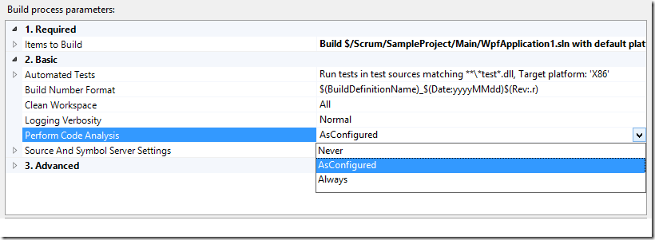
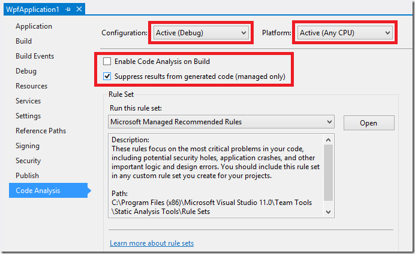
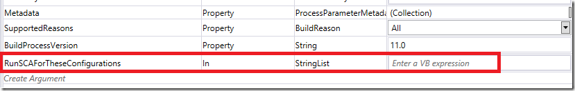
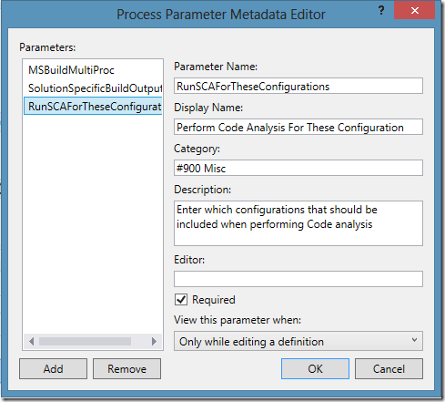
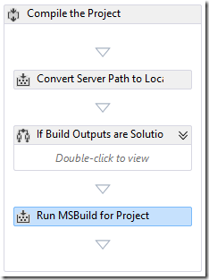
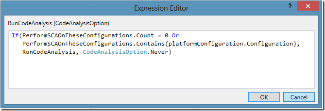
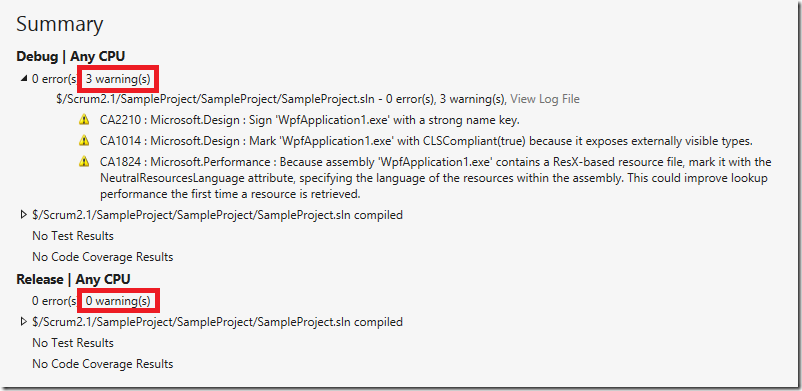

\
Running Static Code Analysis (SCA) is something that you should be doing regularly to verify your code base against a large set of rules that will check your code for potential problems and how it comply with standard patterns such as naming conventions for example. Microsoft include several different rule sets that you can use for starters, but you can build your own rule sets as well, that contain the rule that you want to use, In addition, you can write your own custom rules and add these to your rule sets.

What you will notice quickly when you start running SCA for larger solutions is that it can take a lot of time. Therefore, you normally don’t want to run this on your local build but instead run it as part of your automated builds. It is recommended to set up a specific build for your projects that measures code quality, by running for example SCA, Code Metrics and Code Coverage. All these things take time to complete, so don’t put these in your Check-In builds, but in a Quality Assurance (QA) build.

**\
Configuring Static Code Analysis** \
With Team Foundation Build, it is easy to run Static Code Analysis as part of the build, just modify the **Perform Code Analysis** process parameter in your build definition:

There are three possible values that you can use here:

- **Never** – Never run Static Code Analysis
- **As Configured** – If the project is configured to run Static Code Analysis for the current configuration, then SCA will be executed
- **Always** – Always run Static Code Analysis, independent of how the projects are configured

If you select As Configured, you need to make sure that you have configured your projects correctly. This is done by opening the Properties window for your project and select the Code Analysis tab:

As you can see, the Code Analysis settings are specific to the Configuration and Platform for the project. This means that you can, for example, run code analysis only on Debug builds and not on Release builds.

Now, while using project specific settings like this to control when SCA is executed works, it has some drawbacks. When the solutions start to grow in size, it can be hard to make sure that the settings in every project is correctly configured. Also, as mentioned before, you typically don’t want to run SCA at all on your local builds, since it makes your build times longer. This can be solved by for example making sure that only the Release configuration has the Enable Code Analysis on Build property set to true, and then you only build the Debug configuration locally.

A better way to solve this is to control this completely from the build definition instead. You do this by setting the **Perform Code Analysis** process parameter to Always, as shown above. This will make sure that SCA are run for all projects, no matter how they are configured.

 **Running SCA for specific configurations**

A problem that we faced recently at a customer that are running big builds (1+ hours) is that they are building both the and Debug and Release configurations as part of their builds. We wanted to run SCA on these builds, and we don’t want to configure each project (the solutions has 150+ projects in it). But, setting Perform Code Analysis to Always, this will result in SCA being run for **both** Debug and Release builds resulting in a considerable increase in build time.

So, how can we make sure that SCA is executed on all projects, but only on on (or several) configurations? One way of doing this is to customize your build template and add a parameter that specifies these configurations.

Here are the steps to accomplish this:

1. If creating a new build template from scratch, branch the DefaultTemplate.11.1.xaml build process template. \
2. Open the template in Visual Studio \
3. Select the top Sequence activity and expand the Arguments tab \
4. At the bottom of the list, add a new parameter called *RunSCAForTheseConfigurations* with *StringList* as type \
      \
5. Locate the MetaData process parameter and click on the browse button on the very right \
6. Add a new entry for the new parameter \
    \
7. Inside the workflow, locate the MSBuild activity that is used for compiling the projects. It is right at the end of the C**ompile the Project** sequence: \
    \
8. Right-click the MSBuild activity and select Properties \
9. Locate the **RunCodeAnalysis** property and open the expression editor \
10. Enter the following expression \
      \
    The expression evaluates if the current configuration (*platformConfiguration.Configuration*) is specified in our new property.

    
11. Save the workflow and check it in

Now you can create a new build definition and enter one or more configurations in the new property:

Since this is a property of type StringList, you can add multiple configurations here if you want to.

You can see from this build summary that SCA has only been performed on the Debug configuration, and not for Release.

 **Conclusion**

I have shown one way to implement automatically running Static Code Analysis on a subset of configurations for a build that builds multiple solutions. This is very useful when you have large builds that compile multiple configurations.

Hope you found this post useful.

---

## Comments

*Imported from the original WordPress site. Closed for new replies.*

> **Jeremy Thake** — 01 Feb 2013
>
> Originally posted on: <http://geekswithblogs.net/jakob/archive/2013/01/20/tfs-build-running-static-code-analysis-for-specific-configuration.aspx#624628>
>
> Thanks for the post...but what you don't mention is that a vanilla install of TFS2012 won't even run Static Code Analysis and that you require to install either Visual Studio 2012 Premium or Ultimate on the build server. Is there a way around this?

> **Jakob Ehn** — 02 Feb 2013
>
> Originally posted on: <http://geekswithblogs.net/jakob/archive/2013/01/20/tfs-build-running-static-code-analysis-for-specific-configuration.aspx#624631>
>
> @Jeremy: No, you need to install Visual Studio in order to run Static Code Analysis on the build server. However, in VS 2012, the Professional edition should be enough. See the feature chart here:\
> http://www.microsoft.com/visualstudio/eng/products/compare

> **Anna Holland** — 04 Mar 2013
>
> Originally posted on: <http://geekswithblogs.net/jakob/archive/2013/01/20/tfs-build-running-static-code-analysis-for-specific-configuration.aspx#625703>
>
> Hi Jakob, \
> \
> You have great blog content and found it via Twitter. My name is Anna, and I am a Marketing Coordinator at Syncfusion. I am reaching out to see if you would blog about one of our free e-books, collectively known as the Succinctly series. It is a great way to add value to your personal website. For more information please contact me at annah@syncfusion.com. I look forward to hearing from you!
