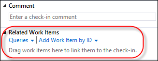
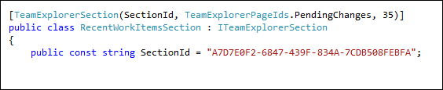
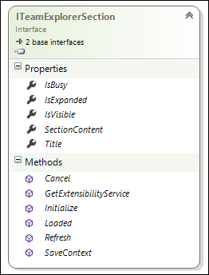
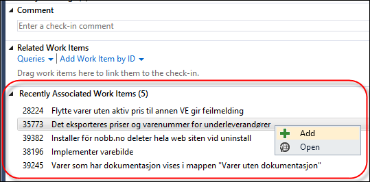

**Extension available at:** [http://visualstudiogallery.msdn.microsoft.com/9ed2d30c-a692-42b0-a21d-cdc8d2bf322c](http://visualstudiogallery.msdn.microsoft.com/9ed2d30c-a692-42b0-a21d-cdc8d2bf322c "http://visualstudiogallery.msdn.microsoft.com/9ed2d30c-a692-42b0-a21d-cdc8d2bf322c")

I have been playing around a bit lately with extending Team Explorer 2012, mostly because it is fun but also to fix a little nagging feature that should have been there from the beginning. Often I (and a lot of other people) find myself wanting to associate several consecutive changesets to the same work item. The problem is that Team Explorer does not remember this, instead I have to either remember the ID or use a query that hopefully will match the work item.

**Where is the work item that I just associated with?** \
  \
True, when using the My Work page and the teams and sprint backlogs are correctly setup, you can find “your” work items there, but every so often this is not the case, and off I go to locate that work item again.

So this seemed to be a good feature to implement and at the same time learn a little about how to extend Team Explorer in Visual Studio 2012.

There is a great sample posted by Microsoft over at MSDN, it also talks about the main extension points and classes/interfaces that you need to know about. You can find it here: [http://code.msdn.microsoft.com/windowsdesktop/Extending-Explorer-in-9dccd594](http://code.msdn.microsoft.com/windowsdesktop/Extending-Explorer-in-9dccd594 "http://code.msdn.microsoft.com/windowsdesktop/Extending-Explorer-in-9dccd594"). If you have developed extensions to Visual Studio before, you will be relieved to know that this new extension model for Team Explorer is purely based on standard .NET/WPF and MEF, no weird COM interfaces.

You can add new pages to Team Explorer, you can add new sections to existing pages and you can add navigation links to the Home screen. All these extensions are discovered by Team Explorer using the Managed Extensibility Framework (MEF). You just need to attribute your classes with the correct attribute and it will be found by Team Explorer. The attributes also control where your extension will appear. This extension is a Section that should appear inside the Pending Changes page:

**Example of attributing a Team Explorer extension**

The last property (35) is a priority number that controls when the extension is created and also where it will placed relative to the other sections. The existing Related Work Items section has priority 30, so 35 will place our extension right below it.

We also need to implement the [ITeamExplorerSection](http://msdn.microsoft.com/en-us/library/microsoft.teamfoundation.controls.iteamexplorersection.aspx) interface, that contains properties and methods that needs to be implemented for anything to show up.

**ITeamExplorerSection interface**

The most interesting property here  is the **SectionContent** property which is where you return the content of your extensions. This is typically a WPF user control in which you can add any controls you like.

This is how the extension appear inside the Pending Changes page. It will analyze your recent changesets in the current team project and extract the last 5 associated work items and show them in a list. \
From the list you can then easily add a work item to the current pending changes by right-clicking on it and select Add. You’ll note that the work item will then disappear from the list, since you are not likely interested in adding it again.

**Recently Associated Work Item section**

I encourage you to read the MSDN article for more information about the possibilities to extend Team Explorer 2012. Also, try out the extension and let me know it you find it useful!

---

## Comments

*Imported from the original WordPress site. Closed for new replies.*

> **Ben Barreth** — 16 May 2013
>
> Originally posted on: <http://geekswithblogs.net/jakob/archive/2013/05/16/extending-team-explorer-2012-ndash-associating-recent-work-items.aspx#628741>
>
> Awesome post Jakob. The more people that mess around with customizing their TFS environment, the better, in my humble opinion. Too many times it's considered a black box that teams don't know how to fully customize to meet their needs.

> **Jakob Ehn** — 17 May 2013
>
> Originally posted on: <http://geekswithblogs.net/jakob/archive/2013/05/16/extending-team-explorer-2012-ndash-associating-recent-work-items.aspx#628754>
>
> Thanks Ben, glad you liked it

> **Eduardo Elias Saleh** — 23 Jul 2014
>
> Originally posted on: <http://geekswithblogs.net/jakob/archive/2013/05/16/extending-team-explorer-2012-ndash-associating-recent-work-items.aspx#638998>
>
> Awesome extension and post ... Very instructive ... I was wandering if you can share the extension's source code, as a didatic example.\
> \
> Thanks, in advance! :D

> **Jakob Ehn** — 18 Nov 2014
>
> Originally posted on: <http://geekswithblogs.net/jakob/archive/2013/05/16/extending-team-explorer-2012-ndash-associating-recent-work-items.aspx#641460>
>
> @Eduardo: I plan to extend this functionality to support Git as well very soon, when I do that I'll post the source to CodePlex/Github

> **Eduardo Elias Saleh** — 16 Jun 2015
>
> Originally posted on: <http://geekswithblogs.net/jakob/archive/2013/05/16/extending-team-explorer-2012-ndash-associating-recent-work-items.aspx#644797>
>
> So, when you do release it, could you please link it here? Thanks in advance and, again, congrats ... this IS a very nice tool.

> **Don Wilcox** — 24 Aug 2015
>
> Originally posted on: <http://geekswithblogs.net/jakob/archive/2013/05/16/extending-team-explorer-2012-ndash-associating-recent-work-items.aspx#645929>
>
> There seems to be a bug in displaying the highlight, at least with the dark theme in VS 2015.\
> \
> Other than that, thanks so much for the extension.
