As you probably already know, Microsoft [recently acquired InRelease](http://blogs.msdn.com/b/bharry/archive/2013/07/10/inrelease-acquisition-is-complete.aspx), a release management product build by InCycle software that integrates tightly with Team Foundation Server. This acquisition fills a huge gap in the Visual Studio ALM suite, letting customers handle the release management and automatic deployment of their solution. This is a crucial feature for enabling Continuous Deployment.

In this post I will show you how to get started with using InRelease, by installing it and setting up your first release including automatic deployment to a staging server. I expect to blog some more about InRelease in the near future, looking at the nitty gritty details of release automation and deployment using InRelease.

**Note:** Both TFS 2013 and this edition of InRelease are still in preview and details can change in time for the RTM version.

## InRelease Overview

A deployment of InRelease typically looks like this:

[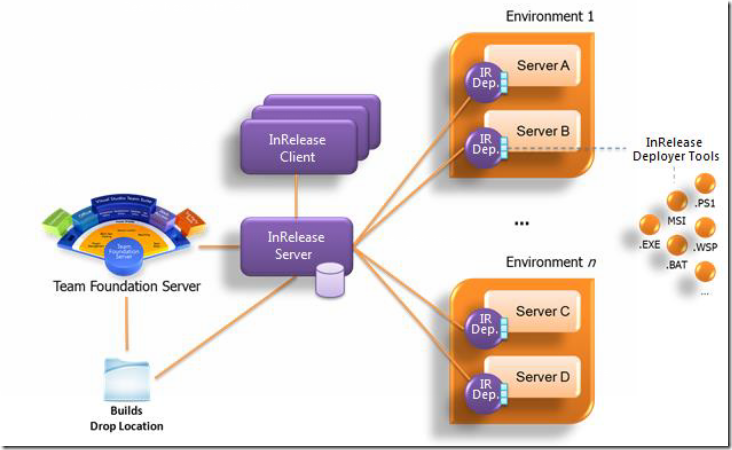](https://gwb.blob.core.windows.net/jakob/Windows-Live-Writer/9a505baeb3d9_C9AF/image_14.png)

So we have three main components here:

- **InRelease Server \**The server consists of both a windows and a web service that the deployers and clients communicates with (using HTTP/HTTPS).  \
- **InRelease Deployer \**The Deployer is a windows service that is installed on each target server where you want to deploy your applications. Like Visual Studio Lab Management, you can define environments that consist of several servers (physical or virtual). But each servers needs to have a deployer agent installed to be able to carry out the actual deployment. \
- **InRelease Client** \
  There are in fact two clients. There is a WPF application that is the main interface for managing all release information. In addition there is a web application where users can act on approval requests, that is sent out using email. \

## InRelease Concepts

There are several concepts in InRelease that you need to understand in order to fully utilize it. These concepts are related to each other as well, and it can be a bit tricky in the beginning to understand how they relate to each other.

- **Stage Type** \
  This corresponds to a set of logical steps that are required to move your application build from development all the way to production. Typically you will have stages for Development, QA, User Acceptance Test, Production etc. \
- **Technology Type** \
  These are basically tags that allow you to specify what kind of technologies that are used on your target servers and environments. These tags are used by InRelease for anything, they are merely informational values. \
- **Environment** \
  As mentioned above, an environment consist of one or more servers.   \
- **Server** \
  In order to deploy your application, you need to register your target servers in InRelease. Add the servers using the DNS name and InRelease will register the IP address of the server that first time the Deployer agent on that machine communicates with the Server. \
- **Release Path** \
  A Release Path is how you distribute a release in a certain scenario. Even though you will often use the same release path every time for your application, you might for example define one release path for major releases and another release path for minor/hotfix releases, since these might have different pre- or post validation steps. \
- **Release Template** \
  A Release Template is the workflow that is used for releasing an application. Users that are familiar with TFS Build will find themselves at home here, since InRelease also uses Windows Workflow for create the deployment orchestration, by using a sequence predefined Workflow Activities. \
- **Release \**Defines a specific release of an application or system. A release is defined by associating it with a *Release Template*, a *Stage Type* and a *Build*. You want to use TFS Build here and associate the Release Template with a corresponding TFS Build, but it is also possible to use a UNC path as the source of deployment items, in case you for example use Team City as your build automation tool. \
- **Tool** \
  Represents an executable piece of code, for example a PowerShell or a batch file, or an executable. The only real important thing here is that it is possible to execute the tool silently from command line. A tool is always used by either an Action or a Component \
- **Action** \
  An object in InRelease that can be used in a deployment sequence. Often this is a tool with the corresponding command and parameters, such as MSI Deployer or Windows Process. \
- **Component** \
  Part of an application that needs to be installed. For example a database, web site or  a windows service. A component has a source, which often is fetched from the TFS Build drop folder

## Installing InRelease

The installation procedure is pretty straight forward except some minor issues that should be improved by RTM. [Martin Hinshelwood](http://nakedalm.com/) has posted some of these issues [here](http://nakedalm.com/issue-tfs-2013-inrelease-you-get-tf400324-when-connecting-inrelease-to-tfs/),  [here](http://nakedalm.com/issue-tfs-2013-you-need-elevated-privileges-to-install-inrelease/) and [here](http://us6.campaign-archive.com/?u=8f1debed5aa20a5cfafd20918&id=b27b9998dd).

The InRelease Server uses SQL Server to store all its information, this can be basically any version, and can be hosted remotely. In addition, the InRelease server has the following prerequirements, so make sure that you install/enabled these features before:

[![image_thumb[9]](image_thumb5B95D_thumb.png "image_thumb[9]")](https://gwb.blob.core.windows.net/jakob/Windows-Live-Writer/9a505baeb3d9_C9AF/image_thumb%5B9%5D_2.png)

**Note** that it is possible to run on IIS 6 as well, check the installation manual

After you have installed everything, you first need to add users. Start the InRelease Client and go to Administration –> Users: \

[![SNAGHTML1f1578f9_thumb[1]](SNAGHTML1f1578f9_thumb5B15D_thumb.png "SNAGHTML1f1578f9_thumb[1]")](https://gwb.blob.core.windows.net/jakob/Windows-Live-Writer/9a505baeb3d9_C9AF/SNAGHTML1f1578f9_thumb%5B1%5D_2.png)

Select the windows account by browsing your AD directory. This will automatically fill out the name and email address for you, as long as this information is available in AD. \
Also mark if the user is a Release Manager and/or a Service User. Release Managers have access to everything, and Service Users are used for deployer accounts and TFS build service account. \
These users won’t show up in any lists where you select users.

[![SNAGHTML1f1915f3_thumb[1]](SNAGHTML1f1915f3_thumb5B15D_thumb.png "SNAGHTML1f1915f3_thumb[1]")](https://gwb.blob.core.windows.net/jakob/Windows-Live-Writer/9a505baeb3d9_C9AF/SNAGHTML1f1915f3_thumb%5B1%5D_2.png)

Next up, you need to register the connection to TFS. Enter the name of your TFS server, and the credentials that should be used for accessing it. \

[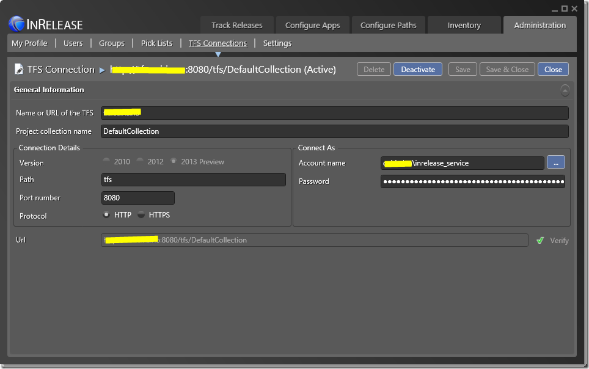](https://gwb.blob.core.windows.net/jakob/Windows-Live-Writer/9a505baeb3d9_C9AF/SNAGHTML2013a2ad.png)

Verify that the TFS connection works properly, after this you should be good to go and start creating releases!

## Creating and deploying a Release

Lest walk through how to get started quickly, by creating a new release and deployment sequence for an application. In this case, I am reusing our existing release build for this application, but will manage and deploy it using InRelease. This build already produces an MSI (using Wix) so we will use an existing InRelease tool called MSI Deployer, that is capable of executing a MSI with custom parameters as part of the deployment.

These are the steps that we will walk through:

1. Define the Stage Types
2. Create an Environment for the test server
3. Register the test server
4. Create a Release Path for our release
5. Setup a component that installs our MSI
6. Create a Release Template that uses the component
7. Create a Release

### Define the Stage Types

We will setup to stage types here, one for Test and one for Production. Go to Administration –> Pick List and select Stage Types. Create two Stage Types, called Test and Production:

[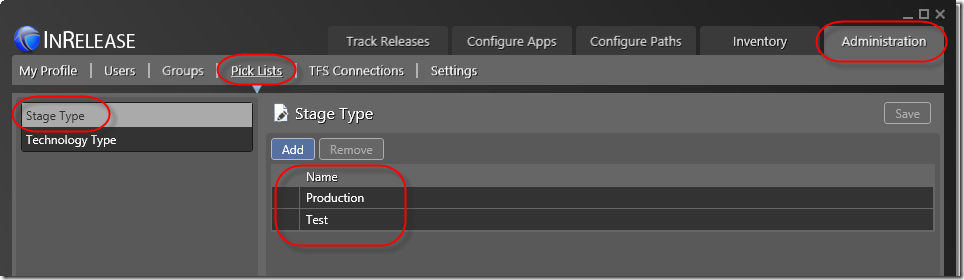](https://gwb.blob.core.windows.net/jakob/Windows-Live-Writer/9a505baeb3d9_C9AF/SNAGHTML1f7a177b.png)

### Define the staging server in InRelease

Now we will register our existing test server used for staging the application. This is the server where we have installed the InRelease Deployer agent, which is used for running the deployment sequence on that machine. Note that a release can of course reference many servers, and each server has its own steps in the deployment sequence.

[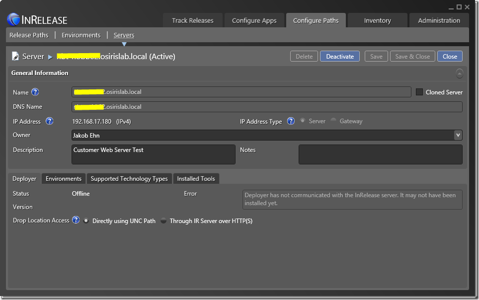](https://gwb.blob.core.windows.net/jakob/Windows-Live-Writer/9a505baeb3d9_C9AF/SNAGHTML1f86c797.png)

Here I have registered the customer test server, running on our lab network. I have assigned myself as the owner of this server, and added a short description. In addition I have used the default option of how the InRelease Deployer should access the build drop location, namely directly through the UNC path. If this is a problem, which it can be due to security restrictions, you can use the other option in which the InRelease Server accesses the drop location and the InRelease Deployer agents gets the files from the IR Server using HTTP(S). This is slower, especially if you have large files.

Note the error that is shown. This means that the InRelease Deployer on the server have not yet communicated with the server. As soon as it does, the error will disappear and the IP Address will be filled out.

### Create an Environment for the test servers

We also need to create environments for each stage type. In this case, each environment will only consist of one server, but often you will have several servers, such as web servers, database server, application servers and so on.

[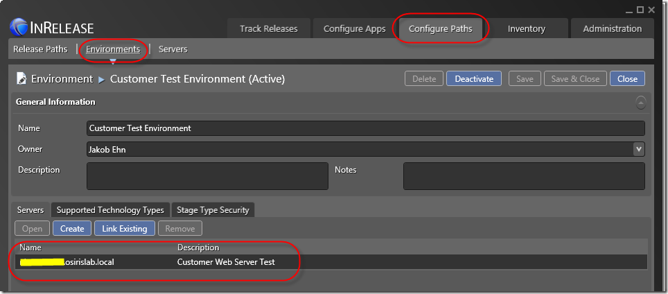](https://gwb.blob.core.windows.net/jakob/Windows-Live-Writer/9a505baeb3d9_C9AF/SNAGHTML1fe9abd0.png)

Here I have created a Test environment that includes the test server. I will also create a Production environment for the production server(s).

### Create a Release Path for our release

Now lets define how the release should flow through the different stages. We will define how each stage should be handled, if the deployment is automatic or not, and if the different steps should be validated and approved by someone.

[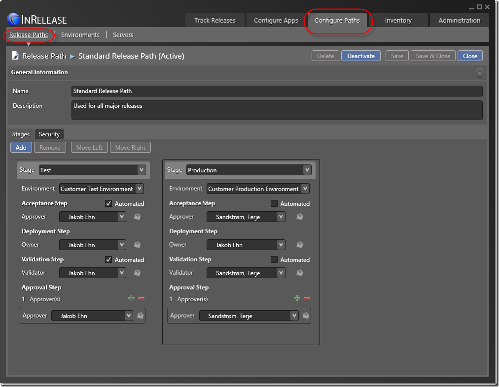](https://gwb.blob.core.windows.net/jakob/Windows-Live-Writer/9a505baeb3d9_C9AF/SNAGHTML1f92e323.png)

As you can see I have added both stages here, but the different steps are a bit different for each step. On the test server I want to automate the acceptance and validation step, and I will approve the deployment afterwards myself. In the production environment, the release first have to be accepted (by my colleague [Terje](http://geekswithblogs.net/terje/Default.aspx) in this case 🙂 ) before the deployment proceeds. Also, Terje will be validating and approving the release in the production environment. \

### Setup a component that installs our MSI

Before create the release template, we need to create a component that will install our MSI. As mentioned before, components can be reused in multiple release template, by using arguments. So first we give the component a name and then point to where the package that belongs this component can be retrieved:

[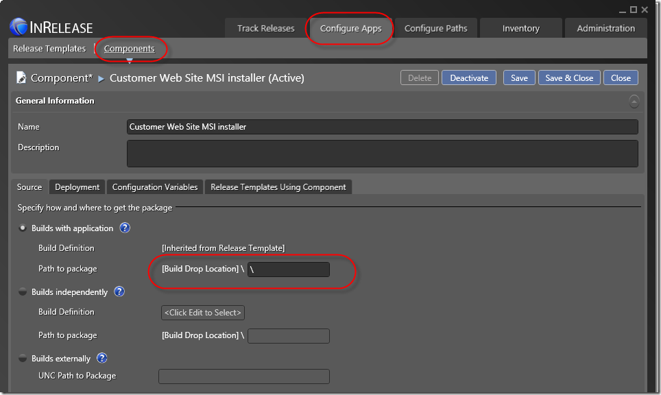](https://gwb.blob.core.windows.net/jakob/Windows-Live-Writer/9a505baeb3d9_C9AF/SNAGHTML1fa8b012.png)

In my case, all the MSI’s from the TFS build is located at the drop folder root. In this case, I must add a ‘’ in the Build Drop Location to have InRelease understand that.

Note the the build definition will be defined in the Release Template. We could also choose to select an independent build, basically any build that has already been executed. We could also point to a UNC share, which would allow us to use InRelease without TFS Build, for example is you use TeamCity.

Next we select the Deployment tab, in which we specify how this component is actually installed. Here we can select from a list of predefined tools, in this case we select the MSI Deployer tool. Each tool has its own set of commands, arguments and parameters. A sample argument will be created when selecting the tool, so all you need to do is to change the parameter values to match your packages.

[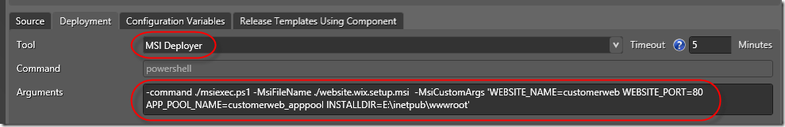](https://gwb.blob.core.windows.net/jakob/Windows-Live-Writer/9a505baeb3d9_C9AF/image_19.png)

The MSI Deployer tool, like many other InRelease tools, uses Powershell as implementation. \
Here I have referenced my installer and added the specific MSI argument that is needed in order to deploy it on the test server, such as web site name, port, app pool and install directory.

### Create a Release Template that uses the component

Now lets create a Release Template that utilizes this component. Go to Configure Apps –> Release Template and create a new template. Fill out a name and description, and select the Release Path that we just created. Also, we can select which build definition that belongs to this release template. This is where the component will fetch its packages from, and it also allows us to later on automatically trigger a release from a build, as I will show in a later post.

[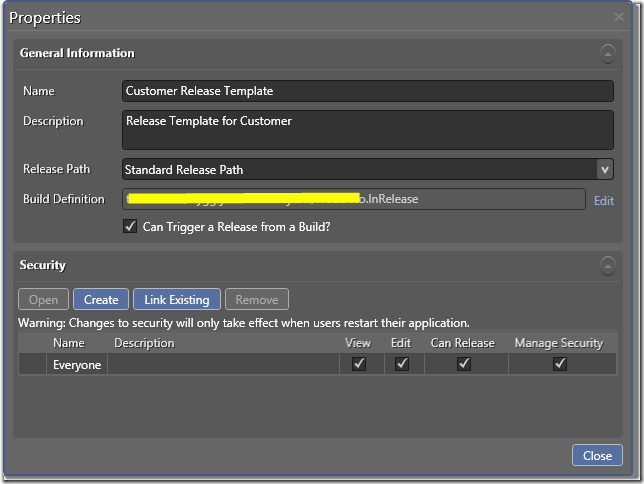](https://gwb.blob.core.windows.net/jakob/Windows-Live-Writer/9a505baeb3d9_C9AF/SNAGHTML1fb789be.png)

Next up we define the Deployment sequence for each stage of the corresponding Release Path, which in our case is Test and Production. You will that in addition to the existing predefined tools the servers and components that you have defined show up in the toolbox.

[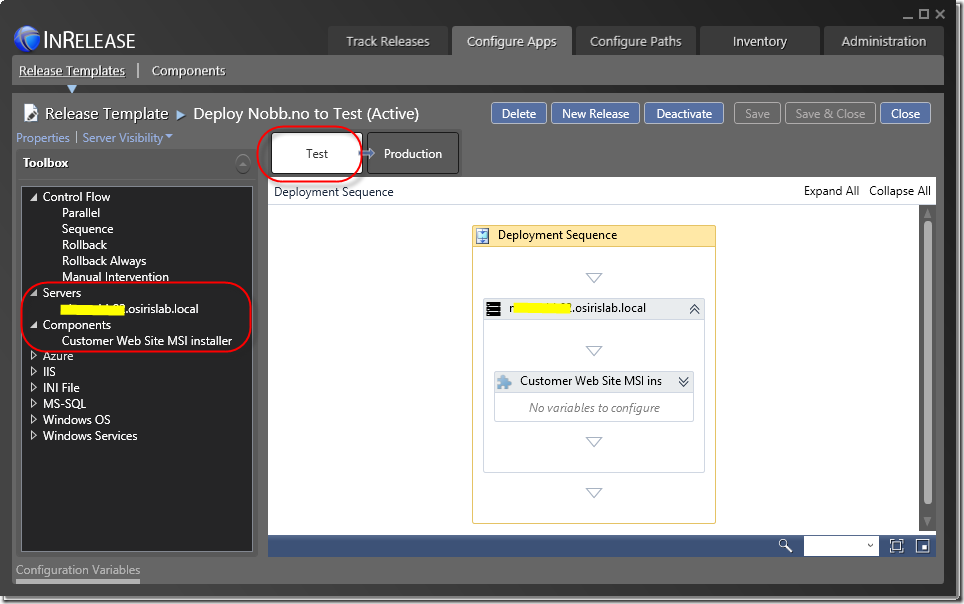](https://gwb.blob.core.windows.net/jakob/Windows-Live-Writer/9a505baeb3d9_C9AF/SNAGHTML1fbae7f4.png)

Here I have first dragged the server onto the workflow surface, and then added the Customer Web Site MSI installer inside the Server activity. This signals that the component shall be executed on that server. I could very well have multiple servers here, and tools/components are always placed within a server node.

Of course there are a lot more things that you can do here, there are tools for creating and configuring web sites, SQL databases, Windows Services and starting and stopping Azure VMs. In my case, I already had an MSI from before, so all I need to do here is to make sure that it is executed with the correct parameters.

### Create a Release

Finally, it is time to actually release something 🙂

By selecting the Release Template, we can click on New Release to create a new Release for this release path. Here we select which Target Stage that we should release to, and which build that should be deployed.

[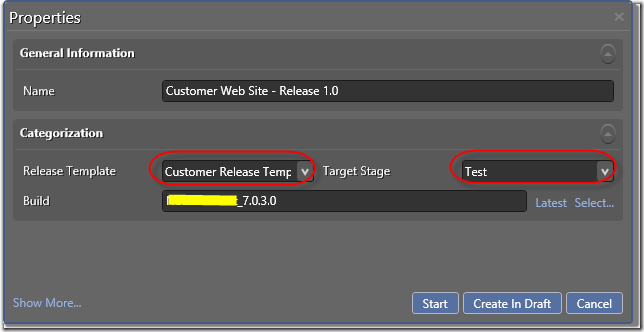](https://gwb.blob.core.windows.net/jakob/Windows-Live-Writer/9a505baeb3d9_C9AF/SNAGHTML1fc62ca2.png)

Here I have clicked on Latest, which automatically finds the latest build for my associated build definition, but it is also possible to select a previous build.

Now I can select Create in Draft which allows me to postpone the release for later, or I can be bold and click in Start immediately.

[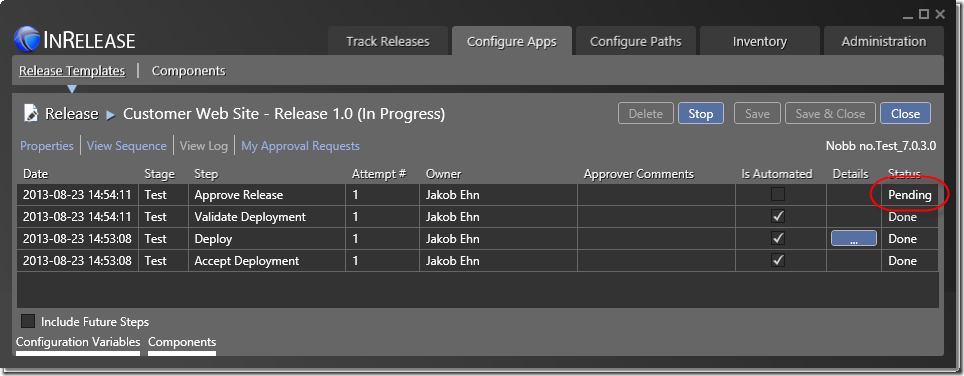](https://gwb.blob.core.windows.net/jakob/Windows-Live-Writer/9a505baeb3d9_C9AF/SNAGHTML1fca5beb.png)

Here we can see that the Release is in progress, and the first three steps are already done. Remember that we set the Accept Deployment step and the Validate Deployment step to automatic for the Test stage. The Deploy step has executed in about 3 seconds, and we can view the log by clicking the button in the Details column.

Finally, the release has stopped in the Approve Release step. This step is manual, and is waiting for me to approve the release. To make this workflow happen, I have received the following email from the InRelease Server:

[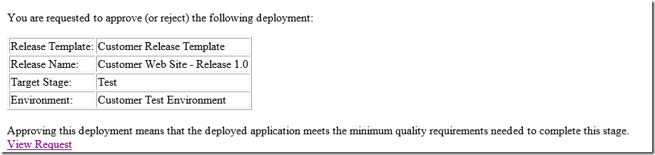](https://gwb.blob.core.windows.net/jakob/Windows-Live-Writer/9a505baeb3d9_C9AF/image_25.png)

After I have surface tested the deployment and verified if it meets the quality gates defined for the release or not, I can click the View Request link which will redirect me to the InRelease web application where I can select to Approve or Reject the release.

# Conclusion

This post has shown how you quickly can get started with InRelease and TFS 2013. As mentioned before, this is still prerelease software, so there are still some know bugs in the software.

---

## Comments

*Imported from the original WordPress site. Closed for new replies.*

> **Mike G** — 23 Aug 2013
>
> Originally posted on: <http://geekswithblogs.net/jakob/archive/2013/08/23/getting-started-with-inrelease-and-tfs-2013-preview.aspx#631535>
>
> I installed and evaluated InRelease a few weeks ago for my company. Its good to see that the installer's prerequirements check is making improvements. I know it was mentioend in the install guide, but it would be nice if the installer itself also checked and verified the prereqs are present.\
> \
> Things that got me:\
> - .NET Framework 4.5 wasn't present\
> - TFS Team Explorer wasn't present\
> \
> Other improvements:\
> - Your install guide said IIS6 Metabase compatibility was needed, but it didn't differentiate on what server(s) it was needed. The InRelease server itself, the agents, etc.?\
> - It would be nice if the installer opened the firewall port which the user selected for the InRelease software.

> **John Hughes** — 20 Oct 2013
>
> Originally posted on: <http://geekswithblogs.net/jakob/archive/2013/08/23/getting-started-with-inrelease-and-tfs-2013-preview.aspx#632840>
>
> It doesn't appear that InRelease is included in the TFS or VS 2013 RTM? Is there any information available on when InRelease wll be available past the preview?

> **lior** — 12 Dec 2013
>
> Originally posted on: <http://geekswithblogs.net/jakob/archive/2013/08/23/getting-started-with-inrelease-and-tfs-2013-preview.aspx#634249>
>
> can i connect it with Ths and GIT ?

> **kimbostan** — 29 Jan 2014
>
> Originally posted on: <http://geekswithblogs.net/jakob/archive/2013/08/23/getting-started-with-inrelease-and-tfs-2013-preview.aspx#635343>
>
> Could you tell me if InRelease is compatible with deploying Microsoft Dynamics AX? (using TFS). Thanks!
