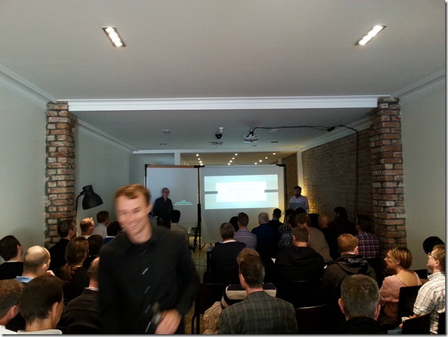

Yesterday, on September 12th, we arranged a Visual Studio Community Day 2013 at [Mesh](http://meshnorway.com) in central Oslo. The agenda was in two parts, first we talked about how you can improve your delivery cadence by using Visual Studio ALM. \
We went through all stages including planning, developing, testing and deployment. In the second part, we showed some of the new goodies in Visual Studio 2013, where we focused mostly on Git and InRelease which are the two major additions in Visual Studio 2013 ALM. Unfortunately we didn’t have the time to go through everything that we wanted, but we have put up links and some more information on our public  GitHub site, at <https://github.com/Inmeta/public/wiki/VS2013-Community-Day>

We had a lot of fun presenting and we got some great feedback during and after the event.

Here is a picture showing me, [Terje Sandstrom](http://geekswithblogs.net/terje) and (in the foreground) [Lars Nilsson](http://larzjoakimnilzzon.blogspot.no/) who hosted the event.

Thanks to Microsoft Norway for arranging this event!
