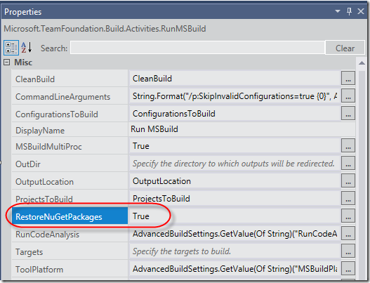

## Problem

One of our customers recently had a problem with NuGet restore when they created a new build template, based on the standard TfvcTemplate.12.xaml template. In TFS 2013, package restore is done automatically by the default build templates.

It is configured as part of the [RunMSBuild](http://msdn.microsoft.com/en-us/library/microsoft.teamfoundation.build.activities.runmsbuild.aspx) activity, where you can enable and disable this by setting the EnableNuGetPackageRestore property:

However, when we were executing the builds we got the following warning in the build log:

***Unable to restore NuGet packages. Details: NuGet.exe was not found in the expected location: C:UsersBuildAppDataLocalTempBuildAgent18Assembliesnuget.exe***

This error puzzled us quite a bit. NuGet.exe is installed as part of TFS Build and is located in the *%ProgramFiles%/Microsoft Team Foundation Server 12.0/Tools* folder. Why was Team Build looking in the build agent custom assembly folder?

It turns out that the reason for this was that the customer had not only checked in the custom activity assemblies in TFVC, they had also checked in all the references TFS assemblies (such as Microsoft.TeamFoundation.Build.Workflow.dll for example). This is not necessary, but had until now never caused any problems. But now, since this assembly was used during the build, it looked in the current path of the assembly for NuGet.exe which resolved to the path from the error message above.

## Solution

After removing all the TFS assemblies from version control NuGet package restore started working again.
