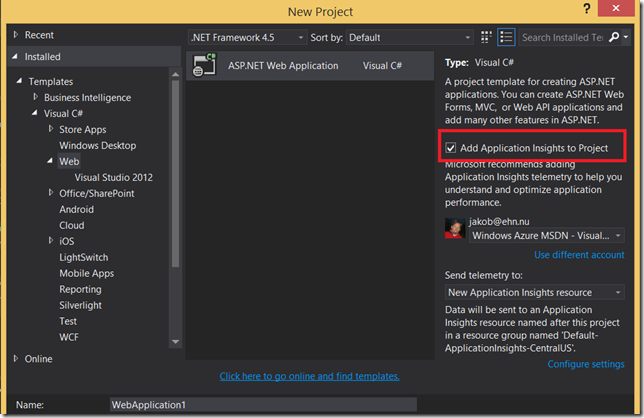
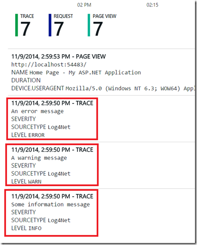
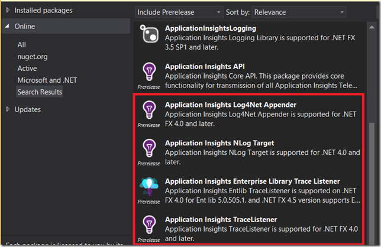

Getting started with Application Insights (AI) in a new or existing application is very easy. From Visual Studio 2013 Update 3 it is even integrated right into the New Web Project dialog:

[](https://gwb.blob.core.windows.net/jakob/WindowsLiveWriter/UsingLog4NetforApplicationInsights_3E6B/image_6.png)

When you select this option, Visual Studio will automatically create a new instrumentation key for you that identifies the web application, and insert the necessary Javascript into your master layout page that takes care of sending usage information to Application Insights. Try running your application, click around a few times, and you will see information showing up in the Azure portal within, literally, a few seconds.

**NB**: you can also perform this operation later on, by select XXXX from the context menu in Solution Explorer.

This will give you a lot of information such as page views, response times, user information like browser version and geographic location. If you want to add custom tracing, you can do this using the [Application Insights Telemtry SDK](https://www.nuget.org/packages/Microsoft.ApplicationInsights.Telemetry.Services/) It exists both for .NET code and JavaScript, so you can add tracing both on the backend and the frontend.

Now, this is very nice for a new project but what if you have an existing application that already contains a lot of code for writing trace and debug information? Perhaps you are using Log4Net or the TraceListener class to emit diagnostic information in some way. Well, the good news is that the nice fellows over at Microsoft thought about this. They have created a set of public NuGet packages that makes it very easy to forward the information that you are logging to Application Insights. This means that you won’t have to rewrite any of the existing code and still have the tracing information show up in the portal.

For example, if you are using Log4Net you can use the [Microsoft.ApplicationInsights.Log4NetAppender](https://www.nuget.org/packages/Microsoft.ApplicationInsights.Log4NetAppender/0.7.0) package that will send the information you log using the Log4Net API to AI. It is implemented as a standard Log4Net Appender class, which makes it very easy to use. Just add the package to the projects that performs logging, and the following information will be added to your configuration file:

```
Code highlighting produced by Actipro CodeHighlighter (freeware)
http://www.CodeHighlighter.com/

<log4net>
  <root>
    <level value="ALL"/>
    <appender-ref ref="aiAppender"/>
  </root>
  <appender name="aiAppender" type="Microsoft.ApplicationInsights.Log4NetAppender.ApplicationInsightsAppender, Microsoft.ApplicationInsights.Log4NetAppender">
    <layout type="log4net.Layout.PatternLayout">
      <conversionPattern value="%message%newline"/>
    </layout>
  </appender>
</log4net>
```

Now, you existing logging Log4Net code..

```javascript
Code highlighting produced by Actipro CodeHighlighter (freeware)
http://www.CodeHighlighter.com/

log4net.Config.XmlConfigurator.Configure();
var logger = log4net.LogManager.GetLogger(this.GetType());

logger.Info("Some information message");
logger.Warn("A warning message");
logger.Error("An error message");
```

Will end up as Trace information in the Azure Portal;

[](https://gwb.blob.core.windows.net/jakob/WindowsLiveWriter/UsingLog4NetforApplicationInsights_3E6B/image_2.png)

Since this is a regular log4net appender, you can apply the standard filters, to include or exclude certain types of information.

Microsoft has also implemented NuGet packages for [NLog](http://nlog-project.org/) and also a [TraceListener](http://msdn.microsoft.com/en-us/library/system.diagnostics.tracelistener(v=vs.110).aspx) class, for use when you do standard .NET tracing. In addition, there are some 3rd party packages that covers other logging frameworks such as [Serilog](http://serilog.net/):

[](https://gwb.blob.core.windows.net/jakob/WindowsLiveWriter/UsingLog4NetforApplicationInsights_3E6B/image4.png)

Happy logging!

---

## Comments

*Imported from the original WordPress site. Closed for new replies.*

> **Philip Hendry** — 07 May 2015
>
> Originally posted on: <http://geekswithblogs.net/jakob/archive/2014/11/09/using-log4net-for-application-insights.aspx#644171>
>
> I've been trying to redirect my log4net to Application Insights but just don't seem to be getting the trace through in much the same way as [others](http://stackoverflow.com/questions/28800320/log4net-with-application-insights#comment48286883_28800320) with the same problem.
>
> \
> \
>
> So I've tried to create a canonical example using an ASP.NET MVC template in VS2013 Update 4. Nothing special, just ticked the box to wire in Application Insights, added NuGet package for the Log4Net appender then added the configuration for the appender to web.config and code to the default controller action both taken from above.
>
> \
> \
>
> I see my requests appearing in the Application Insights portal now - one request and another for the Page View which was logged from the layout page. There is a distinct lack of any Trace information :(
>
> \
> \
>
> Do you have any hints as to why the trace isn't getting through?

> **Philip Hendry** — 07 May 2015
>
> Originally posted on: <http://geekswithblogs.net/jakob/archive/2014/11/09/using-log4net-for-application-insights.aspx#644172>
>
> Ignore my last comment :)\
> \
> I've discovered that installing the PreRelease NuGet package for the log4net appender made everything work as expected!!

> **ashish** — 20 May 2015
>
> Originally posted on: <http://geekswithblogs.net/jakob/archive/2014/11/09/using-log4net-for-application-insights.aspx#644343>
>
> is there anything we must put in "configSections"\
> I'm using log4net "Microsoft.ApplicationInsights.Log4NetAppender 0.7.0\
> " nuget but appender does not found error I got and its not working :( , any inputs?

> **Tom** — 20 Oct 2015
>
> Originally posted on: <http://geekswithblogs.net/jakob/archive/2014/11/09/using-log4net-for-application-insights.aspx#646709>
>
> I just installed Microsoft.ApplicationInsights.Log4NetAppender on my windows console project so I can log log4net logs to ApplicationInsights. I cannot find an instruction on how I can specify the instrumentation key that I want to use with ApplicationInsights. Does anyone know how?\
> \
> I looked at http://jan-v.nl/post/using-application-insights-in-your-log4net-application but it does not seem to help.\
> \
> I also tried the following code to set the instrumentation key via code, but it does not seem to help either. \
> \
>  private static readonly log4net.ILog log = log4net.LogManager.GetLogger(System.Reflection.MethodBase.GetCurrentMethod().DeclaringType);\
>  \
>  static void Main(string[] args)\
>  { \
>  var appenders = log.Logger.Repository.GetAppenders();\
> \
>  foreach(var appender in appenders)\
>  {\
>  if(appender.Name == "aiAppender")\
>  {\
>  ApplicationInsightsAppender appInsightAppender = (ApplicationInsightsAppender)appender;\
>  appInsightAppender.InstrumentationKey = "xxxxxx";\
>  \
>  }\
>  }\
> \
>  log.Error("logging something ");\
>  }\
>  }

> **Pushkar** — 23 Sep 2017
>
> Is there any way to Integrate Application Insight into Azure Service Fabric?

> **Rich** — 20 Jan 2020
>
> In the case of web projects, to be able to specify your Instrumentation Key you should also install the Microsoft.ApplicationInsights.Web package from Nuget and it will create a ApplicationInsights.config file.
>
> Within this config file, you add xxx at the top (under

> **Ningu Walikat** — 27 Sep 2024
>
> Thank you so much, it helped a lot.
