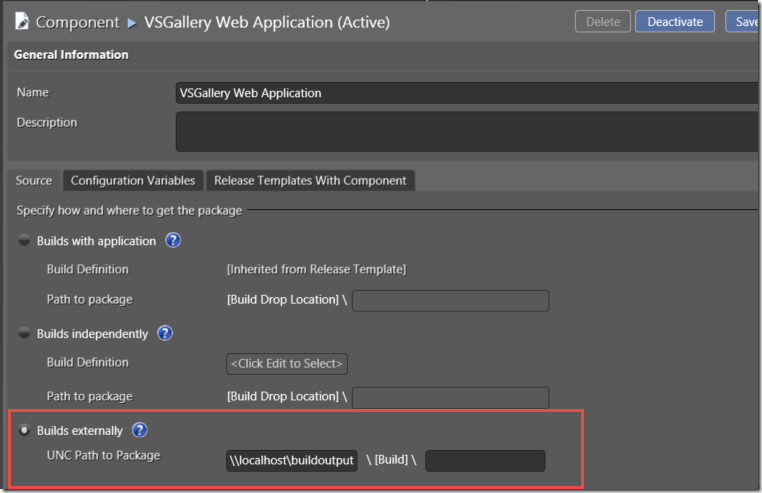
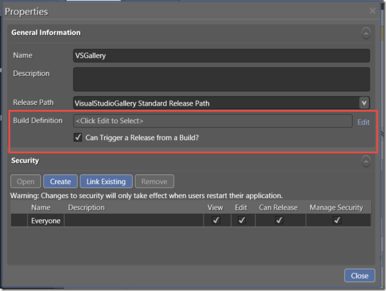
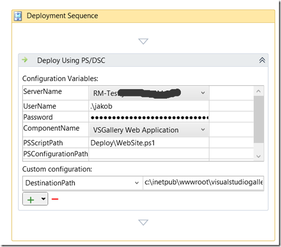
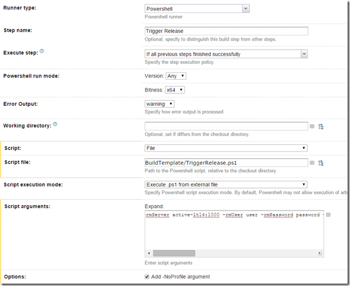
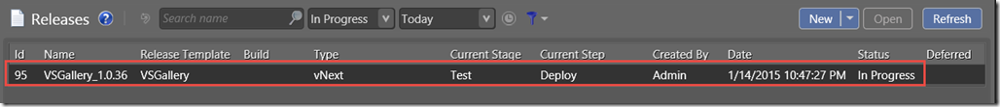

The last couple of updates to Visual Studio has included a lot of new functionality for Visual Studio Release Management. The biggest one is the introduction of so called vNext releases, that leverages Powershell DSC for carrying out the provisioning and deployments of environments and applications.

Also included in Visual Studio 2013 Update 3 was the introduction of a REST API that allows us to both trigger new releases and read back information about them. This API is only available for vNext release templates, and will probably not be implemented for the “old” agentbased deployments.

This REST API opens up a lot of integration possibilities, for example we don’t have to use TFS Build to automatically trigger a release. In this post, I will show how we can use the popular TeamCity build server from JetBrains to trigger a release as part of the build.

First of all, we need to setup a release template in Visual Studio Release Management. I won’t go through all the details here, the most important once is that the components that we define must use the UNC Path as the source parameter:

[](https://gwb.blob.core.windows.net/jakob/WindowsLiveWriter/TriggerVisualStudioReleaseManagementvNex_10DB1/image_4.png)

Here I have specified a shared folder, [\localhostbuildoutput](file://\localhostbuildoutput). Beneath this path, VSRM will look for a folder that typically correspond to a build number that we will pass in using the API, as you will see later on.

Next, we create our release template. To be able to trigger a build using the API, make sure that you tick the “*Can trigger a release from a Build?*” checkbox:

[](https://gwb.blob.core.windows.net/jakob/WindowsLiveWriter/TriggerVisualStudioReleaseManagementvNex_10DB1/image_2.png)

Then we define our deployment sequence, in this case I just have one action for deploying my web site using a PowerShell script:

[](https://gwb.blob.core.windows.net/jakob/WindowsLiveWriter/TriggerVisualStudioReleaseManagementvNex_10DB1/SNAGHTML5c6e9ead.png)

There is nothing really nothing special here, I refere to the DeployWebSite.ps1 which is a PowerShell DSC script that installs my web site. I have also a DestinationPath variable that is referenced in the DSC script and specifies where the web site should be installed on the server.

Now, to trigger a release of this release template we are going to use a PowerShell script, that we can execute using TeamCity. I have used a sample from Microsoft and modified it to use parameters.

Here is the full script:

```powershell
Code highlighting produced by Actipro CodeHighlighter (freeware)
http://www.CodeHighlighter.com/

param(
    [string]$rmServer,
    [string]$rmUser,
    [string]$rmPassword,
    [string]$rmDomain,
    [string]$releaseDefinition,
    [string]$deploymentPropertyBag
    )

$deploymentPropertyBag =
$propertyBag = [System.Uri]::EscapeDataString($deploymentPropertyBag)
$exitCode = 0

trap
{
  $e = $error[0].Exception
  $e.Message
  $e.StackTrace
  if ($exitCode -eq 0) { $exitCode = 1 }
}

$scriptName = $MyInvocation.MyCommand.Name
$scriptPath = Split-Path -Parent (Get-Variable MyInvocation -Scope Script).Value.MyCommand.Path

Push-Location $scriptPath

$orchestratorService = "http://$rmServer/account/releaseManagementService/_apis/releaseManagement/OrchestratorService"

$status = @{
    "2" = "InProgress";
    "3" = "Released";
    "4" = "Stopped";
    "5" = "Rejected";
    "6" = "Abandoned";
}

#For Update3 use api-version=2.0 for Update4 use api-version=3.0.
$uri = "$orchestratorService/InitiateRelease?releaseTemplateName=" + $releaseDefinition + "&deploymentPropertyBag=" + $propertyBag + "&api-version=3.0"

$wc = New-Object System.Net.WebClient
#$wc.UseDefaultCredentials = $true
# rmuser should be part rm users list and he should have permission to trigger the release.
$wc.Credentials = new-object System.Net.NetworkCredential("$rmUser", "$rmPassword", "$rmDomain")

try
{
    $releaseId = $wc.UploadString($uri,"")
    $url = "$orchestratorService/ReleaseStatus?releaseId=$releaseId"
    $releaseStatus = $wc.DownloadString($url)

    Write-Host -NoNewline "`nReleasing ..."

    while($status[$releaseStatus] -eq "InProgress")
    {
        Start-Sleep -s 5
        $releaseStatus = $wc.DownloadString($url)
        Write-Host -NoNewline "."
    }

    " done.`n`nRelease completed with {0} status." -f $status[$releaseStatus]
}
catch [System.Exception]
{
    if ($exitCode -eq 0) { $exitCode = 1 }
    Write-Host "`n$_`n" -ForegroundColor Red
}

if ($exitCode -eq 0)
{
  "`nThe script completed successfully.`n"
}
else
{
  $err = "Exiting with error: " + $exitCode + "`n"
  Write-Host $err -ForegroundColor Red
}

Pop-Location

exit $exitCode
```

Basically, this script calls the following REST API endpoint:

<http://RMSERVER/account/releaseManagementService/_apis/releaseManagement/OrchestratorService/InitiateRelease?releaseTemplateName=RELEASEDEFINITION&deploymentPropertyBag=PROPERTYBAG&api-version=3.0>

This REST endpoint returns a release id, which we can use to read the status of the release. The script loops until the status is not “In Progress” and the quits and returns an exit code depending on how the release went.

The parameters of the above endpoint are:

- **RMSERVER**
  The URL including port to the release management server, typically somthing like *contoso.com:1000*  \
- **RELEASEDEFINITION**
  The name of the release template that we want to trigger.
- **PROPERTYBAG**
  Now this one is a bit special. This is an array of key/value which is not yet documented but it typically looks like this:

```json
Code highlighting produced by Actipro CodeHighlighter (freeware)
http://www.CodeHighlighter.com/

{
    "Component1:Build" : "Component1Build_20140814.1",
    "Component2:Build" : "Component2Build_20140815.1",
    "ReleaseName" : "$releaseName"
}
```

The first two lines references two different components in RM. Here I have just called them Component1 and Component2. The :Build is a keyword and must be there. The value part is the build number, which RM will append to the UNC path that we defined earlier. Note that we can use different build numbers per component here if we want to.
The last line is a predefined keyword that allows us to specify the name of the release, something that we actually can’t do using the RM client or the standard RM TFS Build release template so this is a nice feature.

So, to execute this script in TeamCity, add the above script to repository and then add a PowerShell build step at the end of your build in TeamCity that looks something like this:

[](https://gwb.blob.core.windows.net/jakob/WindowsLiveWriter/TriggerVisualStudioReleaseManagementvNex_10DB1/image_8.png)

The Script Arguments property is the tricky part, since we have to escape the quotes for the propertyBag parameter, and we will also use the %env:BUILD_NUMBER% variable from TeamCity for the build number. Here is the full string as an example:
**-rmServer SERVER:1000 -rmUser USER -rmPassword PASSWORD -rmDomain DOMAIN -releaseDefinition VSGallery -deploymentPropertyBag "{"VSGallery Web Application:Build" : "%env.BUILD_NUMBER%","ReleaseName" : "%env.BUILD_NUMBER%"}"**

Running this build in TeamCity will now trigger a release in Release Management:

[](https://gwb.blob.core.windows.net/jakob/WindowsLiveWriter/TriggerVisualStudioReleaseManagementvNex_10DB1/image_10.png)

---

## Comments

*Imported from the original WordPress site. Closed for new replies.*

> **Daniel Carlstedt** — 17 Feb 2015
>
> Originally posted on: <http://geekswithblogs.net/jakob/archive/2015/01/14/trigger-visual-studio-release-management-vnext-from-teamcity.aspx#643000>
>
> Great Post. I would love to use these REST API's to initiate my vNext release but can't seem to find any documentation on them. Do you happen to know if/where the documentation is located?

> **adwait pathak** — 17 Feb 2015
>
> Originally posted on: <http://geekswithblogs.net/jakob/archive/2015/01/14/trigger-visual-studio-release-management-vnext-from-teamcity.aspx#643005>
>
> Hi, i get error : 500, internal server error.\
> can you please give some example how do you pass arguments:\
> eg -rmServer ServerName - rmUser domainusername -rmpassword Password -releaseDefinition vNextTemplateName

> **Jakob Ehn** — 17 Feb 2015
>
> Originally posted on: <http://geekswithblogs.net/jakob/archive/2015/01/14/trigger-visual-studio-release-management-vnext-from-teamcity.aspx#643006>
>
> @Daniel: Unfortunately at the moment the API is not documented at all. Eventually they will appear here:\
> http://www.visualstudio.com/en-us/integrate/api/overview\

> **Jakob Ehn** — 17 Feb 2015
>
> Originally posted on: <http://geekswithblogs.net/jakob/archive/2015/01/14/trigger-visual-studio-release-management-vnext-from-teamcity.aspx#643007>
>
> @adwait: There is an example in the post above:\
> \
> -rmServer SERVER:1000 -rmUser USER -rmPassword PASSWORD -rmDomain DOMAIN -releaseDefinition VSGallery -deploymentPropertyBag "{"VSGallery Web Application:Build" : "%env.BUILD_NUMBER%","ReleaseName" : "%env.BUILD_NUMBER%"}"\
> \
> Make sure that you have the quotes correct

> **Simon Reindl** — 01 Jul 2015
>
> Originally posted on: <http://geekswithblogs.net/jakob/archive/2015/01/14/trigger-visual-studio-release-management-vnext-from-teamcity.aspx#645089>
>
> Thanks Jakob, the API documentation is now opened up.\
> Great example.
