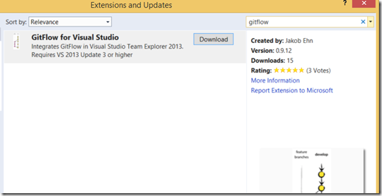
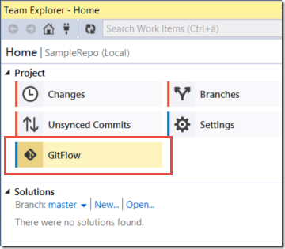
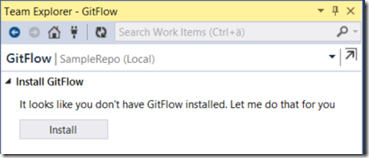
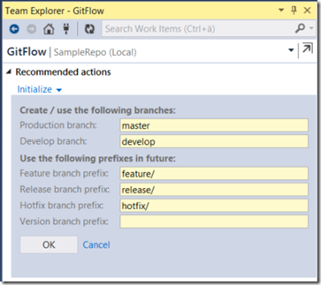
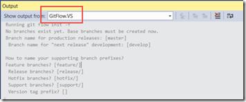
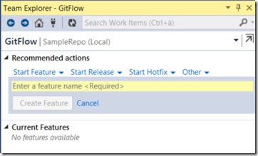
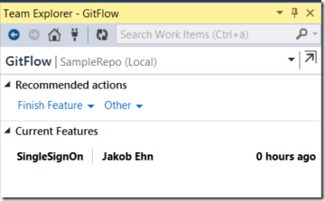
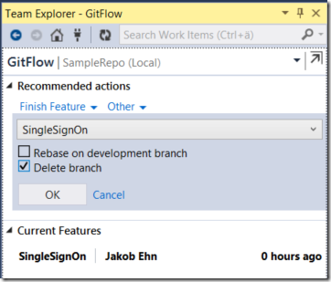
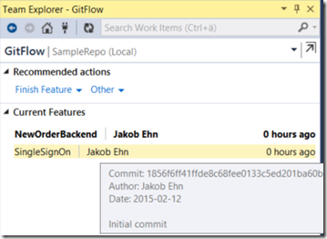
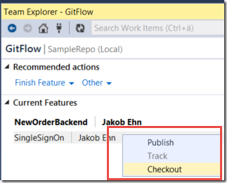

**Update**: The exension is now also available for Visual Studio 2015 Preview: [https://visualstudiogallery.msdn.microsoft.com/f5ae0a1d-005f-4a09-a19c-3f46ff30400a](https://visualstudiogallery.msdn.microsoft.com/f5ae0a1d-005f-4a09-a19c-3f46ff30400a "https://visualstudiogallery.msdn.microsoft.com/f5ae0a1d-005f-4a09-a19c-3f46ff30400a")

GitFlow is a popular workflow that provides a consistent naming convention to your branches as well as clear guidance on how your code should flow through these branches. \
GitFlow was introduced by [Vincent Driessen](http://nvie.com/about/) in [this post](http://nvie.com/posts/a-successful-git-branching-model/) back in 2010, and quickly caught a lot of attention in the community. Since GitFlow by nature is very prescriptive it made a lot of \
sense to implement tooling support for the workflow, which Vincent added shortly after. His repo is available at [https://github.com/nvie/gitflow](https://github.com/nvie/gitflow "https://github.com/nvie/gitflow"), although it hasn’t been updated since 2012. \
However, several forks has been made, one of the most active is being developed by Peter van der Does at [https://github.com/petervanderdoes/gitflow](https://github.com/petervanderdoes/gitflow "https://github.com/petervanderdoes/gitflow")

To make GitFlow more approachable I decided to integrate the GitFlow toolset into Visual Studio, by extending Team Explorer. This makes it very easy to access the commands and lowers the learning \
curve a bit by making it available as a UI. Note that the extension includes the GitFlow scripts from Peter van der Does fork of GitFlow and uses them for every command, so it provides the exact same \
functionality as the GitFlow scripts does.

## Installation

***Note: The extension requires Visual Studio 2013 Update 3 or higher***

You’ll find the extension over at the Visual Studio Gallery, just search for GitFlow in the Extension and Updates Window. \
Or, download it from [https://visualstudiogallery.msdn.microsoft.com/27f6d087-9b6f-46b0-b236-d72907b54683](https://visualstudiogallery.msdn.microsoft.com/27f6d087-9b6f-46b0-b236-d72907b54683 "https://visualstudiogallery.msdn.microsoft.com/27f6d087-9b6f-46b0-b236-d72907b54683"):

Install it and restart Visual Studio, as usual.

## Using the extension

When you connect to a Git repo in Visual Studio (either local or remote), you will see a new icon show up on the home page in Team Explorer:

Now, if GitFlow is not installed on your machine you will be presented with the following message:

By clicking Install, the extension will copy the necessary files into the Git for Windows directory, and run the install script for GitFlow. \
You can check the installation details for GitFlow here [https://github.com/nvie/gitflow/wiki/Windows](https://github.com/nvie/gitflow/wiki/Windows "https://github.com/nvie/gitflow/wiki/Windows")

(***Note**: Since copying files into the %ProgramFiles(x86)%Gitbin directory requires elevated priveledges, this is done by running this as a elevated Powershell script. \
You will see this flash by during the installation*)

### Initialize

Now, you are ready to start use the extension! The first thing you will have to do is to initialize the repo for GitFlow. What this means is that you \
should create your permanent development and master branches, and set the naming conventions for future feature, release and hotfix branches:

You can also set the Tag prefix, which will be used when you tag a release or hotfix branch as part of finishing up those branches.

Note that all output from all GitFlow operations are sent to a separate output window pane in Visual Studio, which is activated when the command start. \
Here you can which gitflow command that were used and the output from it:

### Working with features

From now on, the extension will show the recommended actions based on which branch you are currently in. After initializing the repo, you will be in the develop \
branch, so from here you would typically either start a new feature, release or hotfix branch.

Clicking Start Feature will let you define a name for the branch. GitFlow will add the feature branch prefix for you so don’t include that.

Here I have created a feature branch called SingleSignOn:

As you can see, the extension will now suggest Finish Feature as the recommended action:

Note that all other actions are still available from the Other menu.

In the GitFlow world, you are allowed to have multiple feature branches but only one release and hotfix branch at any single time. \
In fact, if you try to create multiple release branches, you will get an error.

Keeping track of multiple feature branches can be cumbersome, so the extension lists all active feature branches is a separate section:

       

As you can see, if you hover over a feature will get some more details on it, and if you right-click on it you can (depending on the state), checkout, track or publish the feature branch. \
I will be looking at adding more functionality here in the future to make is even easier to use this workflow.

I hope you will find this extension useful. Please report any bugs or feedback over at the GitHub site for this extenstion, over at  [https://github.com/jakobehn/GitFlow.VS](https://github.com/jakobehn/GitFlow.VS "https://github.com/jakobehn/GitFlow.VS")

---

## Comments

*Imported from the original WordPress site. Closed for new replies.*

> **Jaime** — 13 Feb 2015
>
> Originally posted on: <http://geekswithblogs.net/jakob/archive/2015/02/12/introducing-gitflow-for-visual-studio.aspx#642956>
>
> Awesome job Jakob!! :) is there any room for a "the making of..." type article? It would be great to learn about how to write this type of VS extensions. :)

> **Jason W** — 25 Mar 2015
>
> Originally posted on: <http://geekswithblogs.net/jakob/archive/2015/02/12/introducing-gitflow-for-visual-studio.aspx#643588>
>
> This is a great value to our team. One idea for a feature request we had was to have an option before starting a release or a hotfix to show the most recent 2-3 tags in the repo. Since we are tagging by version per git flow and thereby naming the release/hotfix by the next version number, I still have to pull up source tree or the repo to get the last version of the specific project we used. This featurewould allows us to completely dump Source Tree :) Great job on such a clean extension!

> **Jakob Ehn** — 25 Mar 2015
>
> Originally posted on: <http://geekswithblogs.net/jakob/archive/2015/02/12/introducing-gitflow-for-visual-studio.aspx#643595>
>
> Thanks for the feedback Jason! I replied to your feature request on GitHub!

> **M. Hashim** — 06 May 2015
>
> Originally posted on: <http://geekswithblogs.net/jakob/archive/2015/02/12/introducing-gitflow-for-visual-studio.aspx#644156>
>
> when I click gitflow in team explorer it says no gitflow and suggests to install it, 2 windows flash fast one is powershell the other is command prompt, and nothing happens it still suggest to install gitflow, i went and installed gitflow manually and tested it on the command prompt and its working.\
> Do you have any suggestions

> **Jakob Ehn** — 06 May 2015
>
> Originally posted on: <http://geekswithblogs.net/jakob/archive/2015/02/12/introducing-gitflow-for-visual-studio.aspx#644157>
>
> @M. Hasim: that is strange. Can you check where you have Git installed? The extension tries to locate the git installation path by first checking the PATH variables, then the registry and the default to program files (x86)gitbin. \
> \
> In this path, the extension then installs the git-flow bash scripts a few dll:s that gitflow uses. Can you check if you have these files installed there?

> **Rob E** — 13 May 2015
>
> Originally posted on: <http://geekswithblogs.net/jakob/archive/2015/02/12/introducing-gitflow-for-visual-studio.aspx#644237>
>
> Any chance there can be some integration with Work Items? Like I can right click a bug on the query results and start a new feature or hotfix or bug?

> **Jakob Ehn** — 13 May 2015
>
> Originally posted on: <http://geekswithblogs.net/jakob/archive/2015/02/12/introducing-gitflow-for-visual-studio.aspx#644253>
>
> @rob: That's a great idea! Would you mind posting a issue request at the GitHub site?

> **Vinod** — 15 Oct 2015
>
> Originally posted on: <http://geekswithblogs.net/jakob/archive/2015/02/12/introducing-gitflow-for-visual-studio.aspx#646657>
>
> As per Vincent Driessen post, a hotfix needs to branch out from master and it perfectly makes sense to do so, but the gitflow.vs has options to branch out a hotfix while in develop. Why did you have hotfix option in develop, what's your thoughts?

> **Alenka** — 12 Nov 2015
>
> Originally posted on: <http://geekswithblogs.net/jakob/archive/2015/02/12/introducing-gitflow-for-visual-studio.aspx#647001>
>
> I get a message "Could not locate Git for Windows on this machine. This is required by GitFlow. Please install it and try again."\
> But I have it installed and it's in the path variable.

> > **Raphael** — 14 Jan 2016
> >
> > The same here. Could you resolve it?

> **Tomer** — 14 Dec 2015
>
> 10x Jakob for this great extension!\
> One issue so far, I noticed that when starting a new feature (under VS online), it gets incorrect user name and date. Looks like it picked the guy who created the repo/branches.

> > **jakob** — 10 Jan 2016
> >
> > Hi Tomer, this is standard Git behaviour. Until you have committed something, the branch points to the previous commit and the corresponding user. Thanks for using the extension!

> **Tomer** — 14 Dec 2015
>
> I've noticed that the Feature branch Author name and Date are somehow taken as the last user pushed changes.

> **Raghavan** — 12 Jan 2016
>
> Hello,\
> Sorry i am leaving a comment here since your book post does not allow me to comment. Does your latest Apress book cover Git on TFS ?
>
> Thanks

> > **jakob** — 13 Jan 2016
> >
> > Hi! It does not cover Git in any detail, it does talk about important practices around source control management when it comes to continuous delivery, such as branching patterns, branch policies and protecting your mainline. I don't know of any good material on Git in TFS, there is of course a lot of material on Git.

> > > **Jeff Bowman** — 01 Apr 2018
> > >
> > > Is your book for sale on Amazon? Do you have a link? Title?
> > >
> > > Thanks,\
> > > Jeff Bowman\
> > > Fairbanks, Alaska

> **MartinK** — 21 Jan 2016
>
> How do i Initialize / Confirm the settings are correct if the initialize button was never shown ?
>
> My GIT was already working before installing GitFlow and it picked up SOME settings ... but when i start a feature it doesn't end up in the correct "folder" ...

> > **jakob** — 24 Jan 2016
> >
> > If your git repository was already configured for gitflow, the extension will pick this up. gitflow stores it settings in the config file, located in the .git directory of your repository. You can change your settings there

> **Steven Lynn** — 18 Feb 2016
>
> Any plans on adding support for the git flow support command?

> **Martin Herløv Andersen** — 28 Apr 2016
>
> Looks like a great add-in, thanks for making it.
>
> You can also use SourceTree that also have great support for git flow, and more room to implement it on (-: Team explore is to cramp for my test.
>
> But some people prefer to leave VS.

> **[SeetPync](http://eurospinz24.ru)** — 27 May 2016
>
> After I originally commented I clicked the -Notify me when new comments are added- checkbox and now every time a remark is added I get four emails with the same comment. Is there any way you'll be able to remove me from that service? Thanks! http://eurospinz24.ru

> **GD** — 03 Jun 2016
>
> Is there a way to initialize git flow to an existing git repository with the master/develop branches

> > **[Jakob Ehn](http://blog.ehn.nu)** — 17 Feb 2017
> >
> > Yes, just open an existing repo and run the GitFlow extension. It will allow you to run Initialize

> **Kyriacos** — 26 Oct 2016
>
> Hi I have tried the add-in and have some questions around rebasing.
>
> When a conflict exists during a rebase:
>
> 1) Will any support be added to redirect you to the merge conflicts screen directly to resolve them?\
> 2) Will any support be added to display the "continue rebase" menu option when conflicts are resolved without running command line?

> **Johnny Östman** — 11 Oct 2017
>
> Hi! I have a question about Pull Requests and GitFlow. Does it make sense to incorporate pull requests into the GitFlow plugin?
>
> Example 1) "Finish release" merges the "Release branch" into local master and origin/master if specified. But in this case the testing should have been done in the release branch, therefor no need of a pull request?\
> Example 2) "Finish feature" merges the feature branch only to the local develop branch? In this case there will be no need for a pull request from the plugin? Or does the "Finish feature" also have the option to merge to origin/develop?

> > **Sowokie** — 02 Jul 2018
> >
> > Johnny did you ever find out? I want to use PR's with GitFlow but am unsure if it works together.

> **Augusto** — 22 Feb 2018
>
> I got this: "Could not locate git for windows on this machine..."

> **Arshad Mohammad** — 21 Mar 2018
>
> Thank you for this wonderful tool.

> **Damir Šmigovec** — 25 Mar 2018
>
> Hello Jakob,
>
> You did a great job. \
> I see that you updated VS plugin with 'Implemented support for feature finish --squash and --no-ff'\
> at Oct 12, 2017, but latest version on marketplace is dated 1/3/2017, 8:40:07 PM.
>
> Please, could you publish the latest version with squash feature to marketplace?
>
> Thank you,\
> Damir

> **Yaniv** — 07 Nov 2018
>
> Hey,
>
> I would like to ask the same question as Damir Šmigovec.\
> We would also like to use the feature finish –squash and –no-ff
>
> Thanks,\
> Yaniv.

> **José Salgueiro** — 06 Jun 2019
>
> Hi Jakobehn,\
> Great extension!\
> I'm trying to make a code and I'm using visual studio 2019 and I keep getting the error «Visual studio did not load one or more extensions that were using deprecated APIs».\
> I managed to update the manifest but I believe I need to put it to work asynchronous too.\
> I can't resolve this issue. Can you help?\
> Thanks

> > **jakob** — 13 Jun 2019
> >
> > The visual studio 2019 version is available in the marketplace, and the update code is available at GitHub (it's the master branch)
> >
> > Thanks for using the extension!\
> > /Jakob

> **Troy Gerton** — 20 Feb 2020
>
> Hi Jakob,\
> I would very much like to roll out your extension to our team, but I'm getting the following error when trying to initialize gitflow…
>
> System.ComponentModel.Win32Exception (0x80004005): The system cannot find the file specified\
> at System.Diagnostics.Process.StartWithCreateProcess(ProcessStartInfo startInfo)\
> at System.Diagnostics.Process.Start()\
> at GitFlow.VS.GitFlowWrapper.Init(GitFlowRepoSettings settings)\
> at GitFlowVS.Extension.ViewModels.InitModel.OnInitialize()

> **Troy Gerton** — 20 Feb 2020
>
> Hi again, Jakob,\
> I was running the init from within the VS 2019 IDE. I ran git flow init -f from a command prompt and it ran as expected.

> **Troy Gerton** — 20 Feb 2020
>
> Sorry, me again. Just tried creating a new feature branch using gitflow and errored out again...
>
> System.ComponentModel.Win32Exception (0x80004005): The system cannot find the file specified\
> at System.Diagnostics.Process.StartWithCreateProcess(ProcessStartInfo startInfo)\
> at System.Diagnostics.Process.Start()\
> at GitFlow.VS.GitFlowWrapper.RunGitFlow(String gitArguments, Int32 timeout)\
> at GitFlow.VS.GitFlowWrapper.StartFeature(String featureName)\
> at GitFlowVS.Extension.ViewModels.ActionViewModel.StartFeature()

> > **jakob** — 20 Feb 2020
> >
> > Hi Troy,
> >
> > Can you share the exact version of Visual Studio 2019 and the version of the GitFlow extension that you are using?
> >
> > Thanks\
> > /Jakob

> **rick** — 29 May 2021
>
> Damn, doesn't work with 2019 Community edition. That's too bad, love it (we use this at work).

> **Brent** — 14 Mar 2022
>
> Jakob, I know this is several years later than your blog post, but hopefully, you are still checking in from time to time. I really like GitFlow and want to recommend it to my new team, but at what point in the process do code reviews happen? Before the feature branch is closed? After merging back to develop but before release? Any insight anyone has would be great. Thanks.

> **AAAAA** — 14 Jun 2022
>
> TRASH!!!!\
> Instead of respecting the standard and merging an hotfix in main and develop, it merges hotfix in main, then main into develop, leading to a confusing, standard ignoring way of abusing gitflow.\
> NO GOOD

> **Ivo Valente** — 02 Jan 2026
>
> I just realized that the extension no longer appears in the Team Explorer in Visual Studio 2026, is there an update for VS2026 planned? Your effort would be very much appreciated, thankyou.
