I often talk to different teams about how they work with Team Foundation Server or Visual Studio Online. I get a lot of questions about different features, and some of them tend to come up more often than other. So here is a list of 10 features in TFS that I get questions about regularly or that I have noticed a lot of teams don’t know about. It is by no means exhaustive, and it is a mixture of smaller and larger features, but hopefully you will find something here that you didn’t know about before.

### 1. Associate Work Items in Git commits from any client

Associating work items to your changesets in TFS have always been one of the more powerful features. Not in itself, but in the traceability that this gives us. \
Without this, we would have to rely on check-in comments from the developers to understand the reason for a particular change, not always easy when you look at changes that were done a few years back!

When using Git repos in TFS, and you use the Git integration in Visual Studio you have the same functionality that lets you associate a work item to a commit, either by using a work item query or by specifying a work item ID.

[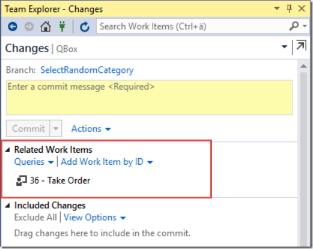](https://gwb.blob.core.windows.net/jakob/WindowsLiveWriter/10FeaturesinTeamFoundationServer_95C8/image_10.png)

But a lot of developers like to use other Git tooling, such as Git Extensions, SourceTree or the command line. And then we have the teams that work on other platforms, perhaps developing iOS apps but store their source code in a Git repo in TFS. They obviously can’t use Visual Studio for committing their changes to TFS.

To associate a commit with a work item in these scenarios, you can simply enter the ID of the work item with a # in front of it as part of the commit message:

#### ***git commit –a –m “Optimized query processing #4321”***

Here we associate this commit with the work item with ID 4321. Note that since Git commits are local, the association won’t actually be done  until the commit has been pushed to the server. TFS processes git commits for work item association asynchronously, so it could potentially take a short moment before the association is done.

### 2. Batch update work items from the Web Access

Excel has always been a great tool for updating multiple work items in TFS. But over the years the web access in TFS has become so much better so that most people do all their work related to work item management there. And unfortunately, it is not possible to export work item queries to Excel as easily from the web as it is from Visual Studio.

But, we can update multiple work items in TFS web access as well. These features have gradually been added to Visual Studio Online and is now part of TFS 2015 as well.

From the product backlog view, we can select multiple work items and the perform different operations on them, as shown below:

[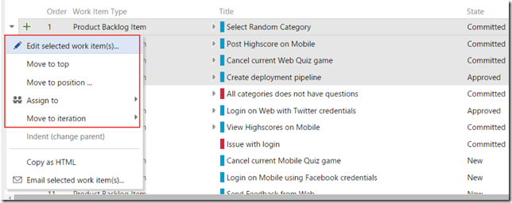](https://gwb.blob.core.windows.net/jakob/WindowsLiveWriter/10FeaturesinTeamFoundationServer_95C8/image_2.png)

There are a few shortcut operations for very common tasks such as moving multiple backlog items to a iteration, or assigning them to a team member. \
But then you have the Edit selected work item(s) that allows us to set any fields to a new value in one operation. \

[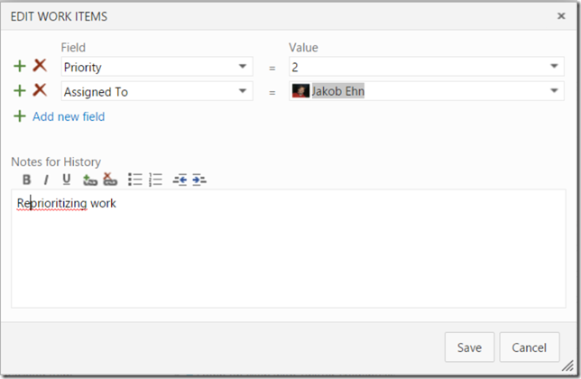](https://gwb.blob.core.windows.net/jakob/WindowsLiveWriter/10FeaturesinTeamFoundationServer_95C8/image_4.png)

You can also do this from the sprint backlog and from the result list of a work item query.

### 3. Edit and commit source files in your web browser

Working with source code is of course done best from a development IDE such as Visual Studio. But sometimes it can be very convenient to change a file straight from the web access, and you can! Maybe you find a configuration error when logged on a staging environment where you do not have access to Visual Studio. Then you can just browse to the file in source control and change it using the ***Edit*** button:

[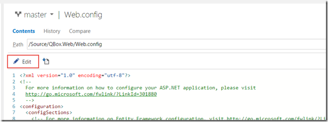](https://gwb.blob.core.windows.net/jakob/WindowsLiveWriter/10FeaturesinTeamFoundationServer_95C8/image_6.png)

After making the changes, you can add a meaning commit message and commit the change back to TFS. When using Git, you can even commit it to a new branch.

[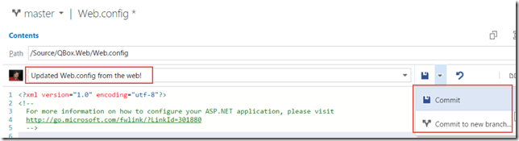](https://gwb.blob.core.windows.net/jakob/WindowsLiveWriter/10FeaturesinTeamFoundationServer_95C8/image_8.png)

### 4. Bring in your stakeholders to the team using the free Stakeholder license

Normally, every team member that accesses TFS and reads or writes information to it (source code, work items etc) need to have a Client Access License (CAL). For the development team this is usually not a problem, often they already have a Visual Studio with MSDN subscription in which a TFS CAL is included. What often cause some friction is when the team try to involve the stakeholders. Stakeholders often include people who just want to track progress or file a bug or a suggestion occasionally. Buying a CAl for every person in this role usually ends up being way to expensive and not really worth it.

In TFS 2013 Update 4 this was changed, from that point people with a stakeholder license does not a CAL at all, they can access TFS for free. Buth they still have a limited experience, they can’t do everything that a normal team member can. Features that a stakeholder can use include:

- Full read/write/create on all work items
- Create, run and save (to “My Queries”) work item queries
- View project and team home pages
- Access to the backlog, including add and update (but no ability to reprioritize the work)
- Ability to receive work item alerts

[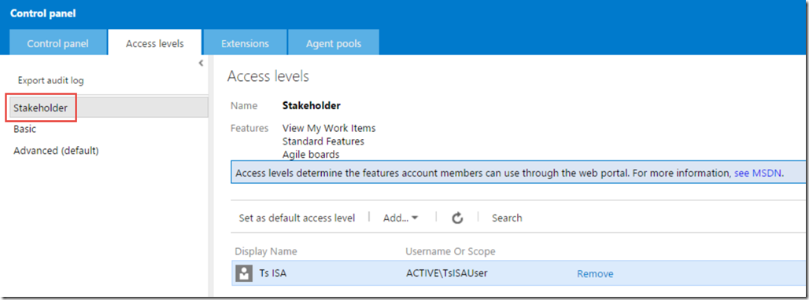](https://gwb.blob.core.windows.net/jakob/WindowsLiveWriter/10FeaturesinTeamFoundationServer_95C8/image_14.png)

To learn more about the Stakeholder license, see  [https://msdn.microsoft.com/Library/vs/alm/work/connect/work-as-a-stakeholder](https://msdn.microsoft.com/Library/vs/alm/work/connect/work-as-a-stakeholder "https://msdn.microsoft.com/Library/vs/alm/work/connect/work-as-a-stakeholder")

### 5. Protect your Git branches using branch policies

When using Team Foundation Version Control (TFVC) we have from the first version of TFS had the ability to use check-in policies for enforcing standards and policies of everything that is checked in to source control. We also have the ability to use Gated Builds, which allows us to make sure that a changeset is not checked in unless an associated build definition is executed successfully.

When Git was added to TFS back in 2013, there was no corresponding functionality available. But in TFS 2015 now, the team has added branch policies as a way to protect our branches from inadvertent or low quality commits. In the version control tab of the settings administration page you can select a branch from a Git repo and then apply branch policies. The image below shows the available branch policies.

### [image](https://gwb.blob.core.windows.net/jakob/WindowsLiveWriter/10FeaturesinTeamFoundationServer_95C8/image_12.png)

###

Here we have enabled all three policies, which will enforce the following:

- All commits in the master branch must be made using a pull request \
- The commits in the pull request must have associated work items \
- The pull request must be reviewed by at least two separate reviewers  \
- The QBox.CI build must complete successfully before the pull request can be merged to the master branch

I really recommend that you start using these branch policies, they are an excellent way to enforce the standard and quality of the commits being made, and can help your team improve their process and help move towards being able to deliver value to your customers more frequently.

### 6. Using the @CurrentIteration in Work Item Queries

Work Item Queries are very useful for retrieving the status of your ongoing projects. The backlogs and boards are great in TFS for managing the sprints and requirements, but the ability to query on information across one ore more projects are pivotal. Work item queries are often used as reports and we can also create charts from them.

Very often, we are interested in information in the current sprint, for example how many open bug are there, how many requirements do we have that doesn’t have associated test cases and so on. Before TFS 2015, we had to write work item queries that referenced the current sprint directly, like so:

[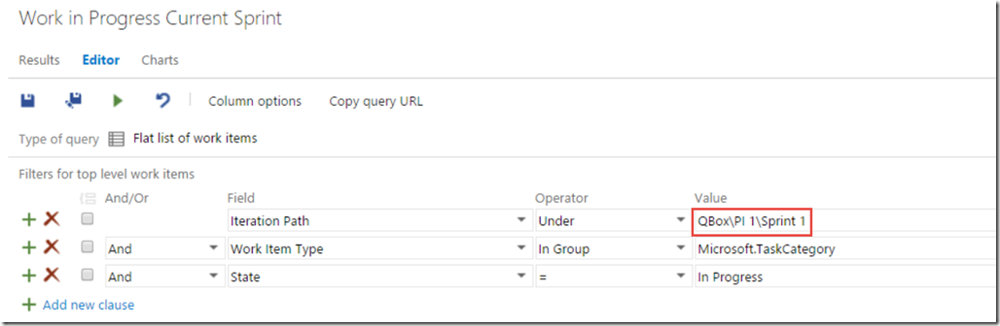](https://gwb.blob.core.windows.net/jakob/WindowsLiveWriter/10FeaturesinTeamFoundationServer_95C8/image_18.png)

The problem with this was of course that as soon as the sprint ended and the next one started, we hade to update all these queries to reference the new iteration. Some people came up with [smart work arounds](http://intellitect.com/transitioning-between-sprintsiterations-with-tfs/), but it was still cumbersome.

Enter the ***@CurrentIteration*** token. This token will evaluate to the currently sprint which means we can define our queries once and they will continue to work for all upcoming sprints as well.

[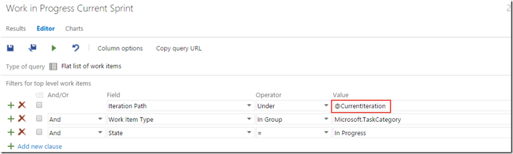](https://gwb.blob.core.windows.net/jakob/WindowsLiveWriter/10FeaturesinTeamFoundationServer_95C8/image_20.png)

this token is unfortunately not yet available in Excel since it is not team-aware. Since iterations are configured per team, it is necessary to evaluate this token in the context of a team. Both the web access and Visual Studio have this context, but the Excel integration does not, yet.

Learn more about querying using this token at [https://msdn.microsoft.com/en-us/Library/vs/alm/Work/track/query-by-date-or-current-iteration](https://msdn.microsoft.com/en-us/Library/vs/alm/Work/track/query-by-date-or-current-iteration "https://msdn.microsoft.com/en-us/Library/vs/alm/Work/track/query-by-date-or-current-iteration")

### 7. Pin Important Information to the home page

The new homepage has been available since TFS 2012, and I still find that most teams does not use the possibility to pin important information to the homepage enough. \
The homepage is perfect to show on a big screen in your team room, at least if you show relevant information on it.

We can pin the following items to the home page:

- **Work Item Queries \**The tile will show the number of work items returned by the query . Focus on pinning queries where the these numbers are important and can trigger some activity. E.g. not the total number of backlog items, but for example the number of active bugs. \
- **Build Definition \**This tile shows a bar graph with the history of the last 30 builds. Gives a good visualization of how stable the builds are, if you see that builds fails every now and then you have a problem that needs to be investigated. \
- **Source control \**Shows the number of recent commits or changesets. Will let you know how much activity that is going on in the different repos \
- **Charts** \
  Charts can be created from work item queries and can also be pinned to the home page. Very useful for quickly give an overview of the status for a particular area

Here is an example where we have added a few items of each type

[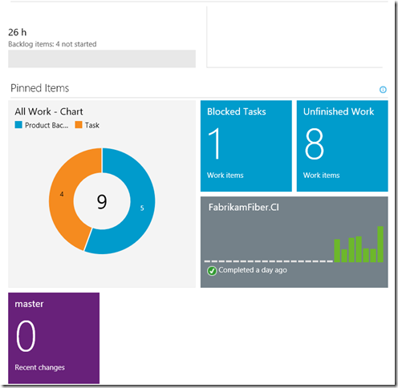](https://gwb.blob.core.windows.net/jakob/WindowsLiveWriter/10FeaturesinTeamFoundationServer_95C8/image_16.png)

### 8. Query on Work Item Tags

Support for tagging was first implemented back in TFS 2012 Update 2. This allowed us to add multiple tags to work items and then filter backlogs and query results on these tags. \
There was however a big thing missing and that was the ability to search for work items using tags.

This has been fixed since TFS 2013 Update 2, which means we can now create queries like this.

[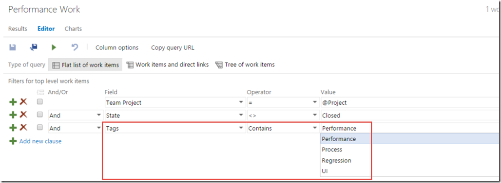](https://gwb.blob.core.windows.net/jakob/WindowsLiveWriter/10FeaturesinTeamFoundationServer_95C8/image_26.png)

It is also possible to work with tags using Excel, this was another big thing missing from the start.

Unfortunately it is not yet possible to setup alerts on tags, you can vote on this feature on UserVoice here: [http://visualstudio.uservoice.com/forums/121579-visual-studio/suggestions/6059328-use-tags-in-alerts](http://visualstudio.uservoice.com/forums/121579-visual-studio/suggestions/6059328-use-tags-in-alerts "http://visualstudio.uservoice.com/forums/121579-visual-studio/suggestions/6059328-use-tags-in-alerts")

### 9. Select how you want to handle bugs

One of the most common questions I get when talking to teams that use TFS is how they should handle bugs. Some teams want to have the bugs on the backlog and treat them like requirements. Other teams want to treat them more like tasks, that is adding them to the corresponding user story or backlog item and use the task board to keep track of the bug.

The good think is that you can configure this per team now. On the team settings page, there is a section that lets you configure the behavior of bugs.

[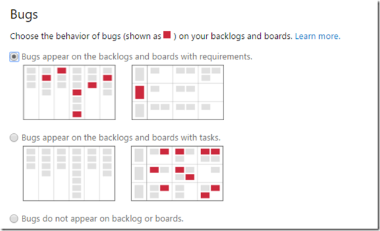](https://gwb.blob.core.windows.net/jakob/WindowsLiveWriter/10FeaturesinTeamFoundationServer_95C8/image_28.png)

To learn more about controlling the behavior of bugs, see [https://msdn.microsoft.com/Library/vs/alm/work/customize/show-bugs-on-backlog](https://msdn.microsoft.com/Library/vs/alm/work/customize/show-bugs-on-backlog "https://msdn.microsoft.com/Library/vs/alm/work/customize/show-bugs-on-backlog")

### 10. Integrate with external or internal services using Service Hooks

Extensibility and integration are very important to Microsoft these days, and this is very clear when looking at the investments for TFS 2015 that included a bunch of work in this area. First of all Microsoft has added a proper REST API for accessing and updating most of the available artifacts in TFS, such as work items and builds. It uses OAuth 2.0 for authentication, which means it is based on open modern web standards and can be used from any client on any platform.

In addition to this, TFS 2015 also support Service Hooks.  A service hook is basically a web endpoint that can be called when something happens, in this case in TFS. So for example, when a backlog item is created in TFS we might want to also create a card in Trello. Or when a new change is committed into source control, we might want to kick off a Jenkins build.

Here is a list of the services that are supported out of the box in TFS 2015:

[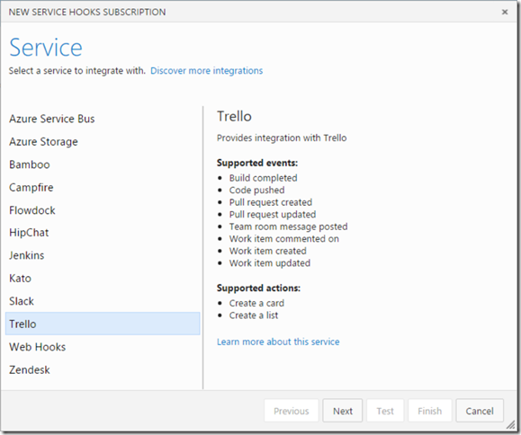](https://gwb.blob.core.windows.net/jakob/WindowsLiveWriter/10FeaturesinTeamFoundationServer_95C8/image_22.png)

And the list keeps growing, in Visual Studio Online there are already 7 more services offered, including **AppVeyor**, **Bamboo** and **MyGet**.

Note that the list contains one entry called Web Hooks. This is a general service configuration in which you can configure a HTTP POST endpoint that will receive messages for the events that you configure. The messages can be sent using JSON, MarkDown, HTML or text. This mean that you can also integrate with internal services, if they expose HTTP REST endpoints.

To learn more about service hooks, see [https://www.visualstudio.com/en-us/integrate/get-started/service-hooks/create-subscription](https://www.visualstudio.com/en-us/integrate/get-started/service-hooks/create-subscription "https://www.visualstudio.com/en-us/integrate/get-started/service-hooks/create-subscription")
