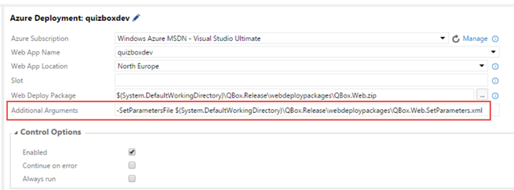

I have [blogged before about how to deploy an Azure Web App using the new build system](http://geekswithblogs.net/jakob/archive/2015/04/29/deploying-an-azure-web-site-using-tfs-build-vnext.aspx) in TFS 2015/Visual Studio Team Services. In addition to configure an Azure service endpoint, it is really only a matter of using the built-in [Azure Web App Deployment](https://github.com/Microsoft/vso-agent-tasks/blob/master/Tasks/AzureWebPowerShellDeployment/task.json) task.

However, in many cases I have decided not to use this task myself since it has been lacking a key feature: Applying deployment parameters using the SetParameter.xml file.

> *As I have mentioned a gazillion times, building your binaries once and only once is a key principle when implementing continuous delivery. If you are using web deploy for deploying web applications (and you should), you must then use* [*Web Deploy parameters*](https://msdn.microsoft.com/en-us/library/ff398068(v=vs.110).aspx) *to apply the correct configuration values at deployment time.*

Under the hood the Azure Web App Deployment  task uses the [Publish-AzureWebsiteProject](https://msdn.microsoft.com/en-us/library/azure/dn722468.aspx?f=255&MSPPError=-2147217396) cmdlet that uses web deploy to publish a web deploy package to Microsoft Azure. Up until recently, this cmdlet did not support web deploy parameters, the only thing that you could substitute was the connecting string, like so:

```
Code highlighting produced by Actipro CodeHighlighter (freeware)
http://www.CodeHighlighter.com/

Publish-AzureWebsiteProject -Name site1 -Package package.zip -ConnectionString @{ DefaultConnection = "my connection string" }
```

However, it is actually possible to specify the path to the SetParameter.xml file that is generated together with the web deploy package. To do this, you can use the –SetParametersFile parameter, like so:

```
Code highlighting produced by Actipro CodeHighlighter (freeware)
http://www.CodeHighlighter.com/

Publish-AzureWebsiteProject -Name Site1 -Package package.zip -SetParametersFile package.SetParameters.xml
```

When using the Azure Web App Deployment task, there is no separate parameter for this but you can use the *Additional Arguments* parameter to pass this information in:



***Note: In this case, I am using the Azure Web App Deployment task as part of a release definition in Visual Studio Release Management, but you can also use it in a regular build definition.***

This will apply the parameter values defined in the QBox.Web.SetParameters.xml file when deploying the package to the Azure Web App.

> **If you are interested, here is the pull request that implemented support for SetParameters files:** [**https://github.com/Azure/azure-powershell/pull/316**](https://github.com/Azure/azure-powershell/pull/316 "https://github.com/Azure/azure-powershell/pull/316")

---

## Comments

*Imported from the original WordPress site. Closed for new replies.*

> **[ET](http://blog.etiennetremblay.ca)** — 29 Jan 2016
>
> Thanks for this post Jakob I was struggling to find how to do this.

> **David** — 12 Apr 2016
>
> Jakob,
>
> Is this still valid? I couldn't get it to work though I'm sure it is on my end.

> **Balaji** — 28 Apr 2016
>
> iam getting error when i setup -SetParameters in to Azure Web App deployment.\
> The error is below,
>
> a positional parameter cannot be found that accepts argument 'Registration'.
