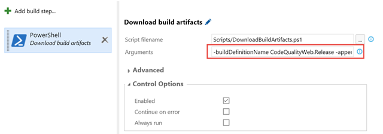
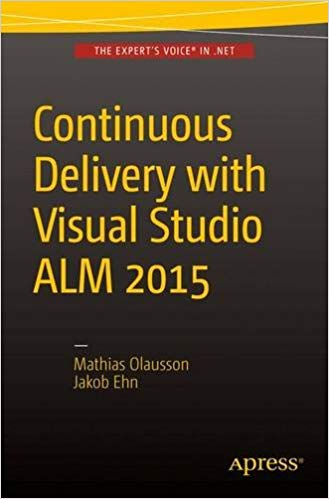

Since a couple of months back, Microsoft new [Release Management servic](/2015/12/microsoft-announces-next-generation-of-visual-studio-release-management/)e is available in public preview in Visual Studio Team Services. According to the current time plan, it will be released for on-premise TFS in the next update (Update 2).

Using a tool like release management allows you to implement a deployment pipeline by grabbing the binaries and any other artifacts from your release build, and then deploy them across different environments with the proper configuration and approval workflow. Building your binaries once and only once is a fundamental principal of implementing continuous delivery, too much can go wrong if you build your application every time you deploy it into a new environment.

However, sometimes you might not have the opportunity to setup a release management tool like VSTS or Octopus Deploy, but you still want to be able to build your binaries once and deploy them. Well, you can still implement your deployment using TFS Build, but instead of building your source code during every build we download the artifacts from **another** build that already has completed.

Let’s look at how we can implement this using PowerShell and the REST API in TFS/VSTS.In this sample we will execute this script as part of a TFS build, in order to create a “poor mans” deployment pipeline. If you want to use the script outside of TFS Build, you need to replace some environment variables that are used in the script below.

### Downloading Build Artifacts using PowerShell and the REST API

First of all, to learn about the REST API and other ways to integrate and extend Visual Studio, TFS and Visual Studio Team Services, take a look at [https://www.visualstudio.com/integrate](https://www.visualstudio.com/integrate "https://www.visualstudio.com/en-us/integrate"). This is a great landing page that aggregate a lot of information about extensibility.

Here is a PowerShell script that implements this functionality, as well as a few other things that is handy if you implement a deployment pipeline from a build definition.

```powershell
Code highlighting produced by Actipro CodeHighlighter (freeware)
http://www.CodeHighlighter.com/

[CmdletBinding()]

param(
    [Parameter(Mandatory=$True)]
    [string]$buildDefinitionName,
    [Parameter()]
    [string]$artifactDestinationFolder = $Env:BUILD_STAGINGDIRECTORY,
    [Parameter()]
    [switch]$appendBuildNumberVersion = $false
)
    Write-Verbose -Verbose ('buildDefinitionName: ' + $buildDefinitionName)
    Write-Verbose -Verbose ('artifactDestinationFolder: ' + $artifactDestinationFolder)
    Write-Verbose -Verbose ('appendBuildNumberVersion: ' + $appendBuildNumberVersion)

    $tfsUrl = $Env:SYSTEM_TEAMFOUNDATIONCOLLECTIONURI + $Env:SYSTEM_TEAMPROJECT

    $buildDefinitions = Invoke-RestMethod -Uri ($tfsURL + '/_apis/build/definitions?api-version=2.0&name=' + $buildDefinitionName) -Method GET -UseDefaultCredentials
    $buildDefinitionId = ($buildDefinitions.value).id;

    $tfsGetLatestCompletedBuildUrl = $tfsUrl + '/_apis/build/builds?definitions=' + $buildDefinitionId + '&statusFilter=completed&resultFilter=succeeded&$top=1&api-version=2.0'

    $builds = Invoke-RestMethod -Uri $tfsGetLatestCompletedBuildUrl -Method GET -UseDefaultCredentials
    $buildId = ($builds.value).id;

    if( $appendBuildNumberVersion)
    {
        $buildNumber = ($builds.value).buildNumber
        $versionRegex = "d+.d+.d+.d+"

        # Get and validate the version data
        $versionData = [regex]::matches($buildNumber,$versionRegex)
        switch($versionData.Count)
        {
           0
              {
                 Write-Error "Could not find version number data in $buildNumber."
                 exit 1
              }
           1 {}
           default
              {
                 Write-Warning "Found more than instance of version data in buildNumber."
                 Write-Warning "Will assume first instance is version."
              }
        }
        $buildVersionNumber = $versionData[0]
        $newBuildNumber =  $Env:BUILD_BUILDNUMBER + $buildVersionNumber
        Write-Verbose -Verbose "Version: $newBuildNumber"
        Write-Verbose -Verbose "##vso[build.updatebuildnumber]$newBuildNumber"
    }

    $dropArchiveDestination = Join-path $artifactDestinationFolder "drop.zip"

    #build URI for buildNr
    $buildArtifactsURI = $tfsURL + '/_apis/build/builds/' + $buildId + '/artifacts?api-version=2.0'

    #get artifact downloadPath
    $artifactURI = (Invoke-RestMethod -Uri $buildArtifactsURI -Method GET -UseDefaultCredentials).Value.Resource.downloadUrl

    #download ZIP
    Invoke-WebRequest -uri $artifactURI -OutFile $dropArchiveDestination -UseDefaultCredentials

    #unzip
    Add-Type -assembly 'system.io.compression.filesystem'
    [io.compression.zipfile]::ExtractToDirectory($dropArchiveDestination, $artifactDestinationFolder)

    Write-Verbose -Verbose ('Build artifacts extracted into ' + $Env:BUILD_STAGINGDIRECTORY)
```

This script accepts three parameters:

***buildDefinitionName*\***This is a mandatory parameter where you can specify the name of the build definition from which you want to download the artifacts from. This script assumes that the build definition is located in the same team project as the build definition in which this script is running. If this is not the case, you need to add a parameter for the team project.*

***artifactsDestinationFolder*\***This is an optional parameter that let’s you specify the folder where the artifacts should be downloaded to. If you leave it empty, it will be downloaded to the staging directory of the build (BUILD_STAGINGDIRECTORY)*

***appendBuildNumberVersion*\***A switch that indicates if you want to append the version number of the linked build to the build number of the running build. Since you are actually releasing the build version that you are downloading artifacts from, it often makes sense to use this version number for the deployment build. The script will extract a 4 digit version (x.x.x.x) from the build number and then append it to the build number of the running build.*

*As an example, if the latest release build has the build number MyApplication-1.2.3.4, the build will extract 1.2.3.4 and append this to the end of the build number of the running build.*

### Running the script in TFS Build

Running a PowerShell script in TFS Build is really easy, but I’ll include it here anyway. Typically you will run this script in the beginning of a build in order to get the build artifacts, and then add the tasks related to deploying the artifacts in whatever way that fits.

Add the script to source control and then add a *PowerShell* task to the build definition and select the script from the repository. Then specify the parameters of the tasks in the argument field



Here is a sample argument:

***-buildDefinitionName MyApplication.Release –appendBuildNumberVersion***

Where MyApplication.Release is the name of the build definition that have produced the build artifacts that we want to release.

Running this script as part of the build will not download the artifacts from the latest successful build of the linked build definition and place them in the staging directory. In addition it will append the version number of the linked build (x.x.x.x) to the end of the running build.

**NB**: You need to consider where to place this script. Often you’ll want to put this script together with the application that you are deploying, so that they can change and version together.

Hope you will find this script useful, le me know if you have any issues with it!

Happy building!

---

*PS: If you want to learn more about implementing Continuous Delivery using Visual Studio Team Services and TFS, grab a copy of my and Mathias Olausson’s latest book “**[Continuous Delivery with Visual Studio ALM 2015](http://www.amazon.com/Continuous-Delivery-Visual-Studio-2015/dp/1484212738)**”*



---

## Comments

*Imported from the original WordPress site. Closed for new replies.*

> **Yassine** — 06 Apr 2016
>
> Thank you for this script, I have a question, how do this script do the authentication to have the authorization to download the artifact ? I can just see the http request here against the Rest api.
