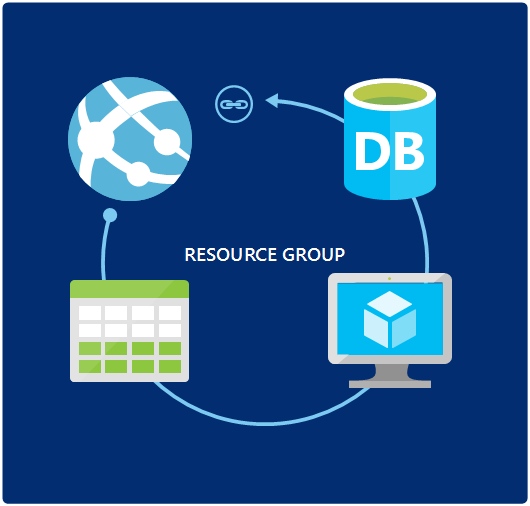
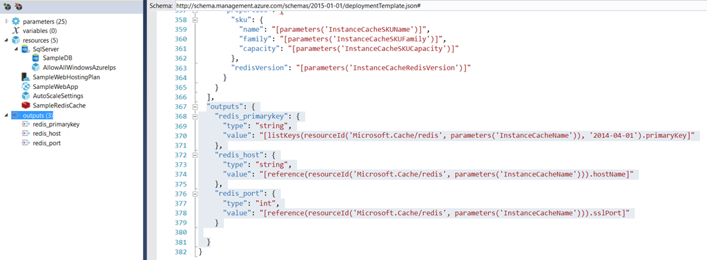
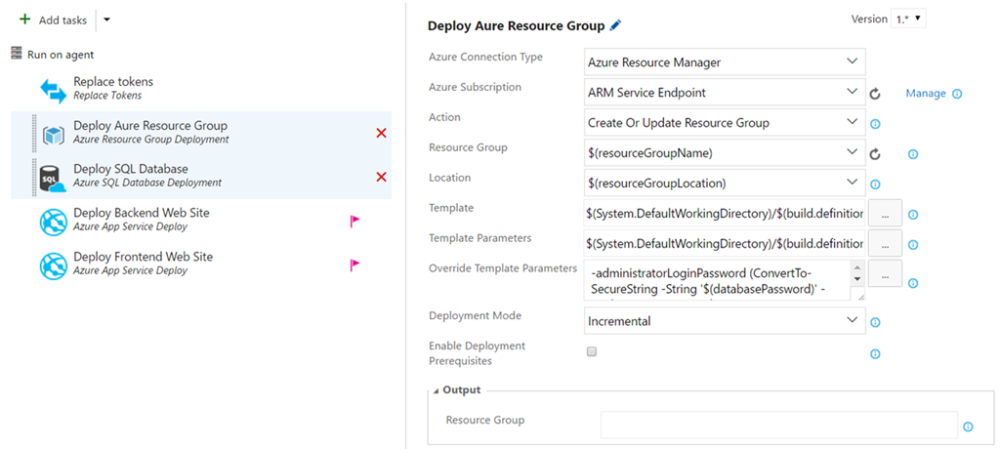
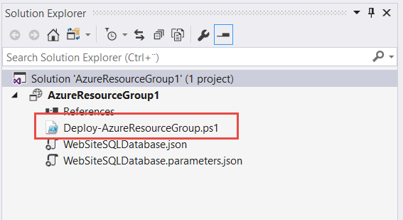
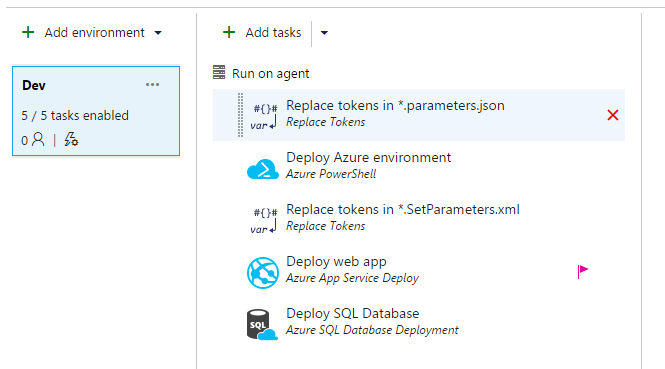
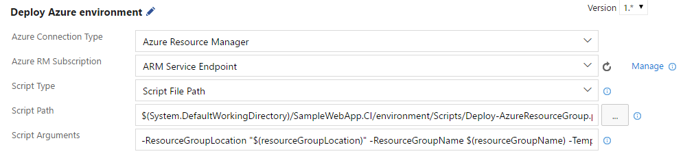

If you are running your applications in Azure, and in particular on PaaS, you need to take a look ARM templates as a way to manage your environments. ARM templates let’s you define and deploy your entire environment using JSON files that you store together with the rest of your source code. The deployment of ARM templates are idempotent, meaning that you can run them many times and it will always produce the same result.



In this post, I will how you how to deploy ARM templates together with your application using Visual Studio Team Services. As you will see, I will not use the out of the box task for doing this, since it has some limitations. Instead we will use a PowerShell script to eexecute the deployment of an ARM template.

The overall steps are:

- Defining our ARM template for our environment.- Tokenize the ARM template parameters file- Create a PowerShell script that deploys the ARM template- Deploy everything from a VSTS release definition.

Let’s get started with the ARM template.

# ARM Template

In this case, I will deploy an ARM template consisting of a Azure web app, a SQL Server + database and a Redis Cache. The web app and sql resources are easy to deploy, since we can supply all the input from my release definition. \
With the Redis cache however, Azure Resource Manager will create some information (such as the primarykey) as part of the deployment, which means we need to read this information from the output of the ARM template deployment.

Here is the outline of our ARM template:



Note the outputs section that is selected above, here we define what output we want to capture once the reource group has been deployed. In this case, I have defined three output variables:

- **redis_host** \
  The fully qualified edish host name- **redis_port** \
    The secure port that will be used to communicate with the cache- **redis_primatykey**\
      The access key that we will use to authenticate

Since our web application will communicate with the Redis cache, we need to fetch this information from the ARM template deployment and store them in our web.cofig file. You will see later on how this can be done.

*Learn more about authoring ARM templates here:* [*https://docs.microsoft.com/en-us/azure/azure-resource-manager/resource-group-authoring-templates*](https://docs.microsoft.com/en-us/azure/azure-resource-manager/resource-group-authoring-templates "https://docs.microsoft.com/en-us/azure/azure-resource-manager/resource-group-authoring-templates")

#

# ARM Template Tokenization

When deploying our template in different environments (dev, test, prod…) we need to supply the information specific to those environment. In VSTS Release Management, the information is stored using environment variables. \
A common solution is to tokenize the files that is needed for deployment and then replace these tokens with the corresponding environment variable. \
To do this, we add a separate parameters file for the template that contains all the parameters but all the values are replaces with tokens:

---


```json
{
    "$schema": "http://schema.management.azure.com/schemas/2015-01-01/deploymentParameters.json#",
    "contentVersion": "1.0.0.0",
  "parameters": {
    "hostingPlanName": {
      "value": "__HOSTINGPLANNAME__"
    },
    "administratorLogin": {
      "value": "__ADMINISTRATORLOGIN__"
    },
    "administratorLoginPassword": {
      "value": "__ADMINISTRATORLOGINPASSWORD__"
    },
    "databaseName": {
      "value": "__DATABASENAME__"
    },
    "webSiteName": {
      "value": "__WEBAPPNAME__"
    },
    "sqlServerName": {
      "value": "__SQLSERVERNAME__"
    },
    "dictionaryName": {
      "value": "__DATABASENAMEDICTIONARY__"
    },
    "extranetName": {
      "value": "__DATABASENAMEEXTRANET__"
    },
    "instanceCacheName": {
      "value": "__INSTANCECACHENAME__"
    }
```

  }\
}

---

We wil then replace these tokens just before the template is deployed.

# PowerShell script

There is an existing task for creating and updating ARM templates, called **Azure Resource Group Deployment**. This task let’s us point to an existing ARM template and the corresponding parameter file.

Here is an example how how this task is typically used:



The problem with this task is that it has very limited support for output parameters. As you can see in the image above, you can map a variable to the output called Resource Group. Unfortunately there is an assumption that the resource group that you are creating contains virtual machines. If you execute this task with an ARM template containing for example an Azure Web App you will get the following error when trying to map the output to a variable:

**2017-01-23T09:09:49.8436157Z ##[error]The 'Get-AzureVM' command was found in the module 'Azure', but the module could not be loaded. For more information, run 'Import-Module Azure'.**

So, to be able to read our output values we need to use PowerShell instead, which is arguably a better choice anyway since it allows you to run and test the deployment locally,  saving you a lot of time.

When we create an Azure Resource Group project in Visual Studio, we get a PowerShell script that we can use as a starting point.

Most part of this script handles the case where we need to upload artifacts as part of the resource group deployment. In this case we don’t need this, we deploy all our artifacts from RM after the resource group has been deployed.

Here is our PowerShell script that we will use to deploy the template:

---

#Requires -Version 3.0\
#Requires -Module AzureRM.Resources\
#Requires -Module Azure.Storage

```
Param(
    [string] [Parameter(Mandatory=$true)] $ResourceGroupLocation,
    [string] [Parameter(Mandatory=$true)] $ResourceGroupName,
    [string] [Parameter(Mandatory=$true)] $TemplateFile,
    [string] [Parameter(Mandatory=$true)] $TemplateParametersFile
)
```

Import-Module Azure -ErrorAction SilentlyContinue

try {\
    [Microsoft.Azure.Common.Authentication.AzureSession]::ClientFactory.AddUserAgent("VSAzureTools-$UI$($host.name)".replace(" ","_"), "2.9")\
} catch { }

Set-StrictMode -Version 3

$TemplateFile = [System.IO.Path]::GetFullPath([System.IO.Path]::Combine($PSScriptRoot, $TemplateFile))\
$TemplateParametersFile = [System.IO.Path]::GetFullPath([System.IO.Path]::Combine($PSScriptRoot, $TemplateParametersFile))

# Create or update the resource group using the specified template file and template parameters file\
New-AzureRmResourceGroup -Name $ResourceGroupName -Location $ResourceGroupLocation -Verbose -Force -ErrorAction Stop

```powershell
$output = (New-AzureRmResourceGroupDeployment -Name ((Get-ChildItem $TemplateFile).BaseName + '-' + ((Get-Date).ToUniversalTime()).ToString('MMdd-HHmm')) `
                                   -ResourceGroupName $ResourceGroupName `
                                   -TemplateFile $TemplateFile `
                                   -TemplateParameterFile $TemplateParametersFile -Force -Verbose)
```

Write-Output ("##vso[task.setvariable variable=REDISSERVER]" + $output.Outputs['redis_host'].Value)\
Write-Output ("##vso[task.setvariable variable=REDISPORT]" + $output.Outputs['redis_port'].Value)\
Write-Output ("##vso[task.setvariable variable=REDISPASSWORD;issecret=true]" + $output.Outputs['redis_primarykey'].Value)

---

The special part of this script is the last three lines. Here, we read the output variables that we defined in the ARM template and then we use one of the VSTS logging commands to map these into variables that we can use in our release definition.

The syntax of the SetVariable logging command is ##vso[task.setvariable variable=NAME]<VARIABLEVALUE>.

**Note:** You can read more about these commands at [https://github.com/Microsoft/vsts-tasks/blob/master/docs/authoring/commands.md](https://github.com/Microsoft/vsts-tasks/blob/master/docs/authoring/commands.md "https://github.com/Microsoft/vsts-tasks/blob/master/docs/authoring/commands.md")

# Release Definition

Finally we can put all of this together by creating a release definition that deploys the ARM template.

**\
Note**: You will of course need to create a build definition that packages your scripts, ARM templates and deployment artifacts. I won’t show this here, but just reference the outputs from an existing build definition.

Here is what the release definition will look like:

Let’s walk through the steps:

1. **Replace tokens**\
   Here we replace the tokens in our parameters.json file that we definied earlier. There are several tasks in the marketplace for doing token replacement, I’m using the one from Guillaume Rouchon ([https://github.com/qetza/vsts-replacetokens-task#readme](https://github.com/qetza/vsts-replacetokens-task#readme "https://github.com/qetza/vsts-replacetokens-task#readme"))\
2. **Deploy Azure environment\**Run the PowerShell scipt using the Azure PowerShell task. This task handles the connection to Azure, so we don’t have to think about that.\
   Here I reference the PowerShell script from the build output artifacts, and also I supply the necessary parameters to the PS script:\
   Script Arguments\
   *-ResourceGroupLocation "$(resourceGroupLocation)" -ResourceGroupName $(resourceGroupName) -TemplateFile "$(System.DefaultWorkingDirectory)/SampleApp.CI/environment/templates/sampleapp.json" -TemplateParametersFile "$(System.DefaultWorkingDirectory)/SampleApp.CI/environment/templates/sampleapp.parameters.json"\
   \*
3. **Replace tokens \**Now we need to update the tokens in our SetParameters file, that is used by web deploy. It is important that we run this task after running the deploy azure enviroment script, since we need the output variables from the resource group deployment. Remember, these variables are now available as environment variables, so they will be inserted in the same way as the variables that we have defined manually.\
4. **Deploy Web app + Deploy SQL Database**\
   These steps just performs a simple deployment of an Azure Web App and a SQL dacpac deployment.

That’s it, happy deployment! 🙂







---

## Comments

*Imported from the original WordPress site. Closed for new replies.*

> **Akhil** — 03 Jul 2017
>
> Hi ,\
> Your article was really helpful.\
> I have a query as i'm trying to implement ALM via VSTS .I have a service fabric cluster and an App service [Angular 2 Applicaiton],so using IaaC i have to create them dynamically .Now my question is how can i pass the Service fabric applications path to my App Service dynamically

> **[Feodor](https://www.red-gate.com/simple-talk/author/feodor-georgiev/)** — 12 Oct 2017
>
> Nice work! \
> Keep in mind that this can be extended even further by using Custom .NET activities in Azure, and thus the entire resource group can be scheduled for creation and deletion via ADF. \
> Keep an eye on my blog posts, I have one coming soon exactly on this topic: https://www.red-gate.com/simple-talk/author/feodor-georgiev/

> **JJose** — 26 Apr 2021
>
> may I know what this block does?
>
> try {\
> [Microsoft.Azure.Common.Authentication.AzureSession]::ClientFactory.AddUserAgent(“VSAzureTools-$UI$($host.name)”.replace(” “,”_”), “2.9”)\
> } catch { }
