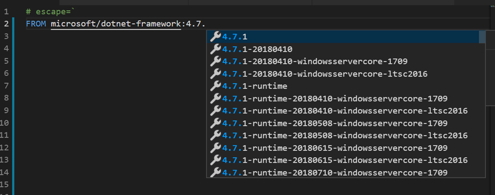
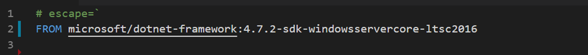
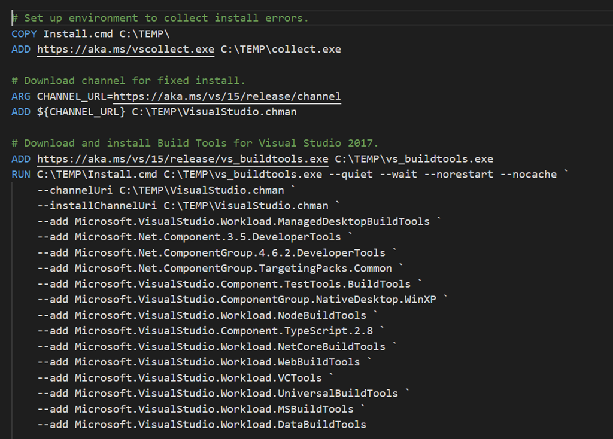
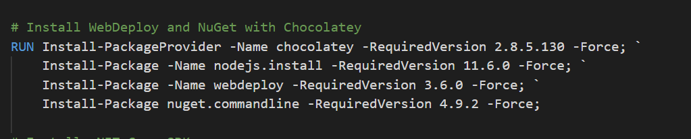
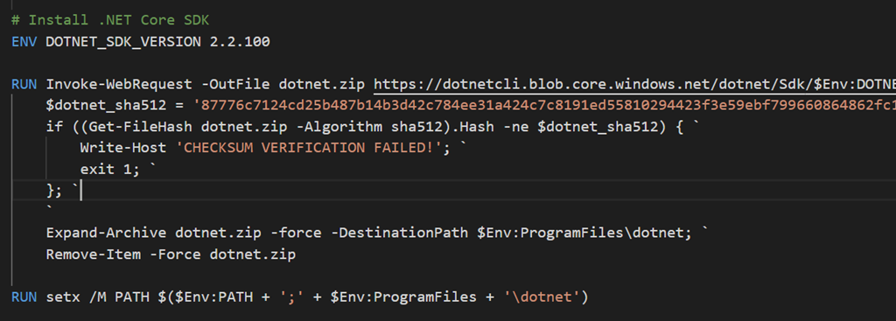
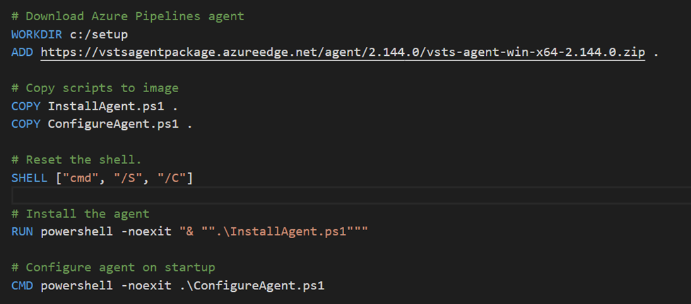
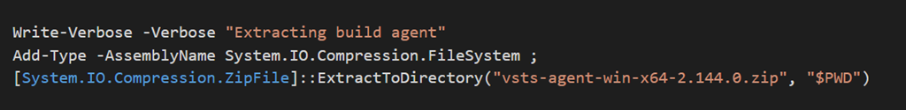
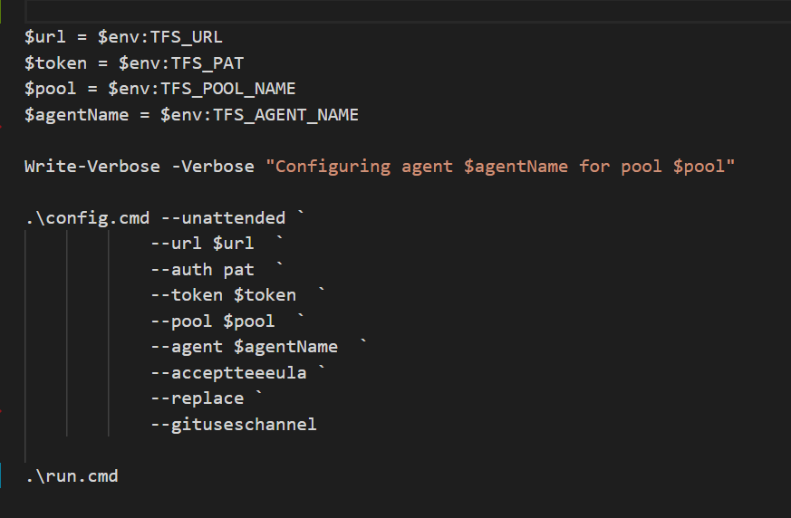
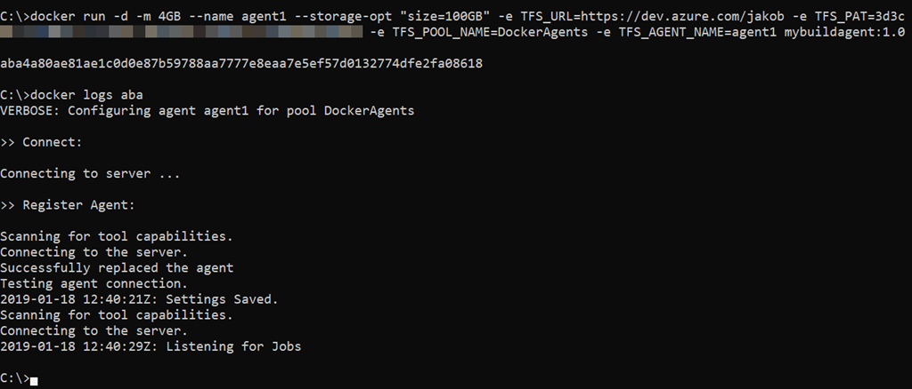
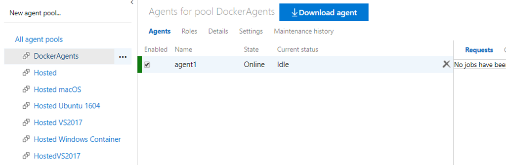

Having automated builds that are stable and predictable is so important in order to succeed with CI/CD. One important practice to enable this is to have a fully scriptable build environment that lets you deploy multiple, identical, build envionment hosts. This can be done by using image tooling such as Packer from HahsiCorp. Another option is to use Docker which is what I am using in this post.

Using Docker will will crete a Dockerfile that specifies the content of the image in which builds will run. This image should contain the SDK’s and tooling necessary to build and test your projects. It will also contain the build agent for your favourite CI server that will let you spin up a new agent in seconds using the docker image.

In this post I will walk you through how to create a Windows container image for Azure Pipelines/Azure DevOps Server that contains the necessary build tools for building .NET Framework and .NET Core projects.

I am using Windows containers here because I want to be able to build full .NET Framework projects (in addition to .NET core of course). If you only use .NET Core things are much simpler, there is even an existing Docker image from Microsoft thath contains the build agent here: [https://hub.docker.com/r/microsoft/vsts-agent/](https://hub.docker.com/r/microsoft/vsts-agent/ "https://hub.docker.com/r/microsoft/vsts-agent/")

All files referred to in this blog post are available over at GitHub:\
[https://github.com/jakobehn/WindowsContainerBuildImage](https://github.com/jakobehn/WindowsContainerBuildImage "https://github.com/jakobehn/WindowsContainerBuildImage")

**Prerequisites:**

You need to have [Docker Desktop](https://hub.docker.com/editions/community/docker-ce-desktop-windows) install on your machine to build the image.

I also recommend using Visual Studio Code with the Docker extension installed for authoring Dockerfiles (see [https://code.visualstudio.com/docs/azure/docker](https://code.visualstudio.com/docs/azure/docker "https://code.visualstudio.com/docs/azure/docker"))

## Specifying the base image

All Docker images must inherit from a base image. In this case we will start with one of the images from Microsoft that ships with the full .NET Framework  SDK, **microsoft/dotnet-framework**.

If you have the Docker extension in VS Code installed, you can browse existing images and tags directly from the editor:

I’m going to use the image with .NET Framework 4.7.2 SDK installed running in Windows Server Core:

## Installing Visual Studio Build Tools

In order to build .NET Framework apps we need to have the proper build tools installed. Installing Visual Studio in a Docker container is possible but not recommended. Instead we can install Visual Studio Build Tools, and select wich components to install.\
> To understand which components that are available and which identifer they have, this page is very userful. It contains all available components that you can install in Visual Studio Build Tools 2017:\
> [https://docs.microsoft.com/en-us/visualstudio/install/workload-component-id-vs-build-tools?view=vs-2017](https://docs.microsoft.com/en-us/visualstudio/install/workload-component-id-vs-build-tools?view=vs-2017 "https://docs.microsoft.com/en-us/visualstudio/install/workload-component-id-vs-build-tools?view=vs-2017")

In the lines shown below, I’m first downloading and installing Visual Studio Log Collection tool (vscollect) that let’s us capture the installation log. Then we download the build tools from the Visual Studio 2017 release channel feed.

Finally we are instaling the build tools in quiet mode,specifying the desired components. Of course you might wamt to change this list to fit your needs.

## Installing additional tooling

You will most likely want to install additional tooling, besides the standard VS build tools. In my case, I want to install Node, the latest version of NET Core SDK and also web deploy. Many of these things can be installed easily using chocolatey, as shown below:

Installing .NET Core SDK can be done by simply downloading it and extract it and update the PATH environment variable:

## Installing and configuring the Azure Pipelines Build Agent

Finally we want to installl the Azure Pipelines build agent and configure it. Installing the agent will be done when we are building the Docker image. Configuring it against your Azure DevOps organization must be done when starting the image, which means will do this in the CMD part of the Dockerfile, and supply the necessary parameters.

The *InstallAgent.ps1* script simply extracts the downloaded agent :

*ConfigureAgent.ps1* will be executed when the container is started, and here we are using the unattended install option for the Azure Pipelines agent to configure it against an Azure DevOps organization:

## Building the Docker image

To build the image from the Dockerfile, run the following command:

**docker build -t mybuildagent:1.0 -m 8GB .**

I’m allocating 8GB of memory here to make sure the installation process won’t be too slow. In particular installing the build tools is pretty slow (around 20 minutes on my machine) and I’ve found that allocating more memory speeds it up a bit. As always, Docker caches all image layers so if you make a change to the Docker file, the build will go much faster the next time (unless you change the command that installs the build tools 🙂

When the build is done you can run **docker images** to see your image.

## Running the build agent

To start the image and connect it to your Azure DevOps organization, run the following command:

**docker run -d -m 4GB --name <NAME> --storage-opt "size=100GB" -e TFS_URL=<ORGANIZATIONURL>-e TFS_PAT=<PAT> -e TFS_POOL_NAME=<POOL> -e TFS_AGENT_NAME=<NAME> mybuildagent:1.0**

Replace the parameters in the above string:

- **NAME\**Name of the builds agent as it is registered in the build pool in Azure DevOps. Also the docker container will use the same name, which can be handy whe you are running multiple agents on the same host
- **ORGANIZATIONURL\**URL to your Azure DevOps account, e.g. <https://dev.azure.com/contoso>
- **PAT\**A personal access token that you need to crete in your Azure DevOps organization Make sure that the token has the **AgentPools (read, manage)** scope enabled
- **POOL\**The name of the agent pool in Azure DevOps that the agent should register in

When you run the agent from command line you will see the id of the started Docker container. For troubleshooting you can run docker logs <id> to see the output from the build agent running in the container

After around 30 seconds or so, you should see the agent appear in the list of available agents in your agent pool:

Happy building!

---

## Comments

*Imported from the original WordPress site. Closed for new replies.*

> **James** — 19 Jan 2019
>
> I can't wait to try this out. This has been on a list of things I wanted todo (Windows Container, Full .NET Framework Agents) for a while. Thanks.

> **Vinay** — 22 May 2020
>
> Hi,
>
> Just wanted to know what edition of windows we need to try out this agent container building\
> could you please respond ASAP

> **Burton** — 17 Nov 2020
>
> +1M Thanks so much! Even today, MS hasn't published a Windows container (that I can find) of their Windows hosted agents -- if anyone knows of the image please share. I want to add a few tools and capture the state after a nightly build to enable incremental scenarios to speed up horridly long build times in CI.
