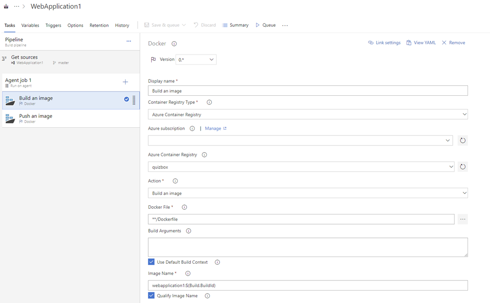
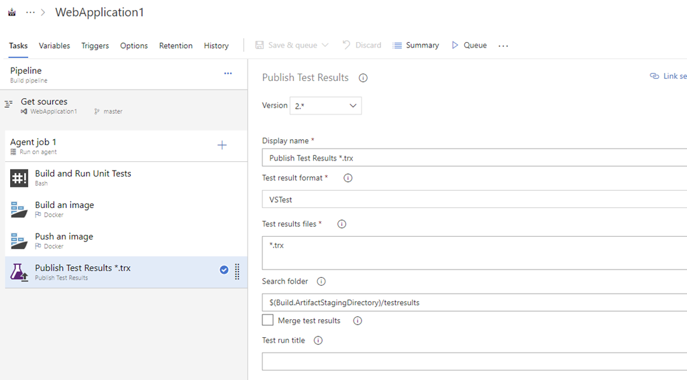
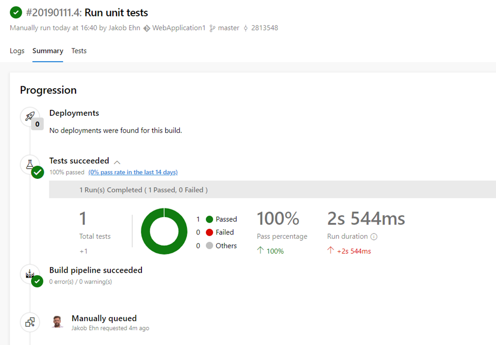

Using Docker for compiling your code is great since that guarantees a consistent behaviour regardless of where you are building your code. No matter if it’s on the local dev machine or on a build server somewhere. It also reduces the need of installing any dependencies just to make the code compile. The only thing that you need to install is Docker!

When you create a ASP.NET Core project in Visual Studio and add Docker support for it you will get a Docker file that looks something like this:\
> \
>
> ```
> FROM microsoft/dotnet:2.1-aspnetcore-runtime AS base
> WORKDIR /app
> EXPOSE 80
> EXPOSE 443
> ```

FROM microsoft/dotnet:2.1-sdk AS build \
WORKDIR /src \
COPY ["WebApplication1/WebApplication1.csproj", "WebApplication1/"] \
RUN dotnet restore "WebApplication1/WebApplication1.csproj" \
COPY . . \
WORKDIR "/src/WebApplication1" \
RUN dotnet build "WebApplication1.csproj" -c Release -o /app

FROM build AS publish \
RUN dotnet publish "WebApplication1.csproj" -c Release -o /app

FROM base AS final \
WORKDIR /app \
COPY --from=publish /app . \
ENTRYPOINT ["dotnet", "WebApplication1.dll"]\
This is an example of a multistage Docker build. The first stage is based on the .NET Core SDK Docker image in which the code is restored, built and published. The second phase uses the smaller .NET Core runtime Docker image, to which the generated artifacts from the first phase is copied into.

The result is a smaller Docker image that will be pushed to a Docker registry and later on deployed to test- and production environments. Smaller images means faster download and startup times. Since it doesn’t contain as many SDKs etc, it also means that  the surface area for security holes is much smaller.

Now, this will compile just fine locally, and settting a build definition in Azure Pipelines is easy-peasy. Using the default ***Docker container*** build pipeline template, results in a build like this:



But, we want to run unit tests also, and then publish the test results back to Azure DevOps. How can we do this?

## Run Unit Tests in Docker

First of all we need to build and run the tests inside the container, so we need to extend the Docker file. In this sample, I have added a XUnit test project called ***WebApplication1.UnitTests***.\
> \
>
> ```
> FROM microsoft/dotnet:2.1-aspnetcore-runtime AS base
> WORKDIR /app
> EXPOSE 80
> EXPOSE 443
> ```

FROM microsoft/dotnet:2.1-sdk AS build \
WORKDIR /src \
COPY ["WebApplication1/WebApplication1.csproj", "WebApplication1/"] \
COPY ["WebApplication1.UnitTests/WebApplication1.UnitTests.csproj", "WebApplication1.UnitTests/"] \
RUN dotnet restore "WebApplication1/WebApplication1.csproj" \
RUN dotnet restore "WebApplication1.UnitTests/WebApplication1.UnitTests.csproj" \
COPY . . \
RUN dotnet build "WebApplication1/WebApplication1.csproj" -c Release -o /app \
RUN dotnet build "WebApplication1.UnitTests/WebApplication1.UnitTests.csproj" -c Release -o /app

RUN dotnet test "WebApplication1.UnitTests/WebApplication1.UnitTests.csproj" --logger "trx;LogFileName=webapplication1.trx"

FROM build AS publish \
RUN dotnet publish "WebApplication1.csproj" -c Release -o /app

FROM base AS final \
WORKDIR /app \
COPY --from=publish /app . \
ENTRYPOINT ["dotnet", "WebApplication1.dll"]\
Now we are also restoring and compiling the test project, and then we run ***dotnet test*** to run the unit tests. To be able to publish the unit test results to Azure DevOps, we are using the *–logger* parameter which instructs dotnet to output a TRX file.

Now comes the tricky part. When we run these tests as part of a build, the results end up inside the container. To publish the test results we need to access the results from outside the container. Docker volumes will not help us here, since we aren't running the container, we are building it. [Docker volumes are not supported when building a container](https://github.com/moby/moby/issues/14080).

Instead we will add another task to our build definition that will use scripts to build the image, including running the unit tests, and the copiying the test results file from the container to a folder on the build server. We use the Docker Copy command to do this:\
> \
>
> ```bash
> docker build -f ./WebApplication1/Dockerfile --target build -t webapplication1:$(build.buildid) .
> docker create -ti --name testcontainer webapplication1:$(build.buildid)
> docker cp testcontainer:/src/WebApplication1.UnitTests/TestResults/ $(Build.ArtifactStagingDirectory)/testresults
> docker rm -fv testcontainer
> ```
>

Here we first build the image by using *docker build*. By using the *–target* parameter it will only execute the first phase of the build (there is no meaning to continue if the tests are failing). To access the file inside the container, we use *docker create* which is a way to create and configure a container before actually starting it. In this case we don’t need to start it, just use ***docker cp*** to extract the test result files to the host.

Now we will have the TRX test results file in the artifact folder on the build server, which means we can just add a ***Publish Test Results*** task to our build definition:



And voila, running the build now runs the unit tests and we can see the test results in the build summary as expected:



---

## Comments

*Imported from the original WordPress site. Closed for new replies.*

> **Santi** — 19 Jun 2019
>
> This saved my day, thank you very much

> **Farzad** — 29 Dec 2019
>
> I'm not sure if I'm missing something, but from what I've been testing, I think this is what's happening: if one or more tests fail, changes in the intermediate container running the tests won't be committed to the image, so I think it's only in the case of successful unit tests that the image will actually contain the results directory

> > **GT** — 18 May 2020
> >
> > I noticed the same thing. When "dotnet test" fail, the entire docker build fails, and the testresults will not be created or copied properly... unless I've failed to notice something quite elementary.

> > > **JOHN** — 22 Sep 2020
> > >
> > > if any of the test case not passed ; following will ignore docker build fail and continue build image
> > >
> > > RUN dotnet test --logger trx; exit 0
> > >
> > > but if wish to not to continue to next stage if test case fails , i believe then instead using "exit 0" , should write the "trx" file to volume.
> > >
> > > Hope this help

> **Michal** — 21 Jun 2022
>
> I was struggling with publishing Test results to DevOps Services and solution was surprisingly easy, but also unintuitive - in the Publish Test results have to be 'VSTest' even if you use XUnit tests.

> **Vikam** — 26 Dec 2025
>
> Where and how do we add this script for extracting test results?\
> -----------------------------------\
> docker build -f ./WebApplication1/Dockerfile --target build -t webapplication1:....
