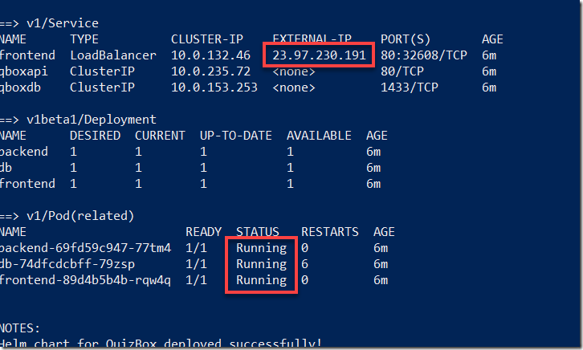
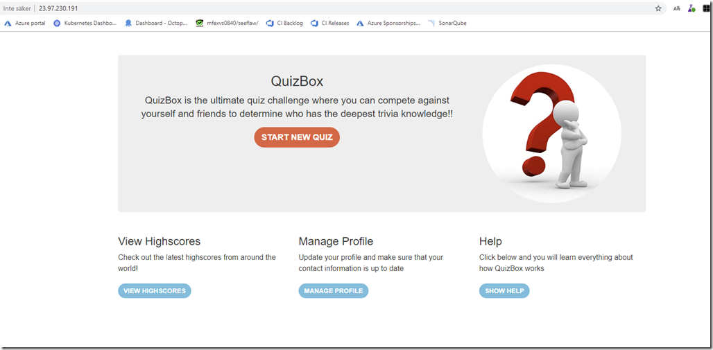

Many of us have eagerly been waiting for the announcement that Microsoft made at the Build 2019 conference, Windows Containers is now in public preview in Azure Kubernetes Service! Yes, it’s in preview so we still have to wait before putting applications into production but it is definitely time to start planning and testing migrations of your Windows applications to AKS, such as full .NET Framework apps.

Containers on Windows are still not as mature as on Linux of course, but they are fully supported on Windows and it is now GA on Kubernetes since version 1.14.

> NB: Read about the current limitations for Windows Server nodes pools and application workloads in AKS here \
> <https://docs.microsoft.com/en-us//azure/aks/windows-node-limitations>

In this introductory post, I will show how to create a new AKS cluster with a Windows node and then deploy an application to the cluster using Helm.

## Enabling AKS Preview Features

If AKS is still in preview when you are reading this, you first need to enable the preview features before you can create a cluster with Windows nodes:

az extension add –name aks-preview

az feature register –name WindowsPreview –namespace Microsoft.ContainerService

The operation will take a while until it is completed, you can check the status by running the following command:

az feature list -o table --query "[?contains(name, 'Microsoft.ContainerService/WindowsPreview')].{Name:name,State:properties.state}"

When the registration state is Registered, run the following command to refresh it:

az provider register --namespace Microsoft.ContainerService\

## Creating an AKS Cluster with Windows nodes

When the registration of the preview feature have been completed, you can go ahead and create a cluster. Here, I’m creating a 1 node cluster since it will only be used for demo purposes. Note that it is currently not possible to create an all Windows node cluster, you have to create at least one Linux node. It is also necessary to use a network policy that uses [Azure CNI](https://docs.microsoft.com/en-us//azure/aks/concepts-network#azure-cni-advanced-networking) .

The below command creates a one node cluster with the Azure CNI network policy, and specifies the credentials for the Windows nodesm, should you need to login to these machines. Replace <MY_PASSWORD> with your own strong password.

(Note that the commands below is executed in a Bash shell):

az group create --name k8s --location westeurope

```bash
az aks create \
    --resource-group k8s \
    --name k8s \
    --node-count 1 \
    --enable-addons monitoring \
    --kubernetes-version 1.14.0 \
    --generate-ssh-keys \
    --windows-admin-password <MY_PASSWORD> \
    --windows-admin-username azureuser \
    --enable-vmss \
    --network-plugin azure
```

Now we will add a new node pool that will host our Windows nodes. for that, we use the new az aks nodepool add command. Note the os-type parameter that dictates that this node pool will be used for Windows nodes.

az aks nodepool add \ \
  --resource-group k8s \ \
  --cluster-name k8s \ \
  --os-type Windows \ \
  --name npwin \ \
  --node-count 1 \ \
  --kubernetes-version 1.14.0

```
When the command has completes, you should see two nodes in your cluster:
```

kubectl get nodes

NAME                                STATUS   ROLES   AGE   VERSION\
aks-nodepool1-15123610-vmss000000   Ready    agent   8d    v1.14.0\
aksnpwin000000                      Ready    agent   8d    v1.14.0

## Installing Helm

Even though [Helm](https://helm.sh/) has it’s quirks, I find it very useful for packaging and deploying kubernetes applications. A new major version is currently being worked on, which will (hopefully) remove some of the major issues that exists in the current version of Helm.

Since Helm is not installed in a AKS cluster by default, we need to install it. Start by installing theHelm CLI, follow the instructions here for your platform:

<https://helm.sh/docs/using_helm/#installing-helm>

Before deploying Helm, we need to create a service account with proper permissions that will be used by Helms server components, called Tiller. Create the following file:

```yaml
helm-rbac.yaml
apiVersion: v1
kind: ServiceAccount
metadata:
   name: tiller
   namespace: kube-system
---
apiVersion: rbac.authorization.k8s.io/v1
kind: ClusterRoleBinding
metadata:
   name: tiller
roleRef:
   apiGroup: rbac.authorization.k8s.io
   kind: ClusterRole
   name: cluster-admin
subjects:
   - kind: ServiceAccount
     name: tiller
     namespace: kube-system
```

Run the following command to create the service account and the cluster role binding:

kubectl apply –f helm-rbac.yaml

To deploy helm to the AKS cluster, we use the helm init command. To make sure that it ends up on a Linux node, we use the –node-selectors parameter:

helm init --service-account tiller --node-selectors "beta.kubernetes.io/os=linux"

Running ***helm list*** should just return an empty list of releases, to make sure that Helm is working properly.\

## Deploy an Application

Now we have an AKS cluster up and running with Helm installed, let’s deploy an application. I will once again use the QuizBox  application that me and Mathias Olausson developed for demos at conferences and workshops. To simplify the process, I have pushed the necessary images to DockerHub which means you can deploy them directly to your cluster to try this out.
> \
> The source code for the Helm chart and the application is available here: <https://github.com/jakobehn/QBox>

Let’s look at the interesting parts in the Helm chart. First up is the deployment of the web application. Since we are using Helm charts, we will pick the values from a separate values.yaml file at deployment time, and refer to them using the {{expression}} format.

Note also that we using the ***nodeSelector*** property here to specify that the pod should be deployed to a Windows node.

**deployment-frontend.yaml**
```yaml
apiVersion: apps/v1beta1
kind: Deployment
metadata:
   name: frontend
spec:
   replicas: {{ .Values.frontend.replicas }}
   template:
     metadata:
       labels:
         app: qbox
         tier: frontend
     spec:
       containers:
       - name: frontend
         image: "{{ .Values.frontend.image.repository }}:{{ .Values.frontend.image.tag }}"
         ports:
         - containerPort: {{ .Values.frontend.containerPort }}
       nodeSelector:
         "beta.kubernetes.io/os": windows
```

The deployment file for the backend API is pretty much identical:

**deployment-backend.yaml**

```yaml
apiVersion: apps/v1beta1
kind: Deployment
metadata:
   name: backend
spec:
   replicas: {{ .Values.backend.replicas }}
   template:
     metadata:
       labels:
         tier: backend
     spec:
       containers:
       - name: backend
         image: "{{ .Values.backend.image.repository }}:{{ .Values.backend.image.tag }}"
         ports:
         - containerPort: {{ .Values.backend.containerPort }}
       nodeSelector:
         "beta.kubernetes.io/os": windows
```

Finally, we have the database. Here I am using SQL Server Express on Linux, mainly because there is no officially supported Docker image from Microsoft that will run on Windows Server 2019 (which is required by AKS, since it’s running Windows nodes on Windows Server 2019).

But this also hightlights a very interesting and powerful feature of Kubernetes and AKS, the ability to mix Windows and Linux nodes in the same cluster and even within the same applications! This means that the whole ecosystem of Linux container images is available for Windows developers as well.

**deployment-db.yaml**

```yaml
apiVersion: apps/v1beta1
kind: Deployment
metadata:
   name: db
spec:
   replicas: {{ .Values.db.replicas }}
   template:
     metadata:
       labels:
         tier: db
     spec:
       containers:
       - name: db
         image: "{{ .Values.db.image.repository }}:{{ .Values.db.image.tag }}"
         ports:
         - containerPort: {{ .Values.db.containerPort }}
         env:
         - name: ACCEPT_EULA
           value: "Y"
         - name: SA_PASSWORD
           valueFrom:
             secretKeyRef:
               name: db-storage
               key: password
       nodeSelector:
         "beta.kubernetes.io/os": linux
```

To deploy the application, navigate to the root directory of the helm chart (where the Values.yaml file is located) and run:

helm upgrade --install quizbox . --values .\values.yaml

This will build and deploy the Helm chart and name the release “quizbox”. Running helm status quizbox shows the status of the deployment:

helm status quizbox

```
LAST DEPLOYED: Fri Jun 28 14:52:15 2019
NAMESPACE: default
STATUS: DEPLOYED
```

RESOURCES:\
==> v1beta1/Deployment\
NAME      DESIRED  CURRENT  UP-TO-DATE  AVAILABLE  AGE\
backend   1        1        1           0          9s\
db        1        1        1           1          9s\
frontend  1        1        1           0          9s

==> v1/Pod(related)\
NAME                      READY  STATUS             RESTARTS  AGE\
backend-69fd59c947-77tm4  0/1    ContainerCreating  0         9s\
db-74dfcdcbff-79zsp       1/1    Running            0         9s\
frontend-89d4b5b4b-rqw4q  0/1    ContainerCreating  0         9s

==> v1/Secret\
NAME        TYPE    DATA  AGE\
db-storage  Opaque  1     10s

==> v1/Service\
NAME      TYPE          CLUSTER-IP    EXTERNAL-IP  PORT(S)       AGE\
qboxdb    ClusterIP     10.0.153.253  <none>       1433/TCP      9s\
frontend  LoadBalancer  10.0.132.46   <pending>    80:32608/TCP  9s\
qboxapi   ClusterIP     10.0.235.72   <none>       80/TCP        9s

NOTES:\
Helm chart for QuizBox deployed successfully!

Wait until the status of all pods are Running and until you see an EXTERNAL-IP address for the frontend service:

Open a browser and navigate to the exernal IP address, in a few seconds you should see the QuizBox application running:

This was a very simple walkthrough on how to get started with Windows applications on Azure Kubernetes Service. Hope you found it useful, and stay tuned for more blog posts on AKS and Windows in the near future!

[](image-3.png)

[](image-5.png)
