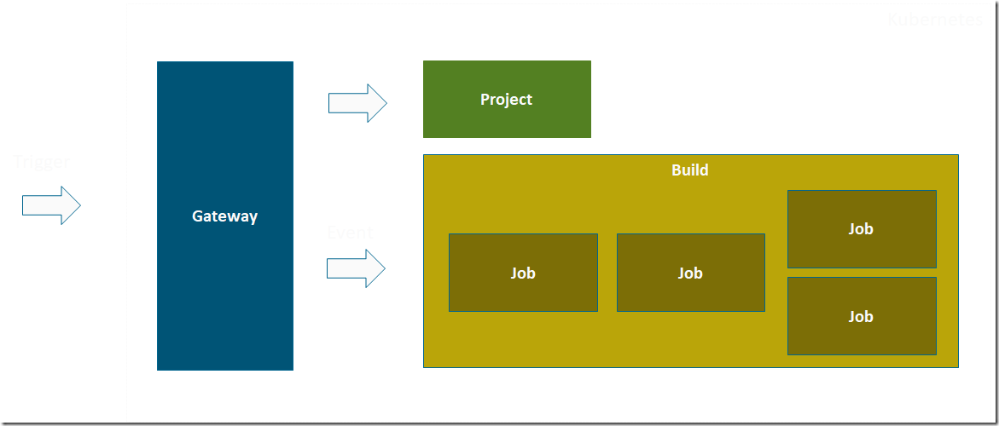
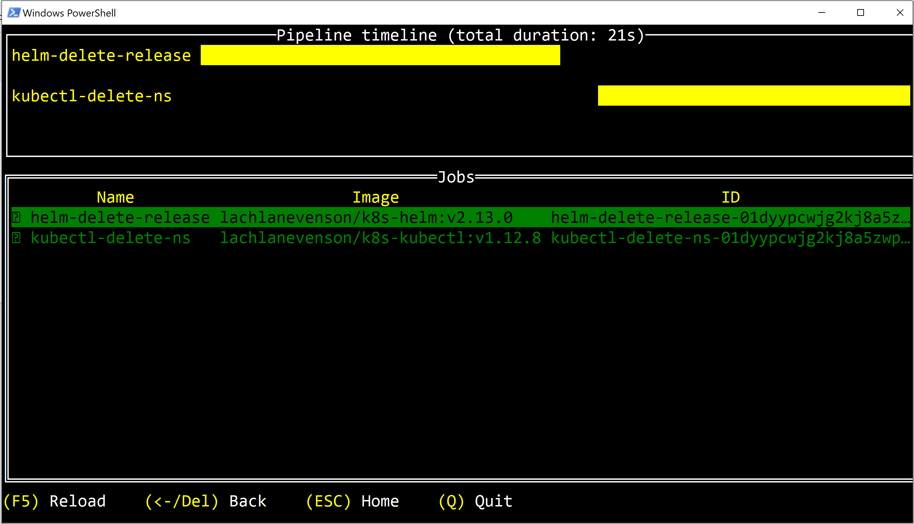
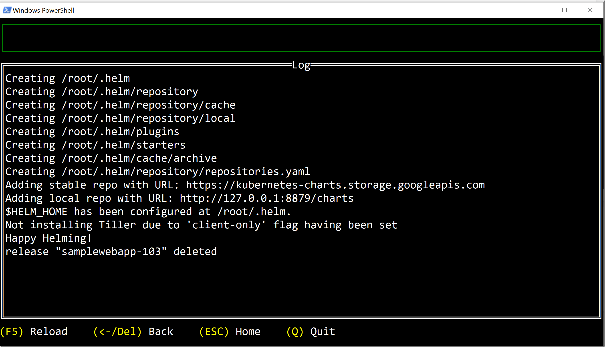

In most projects that I’ve been part of, sooner or later the need for various types of automation jobs arises. For example cleaning up old files, moving database backups, running health checks or system tests and so on.

Historically we’ve implemented these tasks using for example the Windows task scheduler, or through some custom Windows Service app. More recently, we’ve been using Azure Automation jobs for this. Sometimes it can also make sense to use CI/CD automation tools like Azure DevOps for these jobs.

With the move to containers and Kubernetes, it can make a lot of sense to use that platform not just for the business apps that you are developing, but also for these type of automation workloads. It means that you don’t have to invest and manage another platform, and you can leverage existing and 3rd part container images to build automation workflows.

## Brigade

Brigade is a platform that makes it easy to create simple or complex workflows that run on Kubernetes. You use Docker containers as the basis for each step in the workflow, and wire them together using Javascript.


> Brigade is an open-source project, read more about it at:\
> <https://brigade.sh/>

Brigade runs on any vanilla Kubernetes cluster,  you don’t need anything extra installed to run brigade pipelines.

Installing Brigade is as easy as running the following two commands:

```bash
helm repo add brigade https://brigadecore.github.io/charts
helm install brigade/brigade --name brigade-server
```

The image below shows the main concepts in use by Brigade:

[](image.png)

**Project**\
For every automation workflow that you want to implement, you will create a project. Every project has some metadata attached to it, such as id, name and so on. It also either contains or reference the Javascript code that contains the pipeline logic.

**Build**\
A build is created every time a script is triggered, through some  external event. The build runs until all jobs are finished, and you can view the output logs from the running build as well as after it finished.

**Job**\
Each build will contain one or more jobs. For each job, a container instance is started, and then a series of tasks is executed inside that container. You specify the jobs and the tasks in the Javascript code, and how the jobs should be scheduled.

**Gateway**\
A gateway transform outside triggers (a Git pull request, a Trello card move etc) into events, that is passed into the pipeline where you will handle them in your code.

Brigade comes with a Generic gateway that listens and accepts `POST` JSON messages on any format (it also explicitly supports the [CloudEvents](https://cloudevents.io/) format). In addition, there are several custom gateways that makes integration a lot easier with services such as [GitHub](https://docs.brigade.sh/topics/github/), [Docker Container Registry](https://docs.brigade.sh/topics/dockerhub/) or [Azure Event Grid](https://github.com/brigadecore/brigade-eventgrid-gateway).

A basic “hello-world” type of Brigade pipeline can look like this:

```javascript
const { events, Job } = require("brigadier");

//Handler for exec event
events.on("exec", () => {

  var job = new Job("say-hello", "alpine:3.8");
  job.tasks = [
    "echo Hello",
    "echo World"
  ];

  job.run();

});
```

Here, the pipeline is triggered by the **exec** event, and inside that event handler it starts a new job called “**say-hello**” which contains two tasks where each task just prints a message. The job is executed inside a container from the **alpine:3.8** image, that will be downloaded from Dockerhub and started automatically for you. Of course you can use any public image, or a private image from your own container registry.

Brigade has excellent documentation, I encourage you to read up on it more at <https://docs.brigade.sh/>

In this post I will show a slightly more complex example, that is taken from a recent customer project where we developed a microservice application running on Kubernetes, and found the need for some extra automation.

## Removing Kubernetes environment on PR completion

Kubernetes makes it easy to create new isolated environments for your application when you need to. A common desire of many teams is to deploy the application into a fresh environment every time a pull request is created. This lets the team and stakeholders test and verify the feature that is being developed, before it gets merged into the master branch.

Using Azure DevOps, it’s quite easy to setup a release pipeline where every PR is deployed into a new namespace in Kubernetes. You can enable stages in a pipeline to be triggered by pull requests, and then use information from that PR to create a new namespace in your Kubernetes cluster and then deploy the app into that namespace.

The problem we experienced recently at a customer with this was, how can we make sure this namespace (and everything in it) is removed once the PR is complete and merged? We can’t keep it around since that will consume all the resources eventually in the cluster, and we don’t want to rely on cleaning this up manually.

This turned out to be a perfect case for Brigade. We can configure a service hook in Azure DevOps, so that every time a PR is updated we trigger a Brigade pipeline. In the pipeline we check if the PR was completed and if so, extract the relevant information from the PR and then clean up the corresponding namespace. To do this, we used existing container images that let us run helm and kubecl commands.

The Brigade script looks like this:

```javascript
const { events, Job } = require("brigadier");
const util = require('util')

const HELM_VERSION = "v2.13.0"
const HELM_CONTAINER = "lachlanevenson/k8s-helm:" + HELM_VERSION;

const KUBECTL_VERSION = "v1.12.8";
const KUBECTL_CONTAINER = "lachlanevenson/k8s-kubectl:" + KUBECTL_VERSION;

events.on("simpleevent", (event, project) => {
    const payload = JSON.parse(event.payload);
    const prId = payload.resource.pullRequestId;

    if (!payload.resource.sourceRefName.includes('/feature/') && !payload.resource.sourceRefName.includes('/bug/')) {
        console.log(`The source branch ${payload.resource.sourceRefName} is not a /feature/ or /bug/ and is therefore skipped.`)
        return;
    }

    if (payload.resource.status !== "completed" && payload.resource.status !== "abandoned") {
        console.log(`PullRequest not complete or abandoned (current status: ${payload.resource.status}).`);
        return;
    }

    var helm_job = new Job("helm-delete-release", HELM_CONTAINER);
    helm_job.env = {
        'HELM_HOST': "10.0.119.135:44134"
    };
    helm_job.tasks = ["helm init --client-only", `helm delete --purge samplewebapp-${prId}`];

    var kubectl_job = new Job("kubectl-delete-ns", KUBECTL_CONTAINER);
    kubectl_job.tasks = [`kubectl delete namespace samplewebapp-${prId}`];

    console.log("==> Running helm_job Job")
    helm_job.run().then(helmResult => {
        console.log(helmResult.toString())

        kubectl_job.run().then(kubectlResult => {
            console.log(kubectlResult.toString());
        });
    })
});

events.on("error", (e) => {
    console.log("Error event " + util.inspect(e, false, null))
    console.log("==> Event " + e.type + " caused by " + e.provider + " cause class" + e.cause + e.cause.reason)
})

events.on("after", (e) => {
    console.log("After event fired " + util.inspect(e, false, null))
});
```

This code is triggered when the “simpleevent” event is triggered. This event is handled by the generic gateway in Brigade, and can be used to send any kind of information (as a json document) to your pipeline. To trigger this event, we configure a service hook in Azure DevOps for the Pull Request updated event, and point it to the generic gateway:

[![SNAGHTMLae0651d[4]](SNAGHTMLae0651d4_thumb.png "SNAGHTMLae0651d[4]")](SNAGHTMLae0651d4.png)

The full URL looks like this:

[https://brigadedemo.ehn.nu/simpleevents/v1/brigade-55cbf57f7aaeb59afa1fe4d33ca6a5a635eefe060b057c423c97a0/somesecret](https://brigadedemo.ehn.nu/simpleevents/v1/brigade-55cbf57f7aaeb59afa1fe4d33ca6a5a635eefe060b057c423c97a0/somesecret "https://brigadedemo.ehn.nu/simpleevents/v1/brigade-55cbf57f7aaeb59afa1fe4d33ca6a5a635eefe060b057c423c97a0/mysecret")

The URL contains the project id and the secret that were specified when creating the project. This is how external requests is authenticated and routed to the correct brigade script.

Inside the event handler we use two different container images, the first one is for running a Helm command to delete the Kubernetes deployment. Since Helm can’t delete the namespace, we need to run a second job inside another container image that contains the Kubectl tool, where we can delete the namespace by running

**kubectl delete namespace samplewebapp-${prId}`**

The **prId** variable is parsed from the PullRequest updated event coming from Azure DevOps. We use the id of the pull request to create a unique namespace (in this case pull request with id 99 will be deployed into the **samplewebapp-99** namespace).

> NB: You will need to make sure that the service account for brigade have enough permission to delete the namespace. Namespaces are a cluster level resource, so it requires a higher permission compared to deleting a deployment inside a namespace. \
> \
> One easy way to do this is to assign a cluster-admin role to the brigade service account, this is not recommended for production though.

Now, when a PR is complete, our pipeline is triggered and it will delete the deployment and then the namespace.

To view the running jobs and their output, you can either use the brigade dashboard (called Kashti) by running **brig dashboard** or you can install the brigade terminal which will give you a similar UI but inside your favourite console.

Here is the output from the PR job in the brigade terminal:

[](image-1.png)

It shows that two jobs were executed in this build, and you can see the images that were used and the id of each job. To see the output of each job, just return into each job:

[](image-2.png)

Here you can see the the output of the helm job that deletes my helm deployment for the corresponding pull request.

## Summary

I encourage you to take a look at Brigade, it’s easy to get started with and you can implement all sorts of automation without having to resort to other platforms and services. And although Javascript might put some people off, the power of a real programming language (compared to some DSL language) pays off when you want to implemtent something non-trivial.

If you already are using Kubernetes, why not use it for more things than your apps!

Thanks to my colleague Tobias Lolax (https://twitter.com/Tobibben) who did the original implementation of this for our customer.

---

## Comments

*Imported from the original WordPress site. Closed for new replies.*

> **[Sarjana Informatika](https://bif.telkomuniversity.ac.id/en/syntax-is/)** — 19 May 2026
>
> How does Brigade use Docker containers and JavaScript to create and manage event-driven pipelines in Kubernetes?
