When I set out my goals for 2019, one of them was to speak at new conferences. Up until 2018, I had only spoken at conferences in Sweden (like DevSum, TechDays and SweTugg). While these conferences are great, I felt that I wanted to raise the bar a bit and try to visit other conferences, including conferences abroad. And as it turned out, I reached my goal!

I thought that it would be nice to sum up my speaking year in a blog post, with some comments about each comference and a picture or two.

However I want to start this post by (once again) give a big shout out to my employer [Active Solution](https://www.activesolution.se/). While I do spend a lot(!) of my spare time preparing talks and travelling to and from conferences, Active Solution is what makes all this possible by allowing me to use some of my work time for speaking and community related work, and for creating an environment at work where visiting conferences is a natural part of our core activities.

Active Solution works very strategically with regards to developer conferences and meetups. We host a lot of different meetups at our office, and we also very often sponsor and/or exhibits at the three largest conferences for Microsoft/.NET developers in Sweden (DevSum, TechDays and SweTugg, see more about these conferences below). Doing this allows us to meet face to face with a lot of developers. We also have a group of people who have a passion for sharing their knowledge through public speaking, allowing us to share experiences with each other and give feedback on each others talks, CFP’s etc.

A typical Active conference booth, with competitions and nice give aways

Let’s walk through my speaking activities for 2019(not including several smaller meetup talks) for some highlights.

## WinOps 2018 London

As you’ll note, this conference was actually at the end of 2018, but since it was my first conference abroad I’ll include it here 🙂

[WinOps](https://www.winops.org/) is a two-day conference in London that focus on DevOps for Windows. There are a lot of DevOps conferences out there, but this is one of the few (if not the only one) with this focus. It’s not a very big conference, but I was very pleasantly surprised by the quality of the presentations that I saw, and the friendly atmosphere of the whole event.

My talk was about running Kubernetes in Azure, using Azure Kubernetes Service (AKS), and was very well received. You can tell from the questions afterwards if a talk was appreciated or not, in this case I had a lot of questions and interesting discussions afterwards.

For this conference I brought my 11-year old son Svante with me as company. He joined me for my session (not focusing too much on it though 🙂 ) and after the conference we stayed for two nights more in London and expored this fantastic city, where the christmas lights had just been lit up. Among other things we enjoyed a proper afternoon tea at the Dorchester hotel at Hyde Park.

Svante in a nice WinOps t-shirt

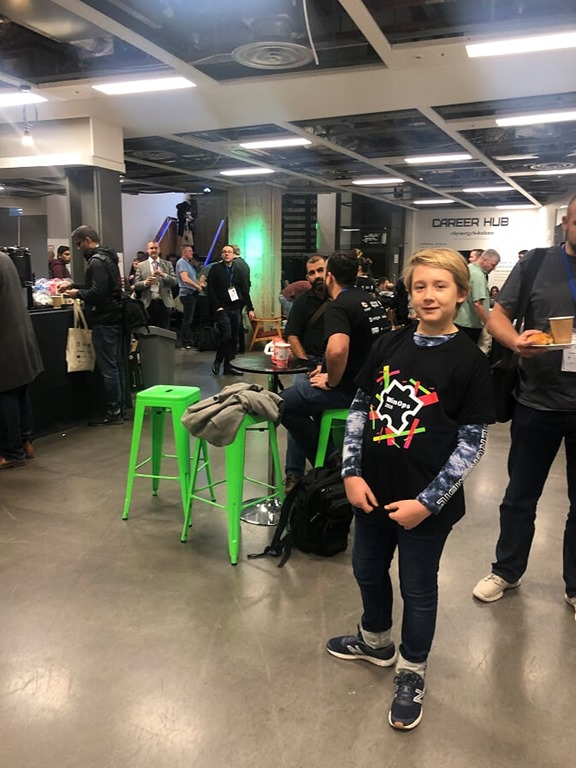

Ready for some afternoon tea!

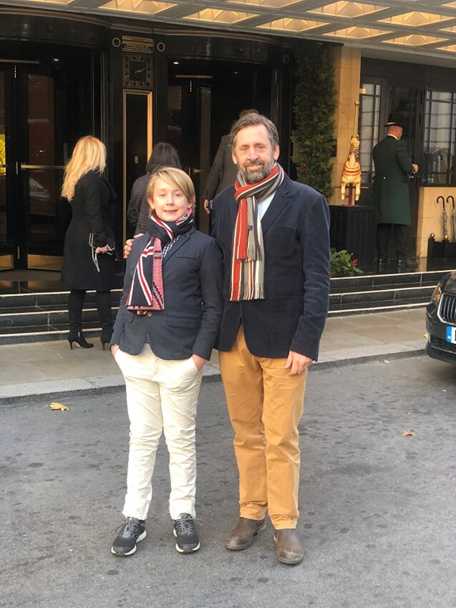

## NDC London

Being accepted to an NDC conference has definitely been on my bucket list for some time, and finally it happened. NDC London accepted my talk “A Lap around Azure DevOps” which is basically an hour of demos, where I try to show as much as possible how team can be more productive with Azure DevOps.  Unfortunately I had some network problems, so some demoes were a bit slow but I think that overall the talk was well received and I managed to finish all the demos within the hour.

Here is a link to the recording of this session:\
<https://www.youtube.com/watch?v=N78NxZ-cKUc>

NDC is well known for organizing great conferences and taking care of their attendees and speakers. I enjoyed hanging out with the other speakers during the conference.

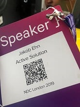

## MVP Summit (Seattle)

So, the MVP Summit is a special conference in this context since it’s not really about presenting anything but instead meeting with the product teams at Microsoft and learn and discuss current and future investments and roadmaps together with them and all the other MVP's from around the world.

However, I did do a short presentation during the “MVP2MVP day” which is a long tradition of the ALM/DevOps MVP group, where we meet on the sunday before the summit begins, and share knowledge with each other in a packed day. Typically there are 20 minute sessions going on from 10AM to 5PM with a short lunch break, and is great fun. A big kudos here to Brian Randall and Neno Loje who are the master minds behind this day!

Although my MVP award was recently moved from the ALM category to the Azure category, I’m still hanging out with this amazing group of people that I’ve come to know through my 8 years of being an MVP.

Celebrating TFS (mow Azure DevOps) on it’s 13th birthday 🙂

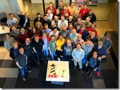

During the summit I had my avatar drawn live with the one and only @reverentgeek (David Neal)

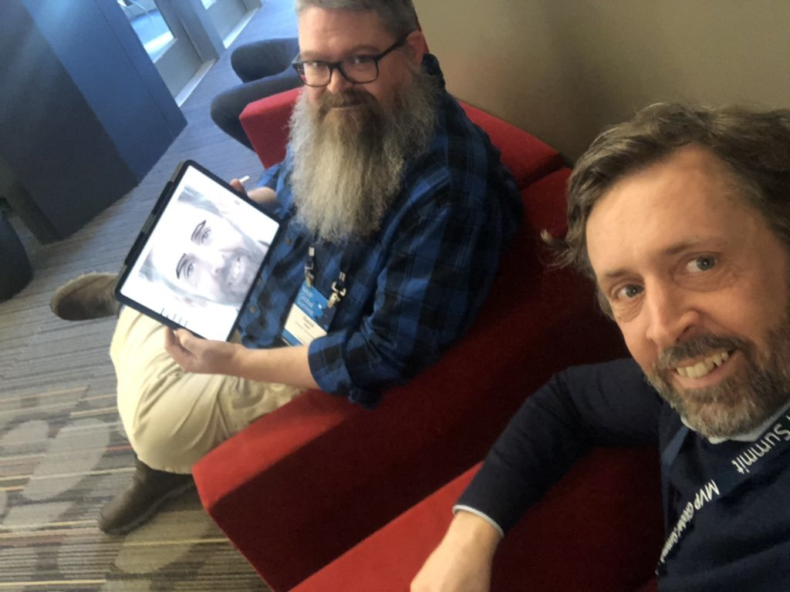

## DevSum (Stockholm)

DevSum is the biggest .NET conference in Sweden, and 2019 was my 5th year in a row to speak at this conference. Active solution has been a proud sponsor at this event and we always have a nice booth where we try to combine cutting edge technologies with some  fun competitions!

This time, I did my “A Lap around Azure DevOps” talk again. It’s always nice to deliver a session more that once, it allows me to refine the presentation and make it a little bit better than last time.

Of course, things are changing so every time I redeliver a talk I end up changing both slides and demos in order to incorporate new things. This time I had no Internet problems so all the demos went as planned!

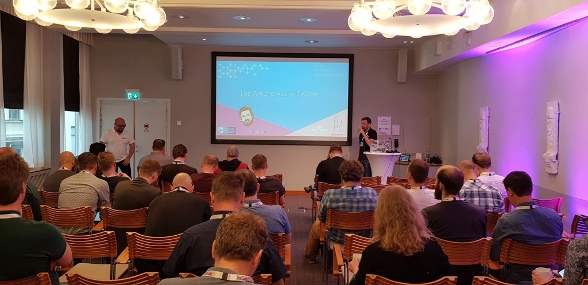

## Ignite Tour Stockholm

208/2019 saw the first edition of Ignite The Tour running around the world. Microsoft took their big Ignite conference in tour, together with speakers from Microsoft and also local community speakers on each location. I submitted a couple of talks to Ignite Tour in Stockholm and got two talks accepted:

**Continuous Delivery with Azure Kubernetes Service\**In this talk I showed how to implemented CD techniques like A/B and Canary testing using Kubernetes and AKS.

**Keeping your builds green using Docker\**This talk was based on work that I’ve been doing for my current customes during the last year, where we have used Docker as the basis for the build environment. Instead of relying on manually patched servers with flaky behaviour, we moved everything to Docker which gives as Infrastructure as code and full isolation which is great when you want to have fully repeatable builds. I also talked about and showed how you can use Docker for building your applications, which has several advantages.

Talking about Kubernetes and AKS

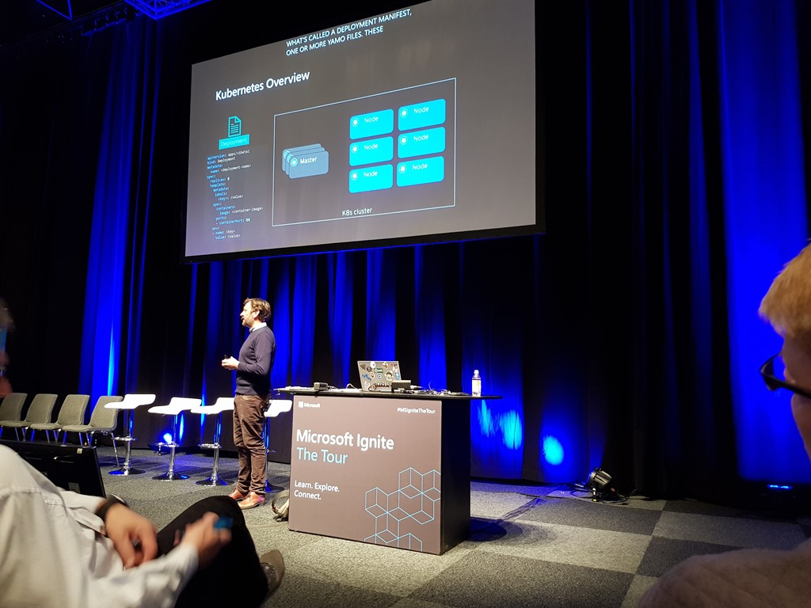

Using Docker for build automation

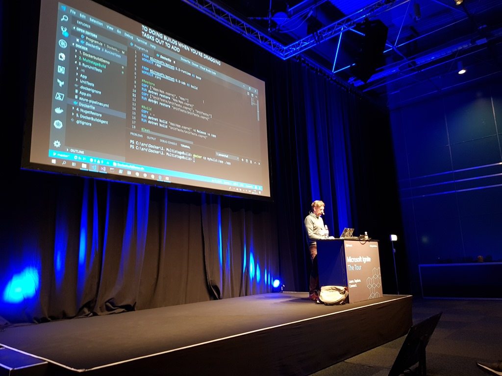

## NDC Sydney

Without a doubt, the biggest thing for me last year was being accepted to NDC Sydney. Travelling to Australia is something that I always wanted to do, so having this opportunity was nothing but amazing. Of course, trafelling to Sydney from Stockholm is a VERY long trip, so I made sure to add some vacation before and after the conference so that I was able to explore the beatiful city of Sydney.

Of course, following the news on the fires in Australia and around Sydney these last couple of months has been very painful to watch, probably even more so since I visited it so recently.

At the conference, I delivered once again delivered the “Keeping your builds green using Docker” talk, which went very well.

Here is a link to the recording:\
<https://www.youtube.com/watch?v=ekNSwDS1ya4>

Visiting friend and fellow MVP Adam Cogan and his wife Anastasia over at Coogee beach

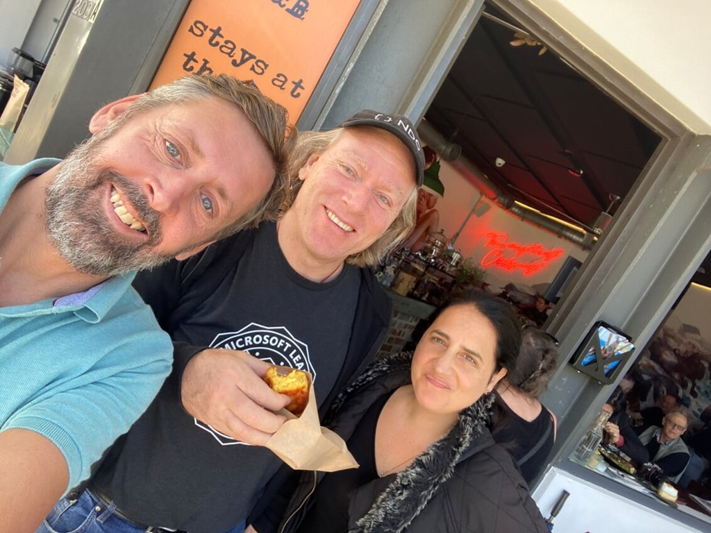

A mandatory shot of the Opera house in the Sydney harbour

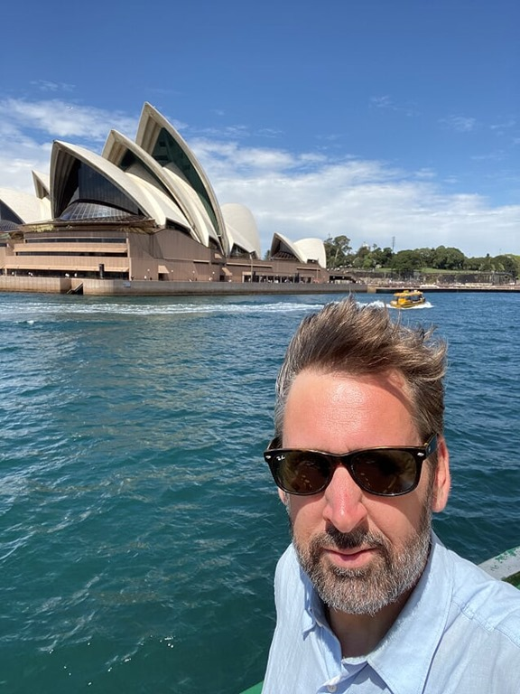

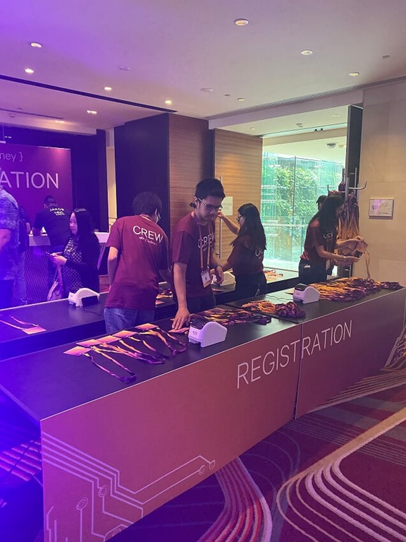

Registration opens at NDC, which

Heather Downing opened the conference with a keynote on how to treat and motivate your software engineers

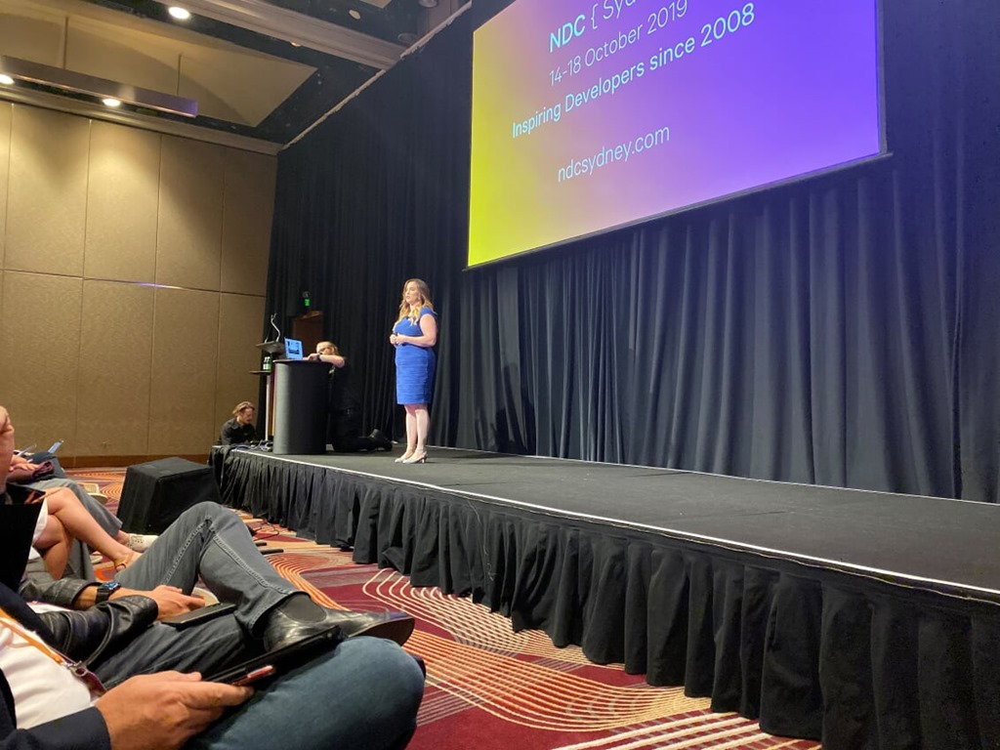

The (in)famous PubConf was held on friday night after the NDC conference ended

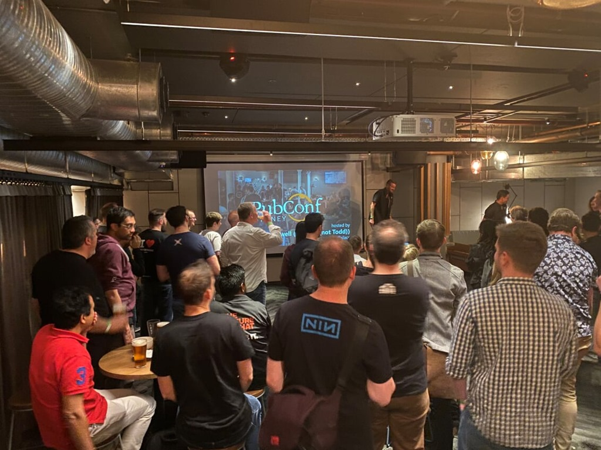

Beautiful night skyline of Sydney

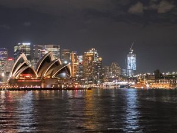

## TechDays Sweden

Another big Microsoft conference in Sweden is TechDays Sweden, which celebrated 10 years in 2019. TechDays is a big conference with almost 2000 participants. Usually there is around 10 different tracks with a mixture of IT/Operations and Developer tracks.

This time, I coordinated a bit with my colleague Chris Klug (@zerokoll). Since we are both working with and speaking a lot about Docker and Kubernetes, we decided to make sure that our sessions didn’t overlap but instead built on each other. So Chris did a session that introduced Kubernetes for developers, and I did a session about “DevOps with Azure Kubernetes Service”, where I showed how to setup a CI/CD pipeline, how to make sure that your AKS cluster and applications are secure , compliant and highly available.

Waiting for everyone to take their seat

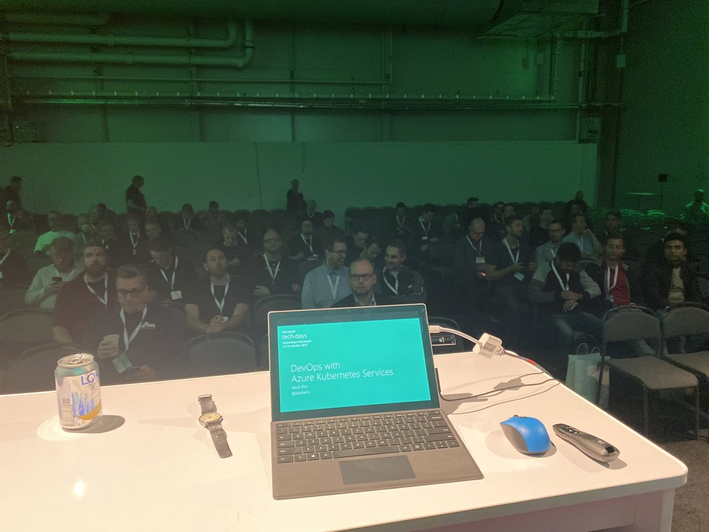

## UpdateConf (Prague)

The Czech Republic is a country that I had never visited before, so I was very glad when I was accepted to speak at this conference in Prague. Unfortunately, as it turned I had to rearrange my travels a bit so I didn’t really have any time to visit the city so I sure hope to come back again!

At UpdateConf, I delivered a new session that is called “Event-driven computing with Kubernetes”, where I talk about some open source tooling that let’s you implement event-based automation and scaling, Brigade and Keda.

My colleague Cecilia Wiren (@ceciliasharp) about to start one of her sessions

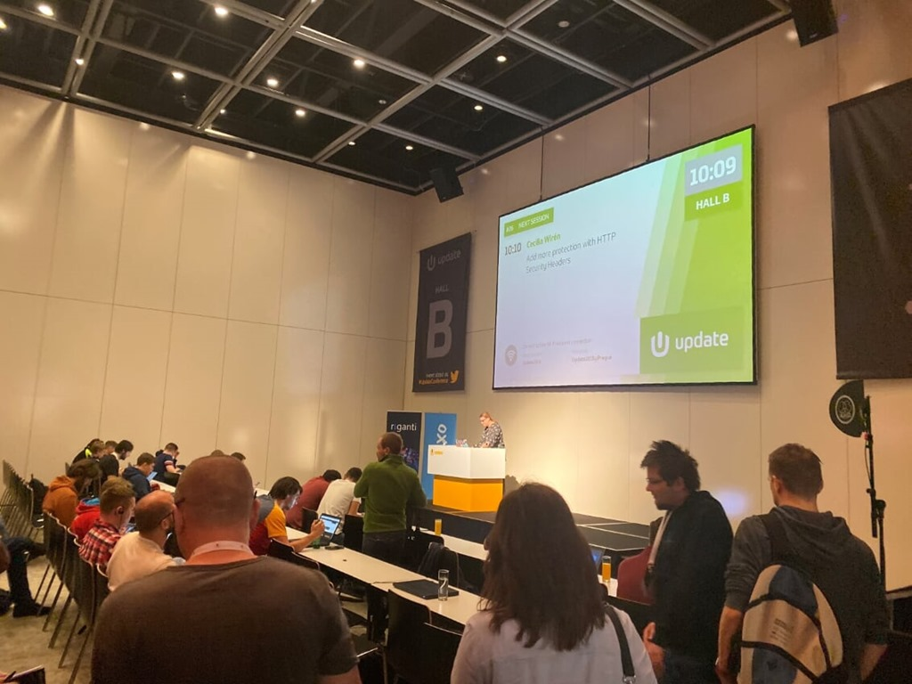

Me speaking about Brigade and Keda

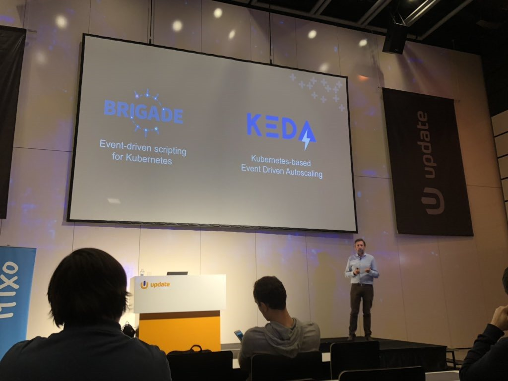

Action pic 🙂

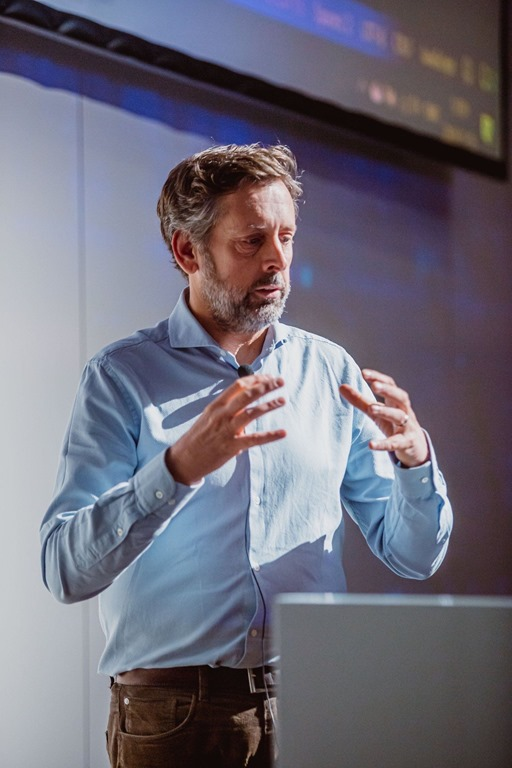

## CloudBrew (Mechelen, Belgium)

The last conference of the year for me was CloudBrew. I have heard so many good things about this community conference over the years so I was naturally thrilled when I was accepted to speak at this conference. And all the good things I heard turned out to be true, or better. The conference has grown a lot over the years, this year there were around 400 attendees which was twice as much as the year before. The crew from the Belgian Azure user group (AZUG) does an amazing job with this conference, everything worked flawlessly and I met a lot of new people at this conference, all with a passion for Azure in common.

I delivered the session about event-driven computing with Kubernetes again, this time with no other than **Clemens Vasters** in the audience, who of course is the father of the Messaging services in Azure. He has recently been involved in the work around Keda and cloud events which I covered in this talk.

Alex Mangs opened the conference with a keynote looking at the future of Azure

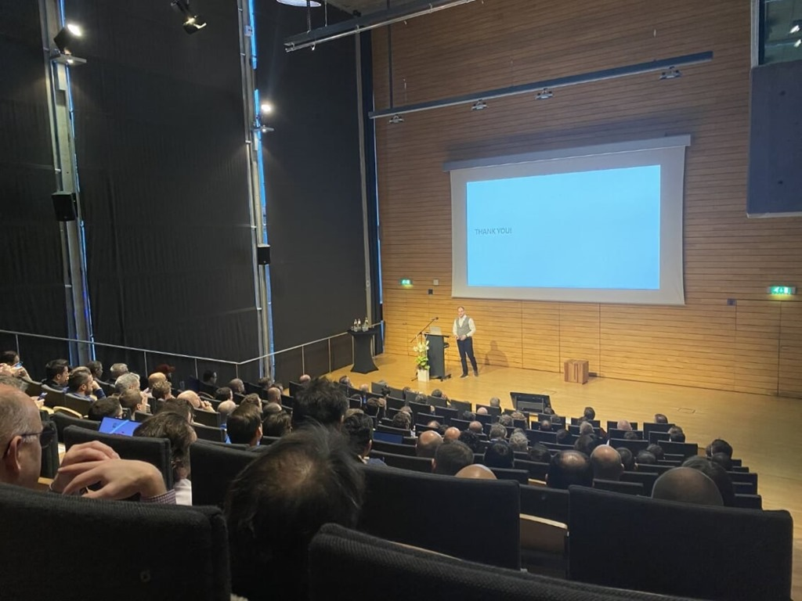

Time to talk about Brigade and Keda again

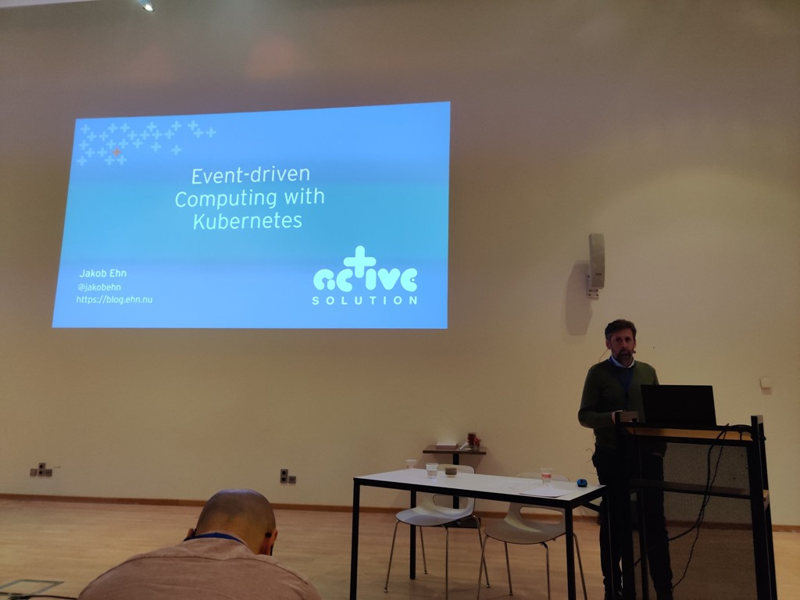

My colleague Alan Smith preparing for his session

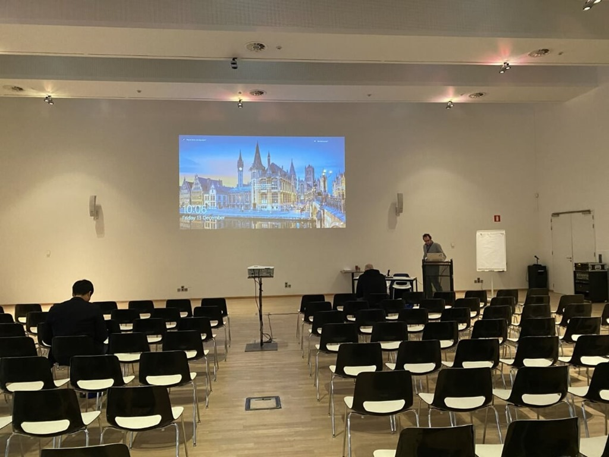

A great speaker dinner with both old a new friends

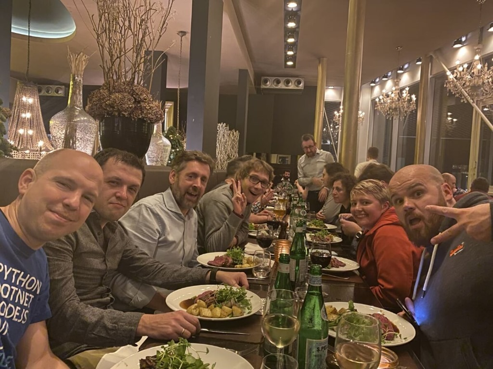

## Summary

From a speaker perspective 2019 was an amazing year where I experienced so much and met so many new people. I can only hope that 2020 will bring some of the same experiences for me.

As with everything else, the more you prepare and speak at conferences the better you will become. For me, public speaking doesn't really come naturally but I do feel that I have improved it over the years.

I keep my list of upcoming (and past) speaking engagements updated here:\
<https://blog.ehn.nu/speaking/>

Hope to see you at a conference soon!
