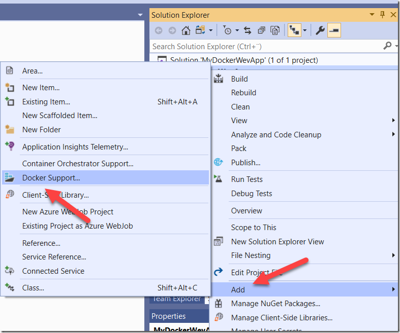

Visual Studio has for quite some time been adding features to make it easier to create, build, run and debug Dockerized applications.  This is great, because Docker can be quite daunting when you intially approach it and anything that makes that journey easier should be encouraged.

However, with this tooling support comes some magic that is performed behind the scene when you hit F5 in Visual Studio. I have on numerous different occasions explained to developers what actually happens when you build and debug a Dockerized application in Visual Studio. With this post, I can send them here instead the next time 🙂

##

## Adding Docker support

Let’s start by taking an existing web project in Visual Studio 2019 and add Docker support to it, and then we’ll examine the details.

If you have a .NET or .NET Core application open in Visual Studio, you can right-click the project and select “**Add –> Docker support**”. You will be prompted if you want to use Linux or Windows containers, if you are doing .NET Core you will most likely want to use Linux containers here, if it is a full .NET Framework apps you have to go with Windows containers here.

> **Note**: \
> The below walkthrough are for Linux containers. For Windows containers the Docker file will look a lot different, but the overall process is the same

Here, I have a ASP.NET Core 3.1 web application called MyDockerWebApp:

[](image.png)

This will generate the following Dockerfile and add it to the project:

```
FROM mcr.microsoft.com/dotnet/core/aspnet:3.1-buster-slim AS base
WORKDIR /app
EXPOSE 80
EXPOSE 443

FROM mcr.microsoft.com/dotnet/core/sdk:3.1-buster AS build
WORKDIR /src
COPY ["MyDockerWevApp/MyDockerWevApp.csproj", "MyDockerWevApp/"]
RUN dotnet restore "MyDockerWevApp/MyDockerWevApp.csproj"
COPY . .
WORKDIR "/src/MyDockerWevApp"
RUN dotnet build "MyDockerWevApp.csproj" -c Release -o /app/build

FROM build AS publish
RUN dotnet publish "MyDockerWevApp.csproj" -c Release -o /app/publish

FROM base AS final
WORKDIR /app
COPY --from=publish /app/publish .
ENTRYPOINT ["dotnet", "MyDockerWevApp.dll"]
```

This is a [multi-stage](https://docs.docker.com/develop/develop-images/multistage-build/) Docker file, which means that when Docker builds this file it will go through multiple phases (each starting with a FROM statement) where each statement will produce a temporary image, that can be used in a subsequent step. This makes it possible to generate optimized images in the end suitable for running in production. (Again, for .NET Framework apps and Windows containers, the generated Dockerfile will not be a multi-stage file)

The Docker file looks a bit unusual though, the first phase called “base” doesn’t really do anything. What’s the point with that phase? As it turns out, this phase has  a special meaning for Visual Studio, we’ll see when we examine how Visual Studio runs and debug Docker projects.

## Building and running the containerized application

When building the project, you might expect that Visual Studio would build the Dockerfile and produce a Docker image. This is not the case however, at least not when building the Debug configuration. It’s actually when you run the project that Visual Studio will build an image and start a container using that image. Let’s take a look at the output when pressing F5. I’m only showing the relevant parts here, intended for readability:

```bash
docker build -f "C:\src\MyDockerWebApp\MyDockerWebApp\Dockerfile"
                        --force-rm
                        -t mydockerwebapp:dev
                        --target base
                       --label "com.microsoft.created-by=visual-studio"
                       --label "com.microsoft.visual-studio.project-name=MyDockerWevApp"
                       "C:\src\MyDockerWebApp"
```

Here you can see that Visual Studio runs a Docker build operation with the Dockerfile as input, and naming the generated image **<projectname>:dev**. However, there is one important parameter: **–target base**. This means that Visual Studio will only build the first phase, called base. This will then produce a Docker image that is just the ASP.NET Core 3.0 base image, it won’t contain any application files at all from my project!

The reason for this is that Visual Studio tries to be smart and avoid rebuilding the Docker image  every time you press F5. That would be a very slow inner loop for developers. This is called “fast” mode, and can be disabled if you always want to build the full image even in Debug mode. If you want to add something more to the image that is used in fast mode, you have to add the Docker instructions it this phase.

> You can disable fast mode by adding the following to your .csproj file:

```
<PropertyGroup>
    <ContainerDevelopmentMode>Regular</ContainerDevelopmentMode>
</PropertyGroup>
```

If you switch to the Release configuration and run, Visual Studio will process the whole Dockerfile and generate a full image called **<projectname>:latest**. This is what you will do on your CI server

So, how does Visual Studio actually run the application then? Let’s look a bit further down in the output log to understand what happens:\

```
C:\WINDOWS\System32\WindowsPowerShell\v1.0\powershell.exe -NonInteractive -NoProfile -WindowStyle Hidden -ExecutionPolicy RemoteSigned -File "C:\Users\jakobe\AppData\Local\Temp\GetVsDbg.ps1" -Version vs2017u5 -RuntimeID linux-x64 -InstallPath "C:\Users\jakobe\vsdbg\vs2017u5"
Info: Using vsdbg version '16.3.10904.1'
Info: Using Runtime ID 'linux-x64'
Info: Latest version of VsDbg is present. Skipping downloads
C:\WINDOWS\System32\WindowsPowerShell\v1.0\powershell.exe -NonInteractive -NoProfile -WindowStyle Hidden -ExecutionPolicy RemoteSigned -File "C:\Users\jakobe\AppData\Local\Temp\GetVsDbg.ps1" -Version vs2017u5 -RuntimeID linux-musl-x64 -InstallPath "C:\Users\jakobe\vsdbg\vs2017u5\linux-musl-x64"
Info: Using vsdbg version '16.3.10904.1'
Info: Using Runtime ID 'linux-musl-x64'
Info: Latest version of VsDbg is present. Skipping downloads
```

These steps downloads and executes a Powershell scripts that will in turn download and install the Visual Studio remote debugging tools to your local machine. Note that this will only happen the first time, after that it will skip the download and install as you can see from the logs above.

```bash
docker run -dt
                   -v "C:\Users\je\vsdbg\vs2017u5:/remote_debugger:rw"
                   -v "C:\src\MyDockerWebApp\MyDockerWebApp:/app"
                   -v "C:\src\MyDockerWebApp:/src"
                   -v "C:\Users\je\AppData\Roaming\Microsoft\UserSecrets:/root/.microsoft/usersecrets:ro"
                   -v "C:\Users\je\AppData\Roaming\ASP.NET\Https:/root/.aspnet/https:ro"
                   -v "C:\Users\je\.nuget\packages\:/root/.nuget/fallbackpackages2"
                   -v "C:\Program Files\dotnet\sdk\NuGetFallbackFolder:/root/.nuget/fallbackpackages"
                   -e "DOTNET_USE_POLLING_FILE_WATCHER=1"
                   -e "ASPNETCORE_ENVIRONMENT=Development"
                   -e "NUGET_PACKAGES=/root/.nuget/fallbackpackages2"
                   -e "NUGET_FALLBACK_PACKAGES=/root/.nuget/fallbackpackages;/root/.nuget/fallbackpackages2"
                   -p 50621:80 -p 44320:443
                  --entrypoint tail mydockerwebapp:dev
                  -f /dev/null
```

This is where Visual Studio actually starts the container, let’s examine the various (interesting) parameters:

**-v "C:\Users\je\vsdbg\vs2017u5 : /remote_debugger:rw"**\
This mounts the path to the Visual Studio remote debugger tooling into the container. By doing this, Visual Studio can attach to the running process inside the container and you can debug the applicatoin just like you would if it was running as a normal process.

**-v "C:\Users\je\vsdbg\vs2017u5 : /remote_debugger:rw"\
-v "C:\src\MyDockerWebApp : /src"**

These two parameters maps the project directory into the /app and /src directory of the container. This means that when the container is running,  and the web app starts, it is actually using the files from the host machine, e.g. your development machine. This ameks it possible for you to make changes to the source files and have that change immediately available in the running container

**-v "C:\Users\je\AppData\Roaming\Microsoft\UserSecrets : /root/.microsoft/usersecrets:ro"** \
Makes the UserSecrets folder from the roaming profile folder available in the container

**C:\Users\je\AppData\Roaming\ASP.NET\Https : /root/.aspnet/https:ro"**\
Mounts the path where the selfsigned certificates are stored, into the container

**-v "C:\Users\je\.nuget\packages\ : /root/.nuget/fallbackpackages2" \
-v "C:\Program Files\dotnet\sdk\NuGetFallbackFolder : /root/.nuget/fallbackpackages"**

Mounts the local NuGet package cache folder and the NuGet fallback folder into the container. These files are read by the *.nuget.g.props files that are generated in the obj folder of your project

## Summary

The result of this magic is that you can just run your project, make changes to it while running and have the changes immediately be applied, and also add breakpoints and debug your applications just like you are used to, even though the are running inside containers.

I hope this will shed some light on what’s going on when you are building and running Dockerized projects in Visual Studio.
