I’ve been playing around with the [Dapr](https://dapr.io/) project recently, which is an interesting approach to building distributed, “microservices” applications. Tha main idea with Dapr is to make it easier for developers to implement distributed application running either in the cloud or on “the edge” (e.g. anywhere else), by implementing a lot of the cross-cutting concerns that is a part of every distributed app. Dapr consists of a number of building blocks, such as Service Invocation, State Service, Pub/Sub messaging and distributed tracing.

Read more about the main concepts of Dapr here:\
<https://github.com/dapr/docs/tree/master/concepts>

The architecture of Dapr makes local devlopment a bit special. Dapr uses a Sidecar architecture, meaning that the Dapr runtime runs in a separate process (or container if you’re running in Kubernetes), and all interaction beween your application and the Dapr runtime is done using HTTP/gRPC calls to that sidecar process:

Image from <https://github.com/dapr/docs/tree/master/overview>

You can read more about how to run Dapr locally [here](https://github.com/dapr/docs/blob/master/getting-started/environment-setup.md), but essentially you’ll use the Dapr CLI to run or debug your application. The Dapr CLI will in turn launch your application and configure the necessary environment variables and sidecar pod injectors etc to make sure that your application can communicate with the Dapr runtime.

This can be a bit cumbersome when you want to be able to quickly iterate when working locally, but Visual Studio Code makes this process fairly simple. Let’s walk through how to set this up.

## Debugging an ASP.NET Core Dapr app

First of all, if you haven’t installed Dapr, follow the simple instructions here to do so. Use the standalone mode when you get started:\
<https://github.com/dapr/docs/blob/master/getting-started/environment-setup.md>

Next up, we will be using a Visual Studio Code extension for Dapr that can automate and simplify a lot of tasks when it comes to working with Dapr applications, so go ahead and install this:

<https://github.com/microsoft/vscode-dapr>

[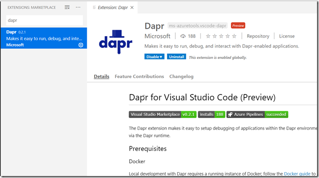](image.png)

Let’s create a ASP.NET Core web application and see how we can build, run and debug this application using Visual Studio Code.

1. Create a new folder for your application
2. In the folder, create a new ASP.NET Core web app using the dotnet CLI:**dotnet new mvc -n daprweb**
3. Open Visual Studio code in the current folder by running:**code .**
4. To configure how VSCode runs and debug an application you need to add and/or modify the launch.json and tasks.json files that are located in the .vscode folder in the root directory.\
   If you don’t see them you need to restore and build the project at least once in VSCode.After that, hit CTRL + P and then select **Dapr: Scaffold Dapr Tasks\
    \**

[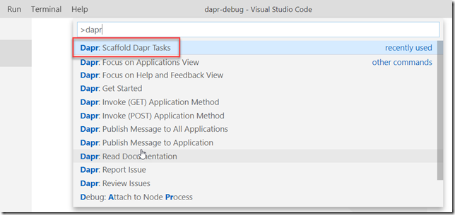](image-1.png)

**\**\
- For the configuration, select the **.NET Core Launch (web)** configuration
- Give the app a name (**daprweb**) and select the default port for the app (5000)
- When done, take a look at the launch.json file. You’ll see that the extension added a new configuration called **.NET Core Launch (web) with Dapr**. It is very similar to the default .NET Core launch configuration, but is has a special preLaunchTask and a postDebugTask. These tasks have also been added by the extension to the tasks.json file
- Take a look at Tasks.json to see the new tasks:

[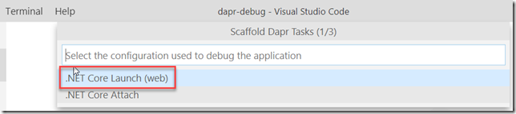](image-2.png)

[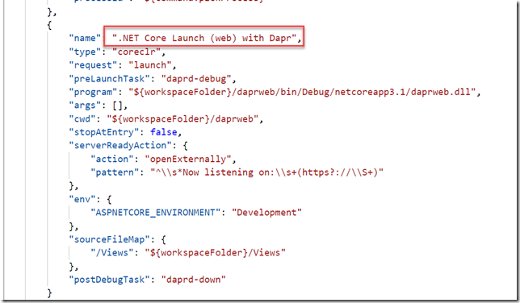](image-3.png)

[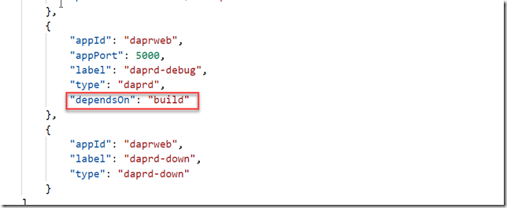](image-4.png)

You can see that the darp-debug task has the type “daprd” which is a reference to the Dapr CLI debugger. The task depends on the build task, which means that it will trigger a build when you launch the configuration. The other task is daprd-down, which is called when you stop a debug session, which enables the extension to finish Daprd correctly.\
- To debug the application, simply navigate to the Run tab and select the **.NET Core Launch (web) with Dapr** configuration in the dropdown bar at the top:
- If you set a breakpoint in the Home controller, it should be hit immediately when you start debugging the application:

## Debugging multiple Dapr applications

What about running and debugging multiple Dapr applications at the same time? If you for example have a web app that calls an API app, you would most likely want to be able ro run and debug them simultaneously.

[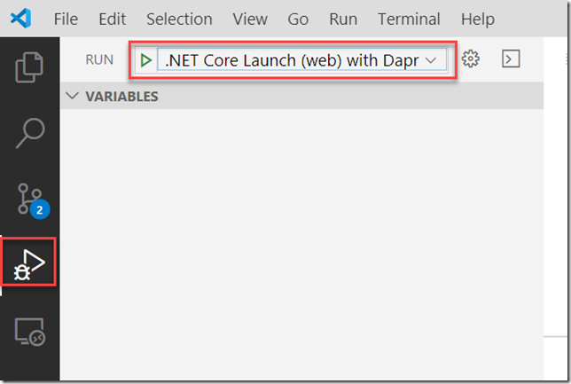](image-5.png)

[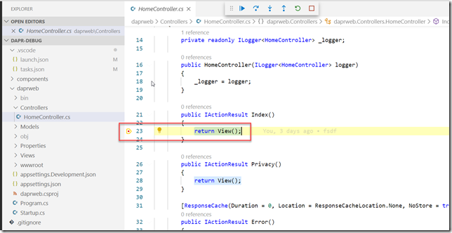](image-6.png)

It works pretty much the same way. Here I have added a ASP.NET Core Web API application, and then added another launch configuration:

[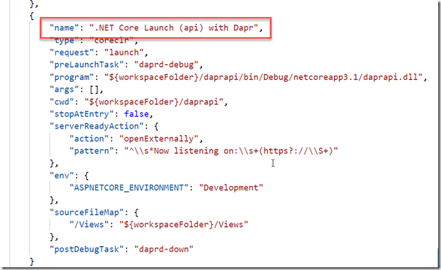](image-7.png)

To be able to build and run both applications at the same time, the best way is to add a solution file with the two projects in it, and then change the **Build** task to build from the solution folder instead.

Here I have changed the argument to the build command to point to the workspace folder root:

[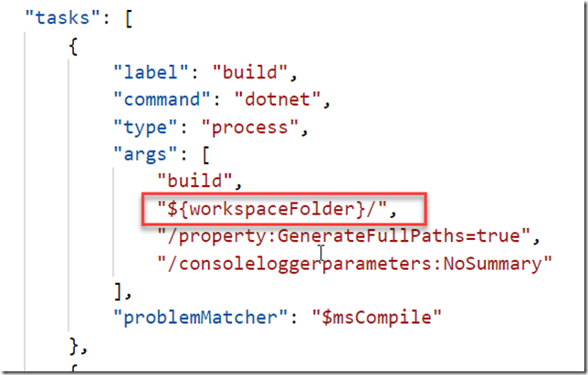](image-8.png)

Now, to easily start both applications with a single command, you can add a **compound** launch configuration that will reference the applications that you want to start. Add the following to your launch.json file:

[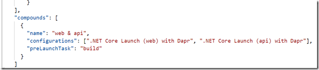](image-9.png)

Select this configuration when starting a debug session in VSCode, this will start up both applications at the same time.

[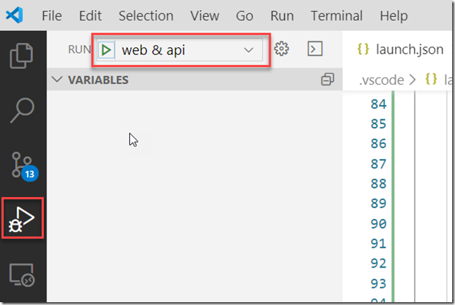](image-10.png)

I hope this post was helpful, I’ll write more posts about Dapr in the near future so stay tuned

---

## Comments

*Imported from the original WordPress site. Closed for new replies.*

> **[Daniel Larsen](https://twitter.com/daniellarsennz)** — 29 Dec 2020
>
> Amazing article! Saved me loads of time. Thank you.
